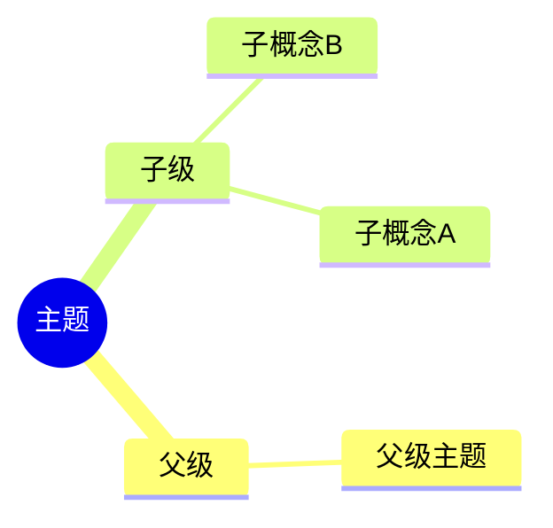
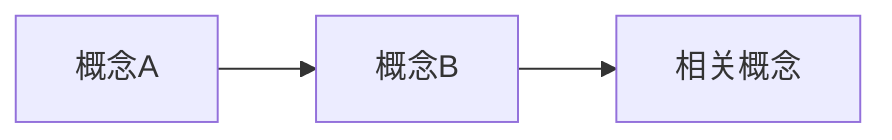
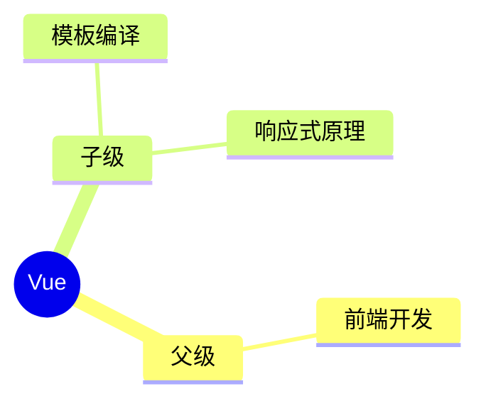

## 触发条件

当用户意图是**创建新笔记**或**追加内容到现有笔记**时使用此 skill。

### 使用示例

```
/obsidian-note 创建笔记 什么是闭包？
/obsidian-note 追加内容到 40-RESOURCES/前端性能优化.md
```

---

## 模板与目录

`content/_templates/template_{type}.md`

| content-type | 目录 |
|:---|:---|
| project | 10-PROJECTS |
| area | 20-AREAS |
| atomic | 30-ZETTELKASTEN |
| concept, sop, question, term, comparison, moc, record, roadmap | 40-RESOURCES |
| article | 60-BLOGS |
| diary | 90-DIARY |

---

## 步骤

### Create（创建新笔记）

1. 读取模板 `template_{type}.md`
2. 替换占位符（tp.file.title, tp.file.creation_date 等）
3. 严格按模板结构生成内容
4. 写入文件

### Append（追加内容）

1. 读取现有笔记 + 对应模板
2. 对比差距
3. 基于模板生成内容
4. 追加到「总结」之前

---

## 规则

- **必须先读取模板**再生成内容
- **严格按模板结构**，不得自行调整章节
- **不使用模板时必须说明原因**

---

## 内容类型判断

| 用户意图 | content-type |
|:---|:---|
| "是什么？"、"什么是 XXX" | concept |
| "如何做？"、"怎样 XXX？" | question |
| "步骤"、"如何实现？" | sop |
| "XXX 和 XXX 区别" | comparison |
| "术语解释" | term |
| "领域/方向" | area |
| "项目"（目标+截止日期） | project |
| "观点/洞察" | atomic |
| "索引/入口" | moc |
| "版本演进"、"发展历程"、"历史"、"timeline" | roadmap |
| "博客文章" | article |
| "记录事件" | record |

---

## 注意事项-Mermaid相关

Obsidian 的 Mermaid 渲染器**不支持** WikiLink `[[]]` 语法在 Mermaid 代码块内使用。

### Mindmap / Flowchart 中的 WikiLink

在 `mindmap` 或 `flowchart` 节点中：
- **错误**：`[[笔记名称]]` — Mermaid 不会渲染
- **正确**：直接写节点文字，如 `笔记名称`





### 解决方案

1. **节点中不写 WikiLink**：只写纯文字标题
2. **节点下方的描述/关联**：在 Mermaid 块外部用 WikiLink 标注
3. **Area 领域知识图谱**：父级/子级/同级/关联节点都用纯文字，关联关系在图外说明

### 错误示例

```mermaid
mindmap
    root((Vue))
        父级
            [[前端开发]]
        子级
            [[响应式原理]]
```

### 正确示例



---

## 注意事项-Markdown相关

### WikiLink 格式

- **Obsidian 笔记间链接**：使用 `[[笔记名称]]`
- **不存在的笔记链接**：断链是正常现象，表示"尚未掌握"，不必强制创建
- **跨目录引用**：使用完整路径如 `[[40-RESOURCES/笔记名称]]`

### 笔记标题

- **命名原则**：使用纯标题，不带前缀
- **前缀存放位置**：aliases 字段（如 `aliases: [C-闭包]`）
- **引用方式**：正文引用 `[[闭包]]`，自动解析到对应笔记

---

## 常见问题

| 场景 | 处理 |
|:---|:---|
| 用户未指定类型 | 根据用户意图自动判断 |
| 模板不存在 | 返回错误，列出可用类型 |
| 追加时笔记不存在 | 提示使用 create 模式 |
| 路径包含空格 | 使用双引号包裹 |
