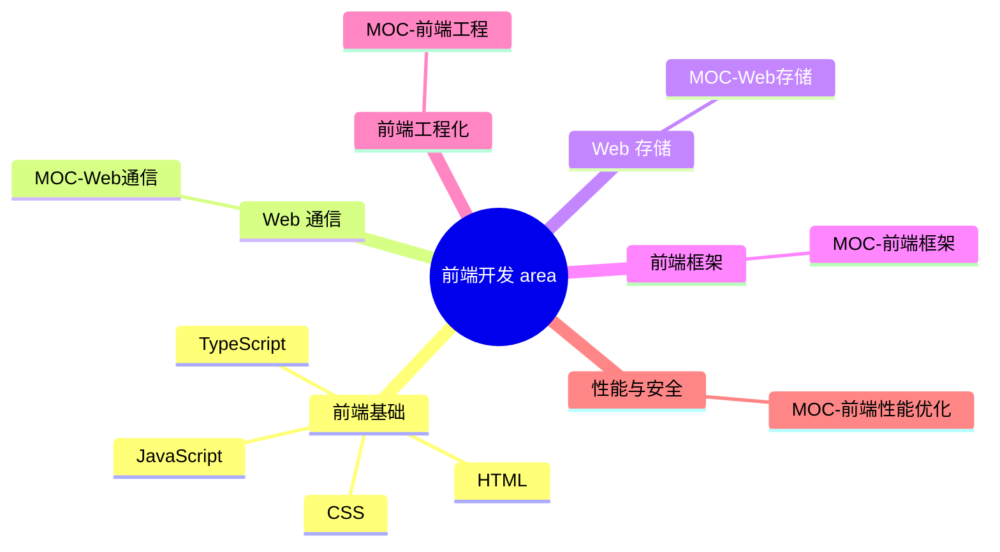

## 概念：知识粒度子系统

> 本库以「领域 → 专题 → 原子」三层粒度组织知识，避免「宏观领域过宽」与「碎片化卡片无体系」两个极端。

**解决的核心痛点**：知识组织的粒度怎么选——太大则无法深入研究，太小则碎片化、无法形成体系。

---

### 核心命题

- 知识粒度是**组织尺度**，与 [[PARA笔记法]] 的「行动导向」、[[卡片盒笔记法]] 的「原子内化」正交
- 三层粒度对应 [[_笔记类型规范]] 的 content-type：宏观=`area`，中观=`moc`，微观=`concept`/`term`/`atomic`
- **area 管责任、MOC 管地图、concept/atomic 管事实**——职责分离是本子系统的核心

---

### 三层粒度模型

| 粒度 | 载体 | 定位 | 判断准则 | 反例 |
|:--- |:--- |:--- |:--- |:--- |
| 宏观·领域 | `area`（20-AREAS） | 责任领域：愿景/里程碑/SOP/健康度 + 专题导航 | 持续数年，作为分类根与导航 | "学好前端"（无法衡量） |
| 中观·专题 | `moc`（30-RESOURCES） | 知识地图 + 研究容器：聚合同主题 concept/sop/term | 资料 5~20 篇高价值内容 / 攻关 1~3 周 | "Three.js"（分支过多） |
| 微观·原子 | `concept`/`term`/`atomic` | 单一概念、事实、可复用模式 | 10 分钟查阅 | 单一 API 说明 |

---

### 核心原则：area 管责任，MOC 管地图

- **area 是动词**：PARA 的「A」= 我负责什么（长期目标、标准流程、健康度）
- **MOC 是名词**：这里有什么知识（聚合索引，不设目标）
- **concept/atomic 是事实**：单一概念与已内化的洞见

**落地规则**：
- area 的「关键领域」段应作为**专题导航**——只列子领域 Area 与专题 MOC 链接，不再平铺 concept
- MOC 内联聚合 concept/sop/term，粒度不足或过细时向上下调整
- 一个专题 MOC 对应一个 NotebookLM 等 AI 研究容器

---

### 粒度判定三问

| 判断维度 | 粒度过大（需拆小） | 黄金粒度 | 粒度过小（需合并） |
|:--- |:--- |:--- |:--- |
| **资料容量** | 几百篇零散文章 | 5~20 篇高价值核心长文/源码/规范 | 单一 API 说明、几行代码 |
| **产出目标** | "学好前端"（无法衡量） | "搞懂 WebGL 深度缓冲区与透明物体渲染排序" | "记住某属性" |
| **学习周期** | 持续数年（职业领域） | 1~3 周（攻关专题） | 10 分钟（查阅文档） |

---

### 粒度不当的调整

- **过宽**（"前端开发"、"JavaScript 基础"）→ 拆小为专题 MOC；拆不出边界的问题集不算专题
- **过碎**（单一 API、几行代码）→ 并入专题 MOC，由 MOC 提供上下文
- **catch-all concept**（概念页堆叠大量子主题）→ 升级为 MOC，或收敛为真 concept

---

### 落地示例：前端领域

- area「[[前端开发]]」只做责任与导航，`专题导航` 段列出 9 个中观节点
- 中观层 = 专题 MOC / 子领域；微观层 = 各 MOC 内联的 concept/term/atomic
- 2026-08-18 重构：前端框架 / Web通信 / Web存储 由 catch-all concept 升级为 MOC

---

### 与 AI 研究容器的对接

- 中观专题 MOC = NotebookLM 笔记本：一个专题放 5~10 篇相关源码、规范、精读
- NotebookLM 负责专题内交叉对比，Obsidian 负责原子沉淀与双链
- MOC 的「待探索」= 专题研究待补缺口

---

### 知识网络

- **父级**：[[本库子系统概述]] — 知识粒度是九大子系统之一
- **相关**：[[_笔记类型规范]]（content-type 定义）· [[本库指南]]（三层粒度理念）· [[PARA笔记法]] · [[卡片盒笔记法]]

---

### 待探索

- [ ] 明确 JS/TS/浏览器 子领域的归位（统一为「子领域全 Area、专题全 MOC」或反之）
- [ ] 为中观层 MOC 补充「资料源列表」字段，对接 NotebookLM 导入
- [ ] 为各专题 MOC 补充攻关周期与产出目标
