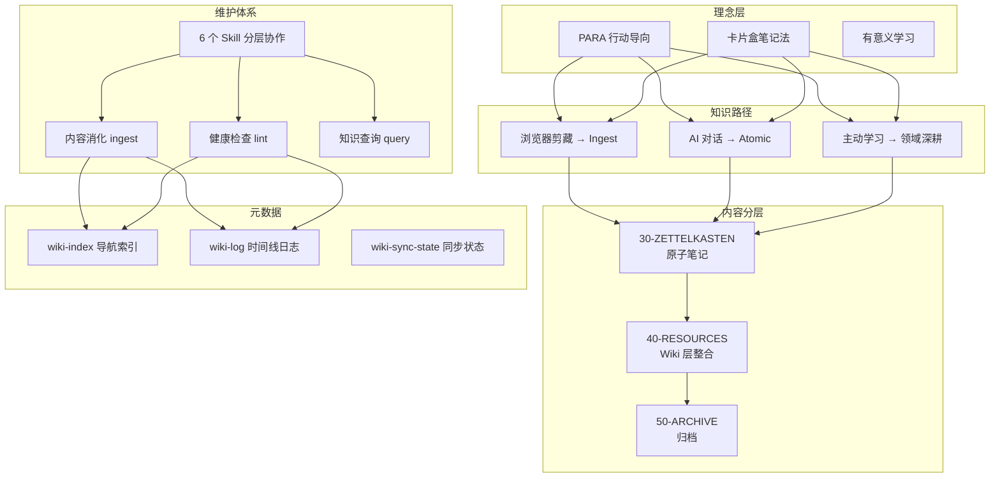

> [!hint]
> 本库设计美学：Less is more.
> 本库设计原则：行动导向、知识地图、系统学习
> 本库方法论：PARA 笔记法 + 卡片盒笔记法 + 有意义学习
> 本库工作流：捕获 → 加工 → 内化 → 行动

---

## 核心理念

本库是一个**个人数字花园**，基于以下原则构建：

1. **PARA 行动导向**：项目（Project）→ 领域（Area）→ 资源（Resource）→ 归档（Archive）
2. **卡片盒内化**：闪念 → 文献 → 永久笔记
3. **物理位置解耦**：目录只管存放位置，元数据决定模板和筛选
4. **保持上下文完整**：笔记内容优先服务于当前上下文，引用原子笔记是补充而非必须
5. **有意义学习**：笔记通过父级、子级、并列、关联等关系作为联系
6. **一致性原则**：所有类型前缀（P-/A-/Q-/MOC-/SOP-/T-/C-/VS-）统一放在 aliases 别名属性中，文件名只使用纯标题

---

## 目录结构

```bash
content/
├── 00-META/           # 系统元数据（本目录）
├── 10-PROJECTS/       # 面向PARA-项目（有明确目标/截止日期）
├── 20-AREAS/          # 面向PARA-领域（需持续关注的范围）
├── 30-ZETTELKASTEN/   # 原创笔记（已内化的知识）
├── 40-RESOURCES/       # 外部资源（剪藏网页等）
├── 50-ARCHIVE/        # 归档（已完成/过时的内容、或者信噪比较低的笔记例如孤立节点）
├── 60-BLOGS/          # 博客文章（长篇主题文章）
├── 80-PRIVATE/        # 私有内容（敏感信息、API keys 等）
├── 90-DIARY/          # 日记（时间序列记录）
└── 99-ASSETS/         # 额外资源（插件配置、附件等）
```

| 目录 | 存放内容 | content-type |
|------|----------|-------------|
| 00-META | 系统元数据 | - |
| 10-PROJECTS | 项目笔记 | `project` |
| 20-AREAS | 领域笔记 | `area` |
| 30-ZETTELKASTEN | 原子笔记 | `atomic` |
| 40-RESOURCES | 整合笔记 | `concept`, `moc`, `sop`, `question`, `term`, `comparison`, `roadmap` |
| 50-ARCHIVE | 归档内容 | - |
| 60-BLOGS | 博客文章 | `article` |
| 80-PRIVATE | 私有内容 | - |
| 90-DIARY | 日记 | `diary` |
| 99-ASSETS | 额外资源 | - |

---

## 模板位置

模板存放在 `content/_templates/`：

| 模板 | 用途 |
|------|------|
| template_area.md | Area 领域模板 |
| template_moc.md | MOC 索引模板 |
| template_atomic.md | 原子笔记模板 |
| template_concept.md | 概念笔记模板 |
| template_term.md | 术语笔记模板 |
| template_sop.md | SOP 流程模板 |
| template_project.md | 项目模板 |
| template_diary.md | 日记模板 |
| template_week.md | 周报模板 |
| template_comp.md | 对比笔记模板 |
| template_question.md | 问题笔记模板 |
| template_article.md | 博客文章模板 |
| template_roadmap.md | 演进路线模板 |
| template_record.md | 事件记录模板 |
| template_new.md | 最小启动模板 |
| template_startup.md | Templater 启动脚本 |

> [!tip]
> 使用 Obsidian 的 Templater 插件创建笔记时，会自动根据 content-type 选择对应模板。

---

## 元数据规范

字段定义、状态流转、content-type 分类、类型对比 → 详见 [[元数据规范]]

**速查**：
- **status 流转**：`fleeting → cultivating → active → completed → archived`（单项不可逆）
- **归档原则**：atomic 永不过期、永不被删除；其他类型过时/孤立时归档而非删除
- **content-type 决定目录**：特定型（project/area/diary/article）由物理位置决定，通用型（atomic → 30-ZETTELKASTEN，其他 → 40-RESOURCES）

---

## 命名规范

文件前缀、目录前缀、子主题命名规则 → 详见 [[命名规范]]

**核心原则**：前缀仅用于 aliases 检索，WikiLink 引用使用纯标题。

---

## 标签规范

### 格式

```bash
#父标签/子标签
```

### 推荐的标签体系

| 父标签 | 子标签 |
|--------|--------|
| #知识管理 | 方法论、工具、工作流、心智模型 |
| #人工智能 | AI 助手、提示词、Agent |
| #前端开发 | JavaScript、React、工程化、CSS |
| #个人成长 | 健康、时间管理、习惯 |
| #工具 | AI、编辑器、效率 |
| #方法论 | PARA、卡片盒、费曼技巧 |
| #认知科学 | 心理学、记忆、学习 |

### 原则

- **content-type ≠ tags**
	- content-type：决定笔记形式（atomic/concept/sop/term），对应模板
	- tags：描述笔记主题，用于横向分类
- 主要用于话题（Topic）和媒介（Medium）
- 无数量限制
- 无特殊含义标签

---

## 工作流

### 逻辑 1：PARA 行动导向

```bash
需要做事 → 创建项目(P-) → 关联领域(A-) → 项目/领域发展中发散观点 → 形成原创笔记
     ↓
项目结束 / 领域不活跃 → 归档(50-ARCHIVE)
```

- **触发**：有明确要做的事情
- **路径**：项目 → 领域 → 原创笔记
- **补充来源**：30-ZETTELKASTEN（原创）和 40-RESOURCES（外部）

### 逻辑 2：卡片盒捕获加工

```bash
对某领域感兴趣 → 领域笔记(A-/MOC-)发散 → 形成概念/原子笔记 → 加工内化
```

- **触发**：兴趣驱动
- **路径**：领域 → 原创笔记
- **不需要项目**

### 生命周期

```bash
fleeting → cultivating → active → completed → archived
```

---

## 系统设计

本库由多层系统组合而成，各方法论在不同层面发挥作用。以下是整体架构总览：



### 组件总览

| 层级      | 组件                         | 位置                     | 职责        |
| ------- | -------------------------- | ---------------------- | --------- |
| **理念**  | PARA + ZK + 有意义学习          | 本指南 → 核心理念             | 为什么这么组织知识 |
| **方法**  | 三条知识获取路径                   | SOP-知识获取工作流            | 知识如何进入系统  |
| **分层**  | Raw → Wiki → Archive       | 核心理念 + LLM Wiki 系统     | 知识存放位置和状态 |
| **维护**  | 6 个 Skill                  | _skills-overview.md    | 谁负责哪些操作   |
| **规则**  | ingest/lint/query/sync 各规则 | 00-META/Specification/ | 具体执行标准    |
| **元数据** | index/log/state            | 00-META/Index/ + Log/  | 系统运行记录    |

### 如何索引

- **想了解设计哲学** → 本指南 → 核心理念
- **想知道知识怎么进入系统** → SOP-知识获取工作流
- **想知道 LLM 怎么维护** → llm-wiki-schema + _skills-overview
- **想查看当前知识库状态** → wiki-index + wiki-log
- **想执行具体操作** → 各 `_rules.md` 和 skill 文档

---

## 索引入口

- [[本库领域索引|领域索引]] - 查看所有领域
- [[方法论汇总]] - 查看所有方法论
- [[标签汇总]] - 查看所有标签
- [[工作流汇总]] - 查看所有工作流

---

## 工具链

- Obsidian - 笔记软件
- Templater - 模板生成
- Linter - 格式规范化
- Dataview - 数据查询
- Excalidraw - 绘图
- Quartz - 静态网站生成

## LLM Wiki 系统

本库已集成 LLM Wiki 维护系统，让 AI 持续构建和维护知识库：

- **[[llm-wiki-schema]]** — LLM 的作业指南，定义 ingest/query/lint 工作流
- **[[wiki-index]]** — 知识库导航索引，按 content-type 分类
- **[[wiki-log]]** — append-only 时间线日志，记录所有操作
- **wiki-sync-state** — 记录 git 提交记录，方便 LLM 进行变更检测

### 三层架构

| 层级 | 位置 | 说明 |
|------|------|------|
| Raw sources | `30-Zettelkasten/` | 原子笔记，source of truth |
| Wiki 层 | `40-RESOURCES/` | concept/moc/sop/term/comparison，LLM 维护 |
| Archive | `50-ARCHIVE/` | 过时知识 |

### 工作流

- **ingest**：新笔记 → 更新相关 wiki 页面 → 更新索引 → 记录日志
- **query**：查 wiki-index → 读 wiki 层 → 深入 atomic → 综合回答
- **lint**：矛盾检测、孤儿页面、概念缺口、索引一致性
