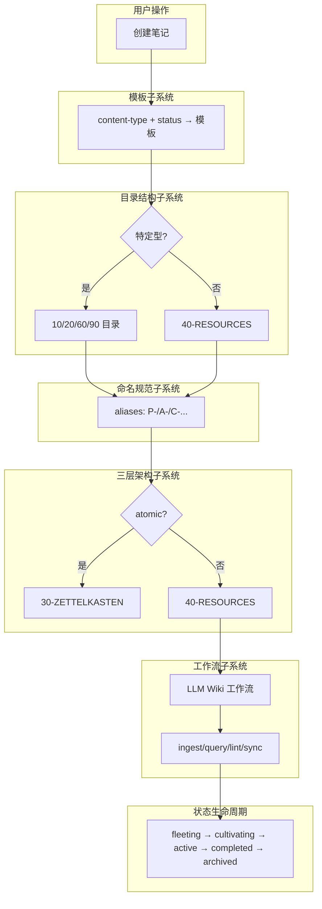

## 概念：本库子系统概述

> 本库是基于 PARA 笔记法 + 卡片盒笔记法构建的个人数字花园，集成 LLM Wiki 维护系统。

**解决的核心痛点**：如何让笔记系统既有行动导向（PARA），又有知识内化（Zettelkasten），还能被 LLM 持续维护？

---

### 核心命题

- [[本库通过目录结构子系统实现 PARA 映射]]
	- **原理**：数字前缀排序 + 语义由目录决定（10-PROJECTS → P，20-AREAS → A，40-RESOURCES → R）
- [[本库通过 content-type 分类子系统决定笔记形式和目录]]
	- **原理**：特定型由位置决定，通用型由 content-type 决定 → 40-RESOURCES
- [[本库通过三层架构子系统实现知识的分层管理]]
	- **原理**：Raw sources (30) → Wiki 层 (40) → Archive (50)，atomic 是 source of truth
- [[本库通过工作流子系统实现 LLM 自动化维护]]
	- **原理**：ingest/query/lint/sync/inbox-review 工作流分工明确
- [[本库通过命名规范子系统实现一致性]]
	- **原理**：前缀放 aliases，文件名用纯标题，正文引用更通顺

---

### 运行机制



---

### 关键子系统

#### 1. 目录结构子系统

| 目录 | PARA 映射 | 决定方式 |
|------|-----------|----------|
| `10-PROJECTS/` | P (项目) | 位置决定 |
| `20-AREAS/` | A (领域) | 位置决定 |
| `30-ZETTELKASTEN/` | Zettelkasten | content-type |
| `40-RESOURCES/` | R (资源) | content-type |
| `50-ARCHIVE/` | Archive | 状态决定 |
| `60-BLOGS/` | article | 位置决定 |
| `90-DIARY/` | diary | 位置决定 |

#### 2. content-type 分类子系统

| 类型                                              | 目录              | 模板               | 决定方式         |
| ----------------------------------------------- | --------------- | ---------------- | ------------ |
| project                                         | 10-PROJECTS     | template_project | 位置           |
| area                                            | 20-AREAS        | template_area    | 位置           |
| article                                         | 60-BLOGS        | template_article | 位置           |
| diary                                           | 90-DIARY        | template_diary   | 位置           |
| atomic                                          | 30-ZETTELKASTEN | template_atomic  | content-type |
| concept/moc/sop/term/comparison/question/record | 40-RESOURCES    | template_*       | content-type |

#### 3. 命名规范子系统

```bash
前缀规则（aliases）：
P-    → project
A-    → area
Q-    → question
MOC-  → moc
SOP-  → sop
T-    → term
C-    → concept
VS-   → comparison
R-    → record
(atomic 无前缀)

一致性原则：前缀放 aliases，文件名用纯标题
```

#### 4. 状态生命周期子系统

```bash
fleeting → cultivating → active → completed → archived
  ↓           ↓            ↓         ↓          ↓
闪念/草稿    培育中       活跃      已完成     已归档
                                               ↑
                                          atomic 除外
```

#### 5. 三层架构子系统

| 层级 | 目录 | 负责方 | 内容 |
|------|------|--------|------|
| Raw sources | 30-ZETTELKASTEN | 你 | atomic，source of truth |
| Wiki 层 | 40-RESOURCES | LLM | concept/moc/sop/term/comparison/question |
| Archive | 50-ARCHIVE | 你 + LLM | 过时知识 |

#### 6. 工作流子系统（LLM Wiki）

| 工作流 | 触发 | 职责 |
|--------|------|------|
| ingest | 新 atomic | atomic → wiki 层整合 |
| inbox-review | 用户要求 | 审核 Inbox，判断类型，移动目录 |
| query | 用户提问 | wiki 层查询回答 |
| lint | 定时/手动 | 健康检查（矛盾/孤儿/缺口/过时/一致性） |
| sync | 笔记变更 | 状态同步，不记录 wiki-log |

---

### 子系统关系

```bash
用户操作 → 模板子系统 → 目录结构子系统 → 命名规范子系统 → 三层架构子系统 → 工作流子系统 → 状态生命周期
                              ↓
                        wiki-index (导航)
                              ↓
                         wiki-log (记录)
```

**核心原则**：
- 目录结构是物理组织，content-type 是逻辑分类
- aliases 是检索索引，文件名是语义标题
- atomic 是 source of truth，三层架构是知识分层
- 工作流是 LLM 自动化维护的职责边界

---

### 知识图谱

- **父级概念**：[[本库指南]] — 本库的核心设计理念和规范文档
- **子级概念**：
	- [[PARA笔记法]] — 行动导向的项目/领域/资源/归档分类
	- [[卡片盒笔记法]] — 原子笔记和双向链接的知识内化方法
	- [[LLM Wiki]] — LLM Wiki 方法论
	- [[llm-wiki-schema]] — LLM 维护知识库的作业指南
- **相关概念**：
	- [[wiki-index]] — 知识库导航索引
	- [[wiki-log]] — append-only 时间线日志
	- [[_content-type-rules]] — content-type 定义和内联规则
	- [[_ingest-rules]] — ingest 工作流
	- [[_lint-rules]] — lint 工作流

---

### 参考延伸

- [[本库指南]] — 本库的核心设计理念、目录结构、规范和工作流
- [[llm-wiki-schema]] — LLM Wiki 作业指南索引
