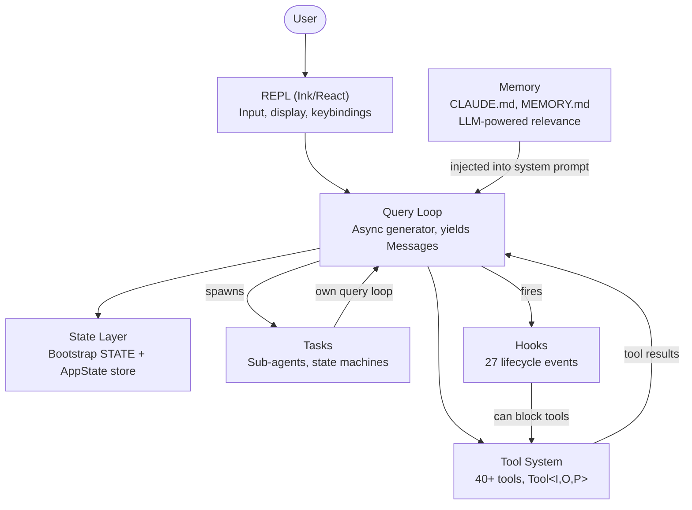

## 背景

现在分析的是 **2026 年公开的 Claude Code 源码/泄露源码分析**，而不是 Anthropic 当前内部源码。2026 年公开的 `2.1.88` source map 被用于恢复约 512K 行 TypeScript 源码

## CC核心架构



- [[ClaudeCode-Query Loop]]
- Tool System
- Tasks
- State
- Memory
- Hooks

## CC核心机制

ClaudeCode的Agent Loop很简单：

```bash
Model→Tool Call→Execute→Result→Model→...
```

真正复杂的是外围：

```bash
             ┌─ Permission
             ├─ Context Compaction
             ├─ Hooks
             ├─ Tools
             ├─ Subagents
             ├─ Memory
Query Loop ─┼─ State
             ├─ MCP
             ├─ Skills
             └─ Session Persistence
```

## 资源

- [alejandrobalderas/claude-code-from-source: Architecture, patterns & internals of Anthropic's AI coding agent — reverse-engineered from source maps](https://github.com/alejandrobalderas/claude-code-from-source/tree/main)
