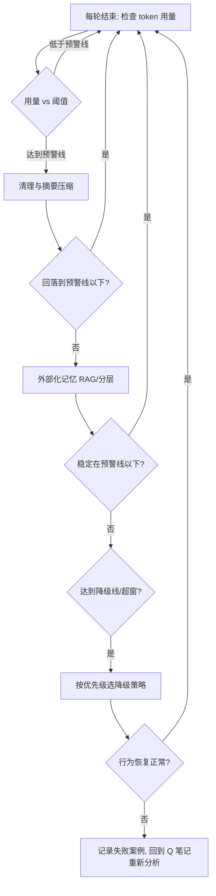

## SOP：管理 Context 长度并执行降级

> 在长任务 Agent 中，避免 Context 因过长或超窗导致的行为退化（目标遗忘、约束失效、重复劳动、跑偏）。
> **问题溯源**：本 SOP 是 [[Context过长会怎样？|Q-Context 过长为什么仍会影响 Agent 行为]] 和 [[Context Window用完之后会怎样？|Q-Context Window 用完之后会怎样]] 的收敛成果——经过多方案对比和实践验证，固化为标准流程。

### 目标与边界

目标：让 Context 在增长过程中始终保持"装得对"，并在接近/超出窗口时有序降级，保证 Agent 行为不脱节。
边界：覆盖监控、压缩、外部化、降级四类手段；不涉及具体模型的窗口实现细节，也不涉及检索系统的内部实现。

---

### 适用场景

- 场景 1：多轮对话 Agent，Context 持续增长
- 场景 2：长任务 Agent（如自动修多个 bug、多步工具调用）
- 场景 3：已出现"未超窗但行为跑偏"或"超窗后失忆"症状的系统

---

### 流程图解



---

### 核心步骤

1. **步骤 1：设定阈值并监控**
	 - 定义预警线（如窗口 70%）和降级线（如 90%），每轮结束检查 token 用量
	 - 注意：用量 < 预警线继续；≥ 预警线进步骤 2；≥ 降级线跳步骤 4

2. **步骤 2：清理与摘要压缩（预警阶段）**
	 - 删除无关轮次、对旧对话摘要、把"当前目标 + 硬约束"显式重写到 Context 末尾
	 - 注意：利用近因效应，关键信息放结尾；摘要须保留文件名/变量/约束/决策

3. **步骤 3：外部化记忆（压缩不足时）**
	 - 历史细节移入外部存储（RAG / 分层记忆），Context 内只留摘要 + 检索入口
	 - 注意：确保召回可用，否则等于失忆

4. **步骤 4：降级策略（达到降级线 / 超窗）**
	 - 按优先级选择：摘要压缩 > 分层记忆 > RAG > 滑动窗口 > 截断
	 - 注意：**系统提示 + 当前目标 + 硬约束必须始终保留**，绝不进入被丢弃部分

---

### 实践/示例

**代码修复 Agent 的降级示例**

```bash
[第1轮]  用户：修复 login.py 空指针 bug
[第3-20轮] 讨论 logging、连接池、测试框架（第8轮随口提"用 async 重写"）
[第21轮] 用户：现在把 login.py 的 bug 修掉

→ 达到预警线，触发步骤 2：
   摘要掉 3-20 轮的周边讨论，末尾重写：
   「当前目标：修复 login.py 空指针 bug；约束：只改 test/，不动 src/」
→ Agent 正确做最小修复，未被第8轮"async 重写"带偏
```

**降级策略优先级表**

| 优先级 | 策略 | 已知失效模式 |
|---|---|---|
| 1 | 摘要压缩 | 有损，多次摘要误差累积 |
| 2 | 分层记忆 | 工程复杂度高 |
| 3 | 检索式记忆 (RAG) | 检索失败即失忆 |
| 4 | 滑动窗口 | 长期依赖断裂 |
| 5 | 截断 | 忘记系统提示/原始目标（最后手段） |

### 常见坑点

- ⛔ **反模式**：直接截断最旧消息——系统提示、原始目标、早期约束往往最先被丢，导致 Agent "忘记自己是谁、要干什么"。
- ⛔ **反模式**：无限制地"摘要的摘要"——误差累积，具体变量名/API 签名丢失。
- 🔧 **排查**：如果 Agent 开始重复劳动或循环调用同一工具，检查是否丢了已执行记录 → 复查步骤 2/3 的摘要与召回。
- 🔧 **排查**：如果 Agent 改了不该改的文件，检查早期硬约束是否仍在 Context 中 → 确认步骤 4 的保留约束。
- 🔧 **排查**：如果压缩后仍超线，检查是否遗漏了无关轮次的清理 → 回到步骤 2。

---

### 知识图谱

- **相关概念**：
	- [[Context Engineering]]
	- [[Context Quality]]
- **问题来源**：
	- [[Context过长会怎样？|Q-Context 过长为什么仍会影响 Agent 行为]] — 未超窗但行为退化的成因
	- [[Context Window用完之后会怎样？|Q-Context Window 用完之后会怎样]] — 超窗后的失效模式与降级策略
