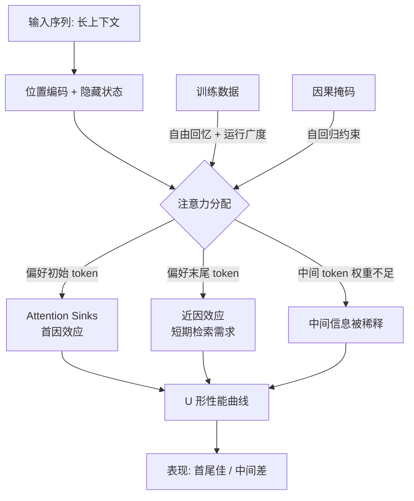

## 概念：Lost in the Middle

> 大语言模型在处理长上下文时，对位于输入序列**中间位置**的信息利用效率显著低于首尾位置，性能随关键信息位置变化呈现 **U 形曲线**。

**解决的核心痛点**：长上下文窗口的"名义容量"与"实际可用容量"之间存在巨大鸿沟——模型宣称能处理 128K token，但关键信息落在中间时可能完全被忽略。这一概念揭示了"能读进去"不等于"能用起来"的本质差距，为长上下文系统的设计（如 RAG 的证据排序、Prompt 结构）提供了实证依据。

---

### 核心命题

> 核心命题引用 atomic 笔记（陈述句观点），每个命题是一句话洞见

- [[LLM 的性能随关键信息位置呈 U 形曲线]]
	- **原理**：信息在开头（首因）或结尾（近因）时表现最佳，在中间时显著下降。Liu et al. 在多文档问答与键值检索任务中首次系统量化该曲线。
- [[Lost in the Middle 独立于检索质量]]
	- **原理**：即使模型能完美检索所有相关信息，仅因输入长度增加，性能仍下降 13.9%–85%。掩码所有无关 token 后性能仍随长度退化，证明问题出在序列长度处理本身，而非"找不到"信息。
- [[Attention Sinks 是首因效应的结构性来源]]
	- **原理**：Transformer 对序列初始 token 存在不成比例的注意力偏好——这些 token 语义极少却吸引大量权重，用于维持注意力分布稳定。消融 attention sinks 会选择性消除首因效应，但不影响近因效应。
- [[Lost in the Middle 是训练数据塑造的理性适应]]
	- **原理**：LLM 从零在自由回忆（长期检索）与运行广度（短期检索）任务上联合训练时，U 形行为自发涌现。近因效应源于近期信息短期需求，首因效应源于均匀长期检索需求与因果掩码的交互。
- [[LLM 可能知晓中间信息的位置但无法告知]]
	- **原理**：探针实验显示，隐藏表示中确实编码了中间位置目标信息的位置，但生成阶段无法有效利用——这是检索与利用之间的**解耦**。

---

### 运行机制

**三层解释**：

1. **注意力沉没（Attention Sinks）**：初始 token 充当"注意力垃圾桶"，维持分布稳定，代价是中间位置注意力不足。
2. **训练数据隐式塑造**：U 形曲线是对两类检索需求的理性适应，非模型缺陷。
3. **隐藏状态位置偏差**：除位置嵌入外，特定隐藏状态通道携带位置信息。仅缩放单个通道即可提升最高 15.2% 性能。

---

### 关键区别

| 维度 | [[Lost in the Middle]] | [[灾难性遗忘]] |
|:--- |:--- |:--- |
| **核心逻辑** | 推理时的上下文内现象（工作记忆限制） | 微调时对预训练知识的参数层面覆盖 |
| **时间尺度** | 单次推理内 | 训练/微调过程中 |
| **可逆性** | 可通过推理策略缓解（重排序、复述） | 需重训练或持续学习缓解 |
| **适用场景** | 长文档问答、RAG、多轮对话 | 持续学习、领域微调 |

| 维度 | [[Lost in the Middle]] | [[检索失败]] |
|:--- |:--- |:--- |
| **核心逻辑** | 找到了但用不起来（利用失败） | 根本没找到（检索失败） |
| **证据** | 掩码无关 token 后性能仍随长度下降 | 召回率指标直接下降 |
| **解决方向** | 注意力校准、位置重排序、训练干预 | 改进检索器、嵌入模型 |

---

### 适用范围

- ✅ **适用场景**
	- **RAG 系统的证据排序**：关键证据应放在上下文首尾，避免"中间迷失"。
	- **长文档问答**：需注意答案位置对模型表现的系统性影响。
	- **多轮对话历史管理**：重要历史信息应放在近期或显式复述。
	- **Prompt 工程**：指令与关键约束应置于开头或结尾。
- ⛔ **误用**
	- **将所有信息都塞到首尾**：会导致首尾过载、中间空洞，且受上下文窗口限制。
	- **认为"窗口大就能用"**：名义容量 ≠ 有效容量，128K 窗口不代表 128K 可用。
- **失效边界**
	- **输入长度接近窗口上限时**：位置偏差模式可能偏移，需以**相对输入长度**而非固定位置理解偏差。
	- **多段相关信息场景**：偏差不仅取决于单条信息位置，还受信息片段**间距**影响。LongPiBench 显示单信息偏差已更鲁棒，但多信息间距偏差仍显著。
	- **短上下文任务**：当输入远小于窗口时，U 形曲线不明显。

---

### 批判

- **外部批判**
	- **长上下文模型支持者**：随着模型架构改进（如 Ring Attention、Mamba）与训练数据优化，U 形曲线可能被大幅削弱，该概念或成历史阶段性现象。
	- **RAG 研究者**：认为"Lost in the Middle"本质是检索质量问题，若检索精度足够高，位置偏差可忽略——但掩码实验反驳了这一点。
- **内在张力**
	- **"知晓但不告知"的解耦**：隐藏表示编码了位置信息却无法利用，说明检索与生成之间存在尚未解释的鸿沟。
	- **训练数据适应 vs 架构缺陷**：U 形曲线究竟是理性适应还是缺陷？若是适应，为何在多数任务中表现为性能损失？
	- **相对 vs 绝对位置**：偏差究竟由绝对位置还是相对位置驱动，学界尚无定论。

---

### FAQ

> 与本概念相关的开放性问题，先理解问题（发散），再看标准流程（收敛）

- [[什么是“Lost in the Middle”现象？]]
- [[Lost in the Middle 和检索失败有何区别？]]
- [[如何判断我的模型是否存在中间迷失问题？]]
- [[长上下文窗口越大，Lost in the Middle 越严重吗？]]
- [[多段相关信息场景下，位置偏差如何变化？]]

---

### SOP

> 与本概念相关的标准操作流程，是 FAQ 中问题经过实践验证后的收敛成果

- [[缓解 Lost in the Middle 的 Prompt 设计流程]] — 关键信息首尾放置、显式复述、分段处理
- [[长上下文 RAG 证据重排序流程]] — 检索后按相关性重排，避免关键证据沉底
- [[长上下文模型评估流程]] — 使用位置受控的基准测试量化 U 形曲线
- [[注意力偏差校准流程]] — 剥离位置偏差，提升中间位置利用率

---

### 知识图谱

> 知识图谱链接 term（术语定义）和相关 concept，建立概念关系网络

- **父级概念**：[[Context Engineering]] — 新知识的概括性上位概念
- **子级概念**：
	- [[Attention Sinks]] — 首因效应的结构性机制
	- [[U 形曲线]] — 性能随位置变化的典型形态
	- [[位置偏差]] — 更广泛的位置相关性能偏差
	- [[知晓但不告知]] — 检索与利用解耦现象
- **并列概念**：
	- [[近因效应]] — 末尾位置偏好
	- [[首因效应]] — 开头位置偏好
	- [[灾难性遗忘]] — 参数层面的知识覆盖
- **相关概念**：
	- [[RAG]] — 检索增强生成，受本现象直接影响
	- [[位置编码]] — RoPE、ALiBi 等，与位置偏差相关
	- [[注意力机制]] — Transformer 核心，偏差来源之一
	- [[上下文窗口]] — 名义容量与有效容量的差距
- **参考文章**
	- Liu, N. F. et al. (2024). Lost in the Middle: How Language Models Use Long Contexts. *TACL*, 12, 157–173.
	- Yu, Y. et al. (2025). Mitigate Position Bias in LLMs via Scaling a Single Hidden States Channel. *Findings of ACL 2025*.
	- Tian, R. et al. (2025). Distance between Relevant Information Pieces Causes Bias in Long-Context LLMs. *Findings of ACL 2025*.
	- Gao, M. et al. (2024). Insights into LLM Long-Context Failures: When Transformers Know but Don't Tell. *Findings of EMNLP 2024*.
	- FilM-7B: Make Your LLM Fully Utilize the Context. arXiv:2404.16811.
	- Found in the Middle: Calibrating Positional Attention Bias Improves Long Context Utilization. arXiv:2406.16008.
