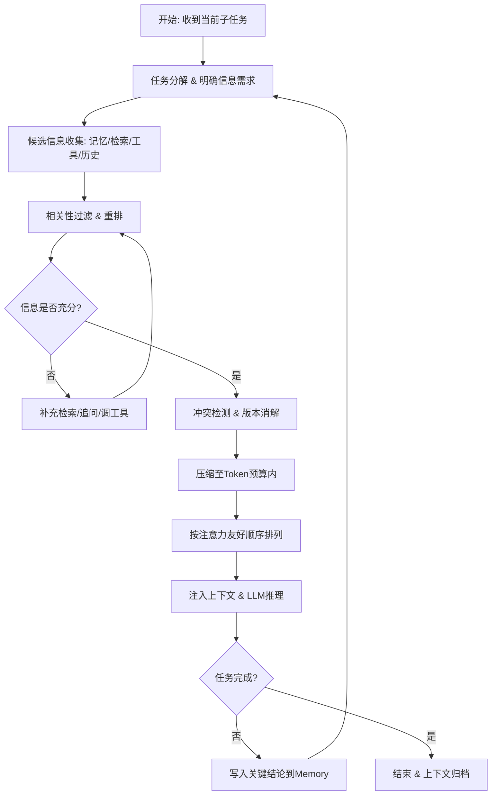

## SOP：构建高质量上下文

> 在有限上下文窗口内，动态选择、组织、压缩信息，使LLM每步推理都拿到"恰到好处"的上下文。
> **问题溯源**：本 SOP 是 [[Q-Agent上下文质量如何保障]] 的收敛成果——经过多方案对比和实践验证，固化为标准流程。

---

### 目标与边界

**目标**：在Agent运行时，持续构造满足 **Relevant + Sufficient - Irrelevant - Conflicting** 最大化平衡的上下文，使LLM在每一步都能做出正确决策。

**边界**：

- 适用于**多轮自主决策**的Agent（ReAct、Plan-Execute、Multi-Agent）
- 不适用于单轮QA、纯RAG问答等无状态场景
- 不涉及模型微调、权重层优化
- 假设已有基础的检索/工具调用能力

---

### 适用场景

- 场景 1：Agent多轮推理后，上下文被工具输出、历史对话撑爆，需要动态压缩
- 场景 2：RAG召回结果信噪比低，LLM被无关片段干扰，需要重排+过滤
- 场景 3：多Agent协作中，子Agent原始输出污染主Agent上下文，需要隔离
- 场景 4：长会话中用户改口、工具结果与记忆冲突，需要冲突检测与版本管理

---

### 流程图解



---

### 核心步骤

1. **任务分解 & 明确信息需求**：把当前任务拆成子任务，显式列出每个子任务需要哪些信息
	 - 注意：不要笼统地问"需要什么"，要具体到字段/事实/工具结果

2. **候选信息收集**：从Memory、RAG、工具返回、对话历史四个来源并行收集
	 - 注意：此阶段**宁多勿少**，过滤留给下一步

3. **相关性过滤 & 重排**：用embedding或LLM打分，按相关性排序，截断低分项
	 - 注意：保留阈值要动态，避免激进过滤伤及Sufficient

4. **充分性检查**：显式检查是否覆盖所有子任务的关键信息
	 - 注意：充分性往往在推理失败后才暴露，需配合**主动追问/再检索**机制

5. **冲突检测 & 版本消解**：对比多来源信息，按"最新工具结果 > 记忆 > 历史对话"优先级消解
	 - 注意：冲突不一定都要消除，但**必须显式标注**，让LLM知道哪个更权威

6. **压缩至Token预算**：按预算配额（System/Memory/Tools/History）压缩超限部分
	 - 注意：压缩优先摘要化，其次丢弃中间过程，最后才丢关键结论

7. **按注意力友好顺序排列**：关键信息放开头或结尾，避开"Lost in the Middle"
	 - 注意：不同模型格式敏感度不同（Claude偏好XML，GPT偏好Markdown）

8. **推理后写入Memory**：把本轮关键结论、状态变更写入短期/长期记忆
	 - 注意：写入要**原子化+带时间戳**，方便后续冲突消解

---

### 实践/示例

**Context Quality 评分函数（运行时自评估）**：

```python
def context_quality(ctx, task):
    relevant    = sum(score_relevance(c, task) for c in ctx.items)
    sufficient  = coverage_check(ctx, task.subgoals)      # 0~1
    irrelevant  = sum(1 - score_relevance(c, task) for c in ctx.items)
    conflicting = detect_conflicts(ctx.items)             # 冲突对数

    # 边际递减 + 阈值效应
    gain = f(relevant) + g(sufficient)
    cost = h(irrelevant) + k(conflicting)
    return gain - cost
```

**每类信息的Token预算示例**：

| 类型 | 预算占比 | 超限策略 |
|------|---------|---------|
| System Prompt | 10% | 固定，不压缩 |
| Memory | 20% | 递归摘要 |
| Tool Definitions | 15% | 按需动态注入 |
| Tool Results | 25% | 字段级截断 |
| Conversation History | 30% | 摘要 + 选择性丢弃 |

**冲突消解优先级**：

```bash
最新工具结果  >  长期Memory  >  短期对话历史  >  检索文档
```

---

### 常见坑点

- ⛔ **反模式**：把工具返回的原始JSON全量塞进上下文
	 - 🔧 **排查**：如果Token消耗异常快，检查工具结果是否未经字段级截断
- ⛔ **反模式**：为追求Relevant而激进过滤，导致Sufficient不足
	 - 🔧 **排查**：如果Agent频繁"答非所问"或"信息不全"，检查过滤阈值是否过严
- ⛔ **反模式**：让子Agent原始输出直接进主Agent上下文
	 - 🔧 **排查**：如果主Agent被无关细节干扰，检查是否缺少Context Isolation层
- ⛔ **反模式**：新信息写入Memory时未失效旧信息
	 - 🔧 **排查**：如果Agent引用过期结论，检查Memory Update是否有版本戳+失效逻辑
- ⛔ **反模式**：关键信息放在上下文中部
	 - 🔧 **排查**：如果LLM忽略关键约束，检查是否踩中"Lost in the Middle"
- ⛔ **反模式**：只做静态Prompt，不做动态注入
	 - 🔧 **排查**：如果工具schema占大量token但多数轮次用不到，改为Just-in-Time注入

---

### 知识图谱

- **相关概念**：
	- [[上下文窗口|Context Window]]
	- [[Token Budgeting]]
	- [[Memory Management]]
	- [[RAG重排与上下文精度]]
	- [[ReAct循环中的Observation精简]]
	- [[Multi-Agent上下文隔离]]
	- [[Lost in the Middle现象]]
- **问题来源**：
	- [[Q-Agent上下文质量如何保障]] — 此 SOP 解决的问题来源

---
