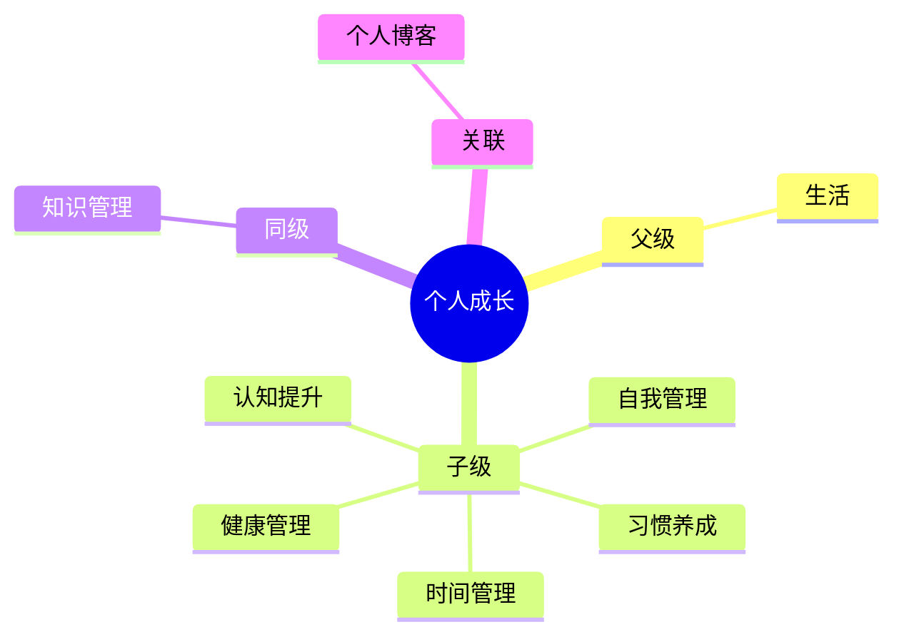

## Area: 个人成长

> 持续提升自我认知、优化习惯回路与自我管理系统，实现个人潜能最大化。

---

### 领域知识图谱

---

### 领域定义

- **核心范畴**：认知提升（思维方式、元认知）、习惯养成、自我管理（目标设定、复盘、精力分配）
- **不包括**：具体职业技能细节（属各专业领域）、健康与精力管理（属 [[A-健康管理]]）、个人品牌与写作输出（属 [[个人博客|MOC-个人博客]]）
- **与相关领域的区别**：关注"人的操作系统"——思维模式、习惯回路与自我管理，而非单一领域技能

---

### 里程碑

- **愿景**：成为更好的自己，实现工作生活平衡
- **里程碑**：
	- [ ] 阶段 1：持续提升专业技能（与各专业领域协同推进）
	- [ ] 阶段 2：建立稳定的习惯与自我管理系统
	- [ ] 阶段 3：形成可持续的认知提升节奏

---

### 专题导航

> 个人成长领域中观层按「子领域 + 专题 MOC」组织：认知提升 / 时间 / 健康 / 体验。

- **认知提升**
	- [[个人认知维度建设]] — 自我认知是成长的基础
	- [[如何学习快速陌生的领域]] — 快速切入陌生领域的方法
	- [[能力提升]] — 能力成长路径
	- [[哲学与认知]] — 哲学与认知的交叉探索
- **时间与精力**
	- [[A-时间管理]] — 精力分配、任务优先级
- **健康基础**
	- [[A-健康管理]] — 身体与精力是自我管理的根基
- **体验与生活**
	- [[心流体验]] — 心流状态的机制与培养
	- [[电影收藏]] — 电影观影记录
- **生活子领域**
	- [[求职]] — 求职就业领域
	- [[宗教与神秘学]] — 宗教与神秘学探索

---

### SOP

> 该领域的标准化操作流程

- [[如何在四象限中应用精力成本]] — 任务优先级与精力周期匹配

---

### FAQ

> 该领域的常见问题

- [[如何区分Project和Area？]] — PARA 中两者的边界

---

### 领域健康度

| 维度 | 状态 | 说明 |
|:---:|:---:|:---|
| 目标进展 | 🟡 | 有多个项目进行中 |
| 认知更新 | 🟢 | 持续学习和成长 |
| 行动频率 | 🟡 | 按计划推进 |
