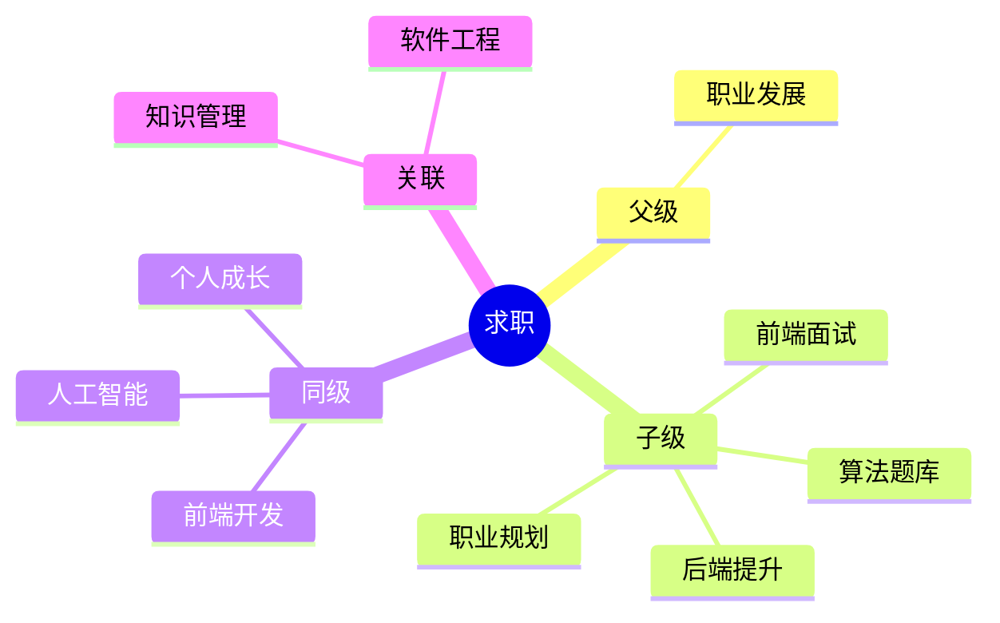

## Area: 求职

> 求职备战的责任领域：把散落的面试题库、算法训练、职业规划收拢为可执行的备战体系。

---

### 领域知识图谱

---

### 领域定义

- **核心范畴**：面试题整理与复习、算法训练、简历与作品集、职业规划与求职策略
- **不包括**：日常工作项目实战、深度技术原理研究（属于各自领域）
- **与相关领域的区别**：前端开发/人工智能 是"学什么"，求职是"如何被评估与录取"——前者积累能力，后者面向市场呈现能力

---

### 里程碑

- **愿景**：建立可持续的求职方法论，顺利拿下心仪 offer
- **里程碑**：
	- [ ] 系统过一遍前端面试真题库（MOC-前端面试真题库）
	- [ ] 算法题库刷满高频题 + 每日一题保持手感
	- [ ] 完成简历与作品集，模拟面试 ≥ 3 轮

---

### 专题导航

> 求职领域中观层按「专题 MOC + 题集」组织，各题集已聚合到对应 MOC。

- **前端面试**
	- [[前端面试真题库]] — 前端面试题总索引
	- [[前端面试知识清单]] — 面试知识点清单
	- [[前端面试常见问题]] — 常见问题汇总
	- [[Vue 面试题]] / [[React面试题]] / [[Angular面试题]] — 各框架面试题
	- [[JS&TS相关问题]] / [[CSS相关问题]] / [[网络协议相关问题]] — 分主题题集
- **算法训练**
	- [[算法真题库]] — 算法真题总索引
	- [[算法与数据结构]] — 算法知识 MOC
	- [[每日一题题单]] / [[每日一题JS题单]] — 刷题计划
- **能力与方向**
	- [[前端能力提升指南]] / [[后端能力提升指南]] — 能力进阶路线
	- [[技能矩阵]] — 技能盘点
	- [[简历素材]] — 前端岗位简历信息素材
	- [[职业规划]] / [[职业发展思考]] — 职业方向
- **浏览器与工具题**
	- [[浏览器兼容性问题]] — 兼容性题集
	- [[浏览器原理与运行机制相关问题]] — 浏览器原理题集

---

### SOP

> 该领域的标准化操作流程

- [[前端面试的算法提升指南]] — 算法部分系统化提升流程

---

### FAQ

> 该领域的常见问题与模拟演练

- [[模拟面试01]] — 面试演练记录
- [[模拟面试02]] — 面试演练记录
- [[ML求职面试指南]] — ML 研究岗面试准备指南

---

### 领域健康度

| 维度 | 状态 | 说明 |
|:---:|:---:|:---|
| 目标进展 | 🟢 | 题库体系已建成，冲刺复习 |
| 认知更新 | 🟢 | 面试知识点持续整理 |
| 行动频率 | 🟢 | 每日一题保持中 |
