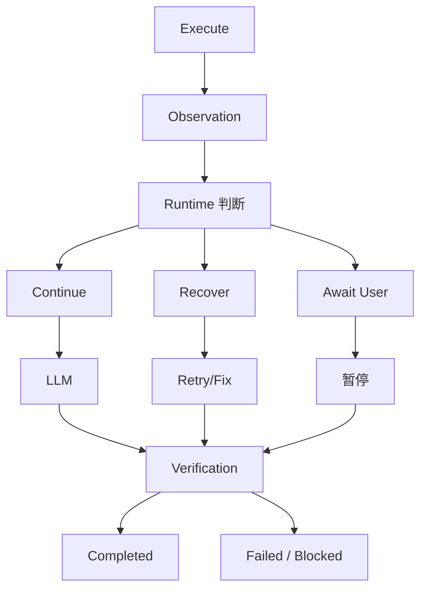

> AgentLoop 在什么情况下应该继续、重试、等待用户、失败退出或正常结束。

## 五种控制行为的概念分类

| 控制行为              | 含义                   | 典型场景              |
| ----------------- | -------------------- | ----------------- |
| **继续 Continue**   | 根据当前结果进入下一步正常执行      | 文件读取成功，继续分析代码     |
| **重试 Retry**      | 再次执行失败的操作            | 网络暂时不可用，重新请求      |
| **等待用户 Await**    | 暂停相关执行，等待用户提供信息或授权   | 操作需要批准，或者任务存在关键歧义 |
| **失败退出 Fail**     | 无法继续满足任务要求，结束执行并报告失败 | 达到重试上限，仍无法通过必需测试  |
| **正常结束 Complete** | 满足系统规定的终止条件，结束任务     | 必需检查已完成，结果满足验收要求  |

系统不能只根据LLM的回答决定执行路径，而应该结合执行状态、策略和终止条件。

## 怎样判定应该进行哪种控制行为？

| 控制行为              | 判断标准                 | 典型场景                 |
| ----------------- | -------------------- | -------------------- |
| **继续 Continue**   | 根据当前结果进入下一步正常执行      | Agent成功读取了文件，但尚未修改代码 |
| **重试 Retry**      | 再次执行失败的操作            | 网络暂时不可用，重新请求         |
| **等待用户 Await**    | 暂停相关执行，等待用户提供信息或授权   | 操作需要批准，或者任务存在关键歧义    |
| **失败退出 Fail**     | 无法继续满足任务要求，结束执行并报告失败 | 达到重试上限，仍无法通过必需测试     |
| **正常结束 Complete** | 满足系统规定的终止条件，结束任务     | 必需检查已完成，结果满足验收要求     |

### 状态判断模型

## FAQ

### 场景 1：权限拒绝

> [!question] 用户要求修改登录组件。
> LLM 请求执行文件修改操作，但 Runtime 检查发现该操作需要用户授权。用户暂时还没有作出决定。
> 请回答：
> - AgentLoop 此时应该继续、重试、等待用户、失败退出，还是正常结束？
> - 为什么不能直接执行修改？
> - 等待期间，系统应该保留哪些状态或信息？

1. 等待用户
2. 越权操作不被允许
3. 上下文、修改前文件列表、用户授权状态记录

### 场景 2：测试失败

> [!question] Agent 修改了登录按钮，并运行测试。
> 测试失败，错误信息表明 loading 状态没有正确显示。系统允许最多修复两次，目前还没有进行修复。
> 请回答：
> - AgentLoop 下一步应该采取什么行为？
> - Runtime 应该把哪些信息提供给 LLM？
> - 如果两次修复后测试仍然失败，应该如何处理？

1. 错误信息作为观察回传给LLM，要求LLM再次进行决策
2. 错误信息、重试要求、重试次数
3. 将AgentLoop状态判定为Fail，结束任务并报告失败

### 场景 3：模型声称完成

> [!question] LLM 输出：
> 登录按钮的 loading 状态已经实现，任务完成。
> 但 Runtime 检查发现，任务要求的测试尚未执行。
> 请回答：
> - 此时能否进入正常结束状态？
> - Runtime 应该如何处理？
> - 如果测试工具不可用，系统应该如何区分"任务已经验证完成"和"任务因阻塞而结束"？

1. 不能，AgengLoop的正常结束状态应以Runtime设计为准，而不是LLM输出
2. 判断任务完成状态为否，执行测试，获取结果，继续判定任务完成状态
3. Runtime应拥有一个既定的验证机制。若工具不可用，系统判定验证不通过，记录验证信息，此时任务是因阻塞而结束
