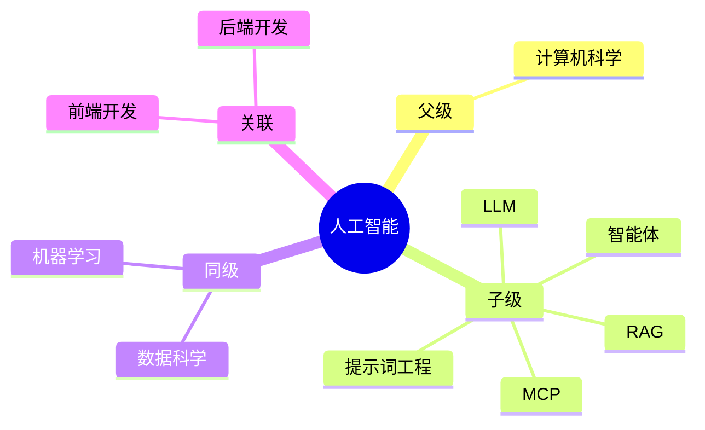

## Area: 人工智能

> 系统性理解和应用大语言模型（LLM）与智能体（Agent）生态，将其转化为实际开发生产力。

- [ ] 👉[[P-AI学习计划|P-AI学习计划]]

---

### 领域知识图谱

---

### 领域定义

- **核心范畴**：LLM 原理、提示词工程、智能体开发、AI 工作流
- **不包括**：底层机器学习算法训练、模型架构设计
- **与相关领域的区别**：关注 AI 的应用层（使用模型），而非研究层（训练模型）

---

### 里程碑

- **愿景**：将 AI 深度融入前端开发工作流，成为 AI-first 开发者
- **里程碑**：
	- [x] KR1：理解 LLM 能力边界 — 知道 AI 能做什么、擅长什么、局限在哪 ✅ 2026-06-04
	- [x] KR2：掌握提示词工程 — 能针对具体前端场景写出稳定、可复用的 Prompt ✅ 2026-06-04
	- [x] KR3：集成 AI 到项目 — 在实际项目中对接 AI API（Claude/OpenAI），实现功能增强 ✅ 2026-06-04
	- [x] KR4：构建 AI 辅助工作流 — 用 Claude Code / AI 工具提升日常开发效率（组件生成、代码审查、文档撰写） ✅ 2026-06-04

---

### 关键领域

> 该领域的核心知识主题（链接 Concept 或子领域 Area）

- **AI 工具**
	- [[Claude Code]] — Authropic 开发的 AI Agent
	- [[CodeX]] — OpenAI 开发的 AI Agent
	- [[OpenClaw]] — 多平台 AI 助手
	- [[Hermes Agent]] — 自学习 AI 助手
- **核心概念**
	- [[LLM]] — 大语言模型原理
	- [[Agent|智能体]] — Agent 智能体相关知识
	- [[RAG]] — 检索增强生成
	- [[MCP]] — Model Context Protocol
- **相关概念**
	- [[Harness]] — AI 工程化体系
	- [[Vibe Coding]] — 氛围编程
- **实践方法**
	- [[LLM 基础工作原理]] — 理解预测下一个词的能力边界
	- [[提示词工程|Prompt Engineering]] — 提示词工程
- **相关文章**
	- [[前端开发者应知的AI概念]]
	- [[Google_Prompt Engineering_v7.pdf]]
	- [[The-Complete-Guide-to-Building-Skill-for-Claude.pdf]]
- **相关库**
	- [mattpocock/skills: Skills for Real Engineers. Straight from my .claude directory.](https://github.com/mattpocock/skills)
	- [affaan-m/everything-claude-code: The agent harness performance optimization system. Skills, instincts, memory, security, and research-first development for Claude Code, Codex, Opencode, Cursor and beyond.](https://github.com/affaan-m/everything-claude-code)

---

### SOP

> 该领域的标准化操作流程（SOP）

- [[SOP-提示词工程最佳实践]] — 前端开发场景中的 Prompt 编写规范（组件生成、代码审查、bug 修复）
- [[SOP-AI输出质量评估]] — 评估 AI 生成结果可靠性的标准流程
- [[SOP-使用Claude-Code开发React组件]] — 使用 Claude Code 开发 React 组件的标准流程

---

### FAQ

> 该领域的常见问题（链接 Question 或 MOC）

- [[Q-AI 如何辅助 WebGL 渲染逻辑生成]]
- [[Q-如何在 Canvas 交互中实现 AI 意图识别]]
- [[Q-如何高效使用 Claude Code？]]

---

### 领域健康度

| 维度 | 状态 | 说明 |
|:---:|:---:|:---|
| 目标进展 | 🟡 | 阶段 2 已完成，阶段 3 进行中 |
| 认知更新 | 🟢 | 持续学习 AI 新技术 |
| 行动频率 | 🟢 | 日常使用 AI 辅助开发 |
