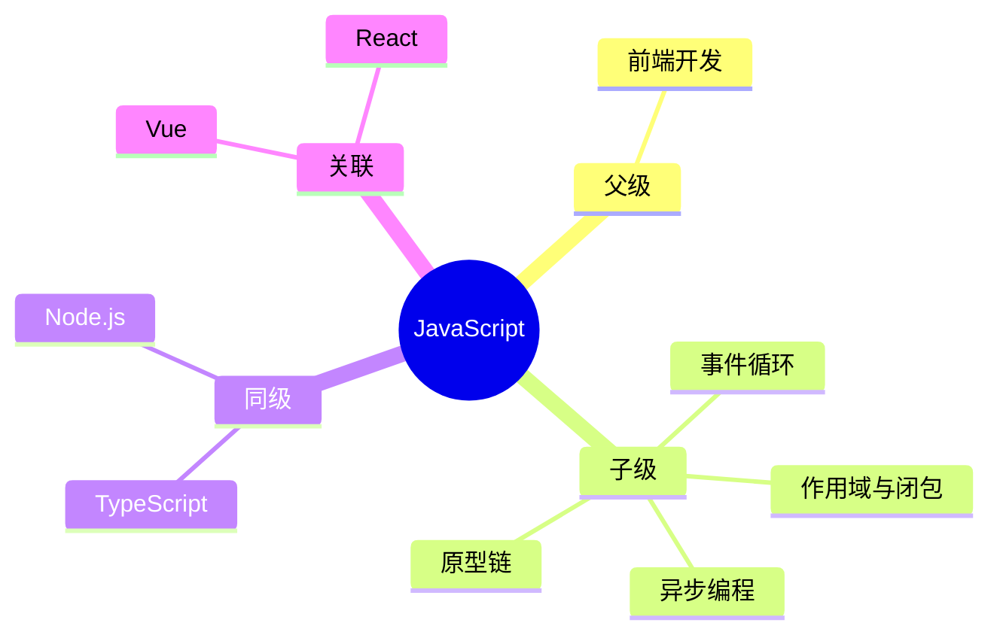

## Area: JavaScript

> JavaScript 是一种高级的、解释型的编程语言，主要用于客户端 Web 开发，为网页添加交互性和动态效果。它也可以用于服务器端开发（Node.js）、移动应用开发（React Native、Ionic）和桌面应用开发（Electron）。

---

### 领域知识图谱

---

### 领域定义

- **核心范畴**：语言核心、运行机制、异步编程、生态工具
- **不包括**：后端业务逻辑、数据库管理
- **与相关领域的区别**：关注浏览器端和服务端的脚本编程

---

### 里程碑

- **愿景**：深入掌握 JavaScript 核心原理，能够编写高质量、可维护的代码
- **里程碑**：
	- [x] 阶段 1：掌握语言核心概念（作用域、原型、异步） ✅ 2026-05-12
	- [x] 阶段 2：理解运行机制（事件循环、执行上下文、V8 引擎） ✅ 2026-05-12
	- [ ] 阶段 3：深入源码级别理解

---

### 专题导航

> 子领域（Area）已是中观层粒度，直接聚合本主题下的关键概念（已按主题分组）。

- **语言核心**
	- [[闭包]] — 模块化、私有变量、内存泄漏
	- [[作用域链]] — 变量可见性规则和函数捕获作用域的能力
	- [[原型链]] — 对象继承的原型链机制
	- [[This绑定|this binding]] — 不同场景下 this 的指向规则
- **运行机制**
	- [[事件循环]] — 单线程非阻塞的异步调度机制
	- [[执行上下文]] — 代码执行时的运行环境
	- [[V8 引擎]] — JavaScript 引擎的编译和执行过程
	- [[JS引擎]] — JavaScript 引擎概述
- **异步编程**
	- [[Promise]] — 异步编程的基础抽象
	- [[async-await|async/await]] — Promise 的语法糖
	- [[柯里化]] — 函数式编程技巧
	- [[Array.fromAsync() vs Promise.all()]] — 两种异步批处理方式对比
- **版本演进**
	- [[Javascript版本演进]]

---

### SOP

> 该领域的标准化操作流程（SOP）

- [[SOP-使用Promise处理异步操作]] — 规范化异步代码
- [[调试JavaScript内存泄漏]] — 性能问题排查
- [[前端监控指标采集]] — 前端监控数据采集

---

### FAQ

> 该领域的常见问题（链接 Question 或 MOC）

- [[Q-如何理解 JavaScript 的事件循环机制]]
- [[Q-JavaScript 闭包的实际应用场景是什么]]
- [[Q-原型链继承与 class 继承的区别]]

---

### 领域健康度

| 维度 | 状态 | 说明 |
|:---:|:---:|:---|
| 目标进展 | 🟢 | 已掌握核心概念 |
| 认知更新 | 🟢 | 持续补充新特性 |
| 行动频率 | 🟢 | 日常开发使用 |
