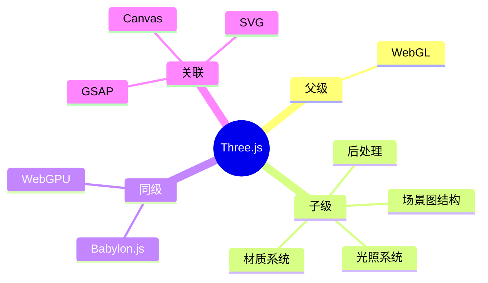

## Area: Three.js 3D 图形

> Three.js 是一个基于 WebGL 的 JavaScript 3D 图形库，简化了浏览器中的 3D 图形开发。

---

### 领域知识图谱

---

### 领域定义

- **核心范畴**：使用 Three.js 构建 3D 场景、角色、动画、特效，并在浏览器中实时渲染
- **不包括**：原生 WebGL 底层开发（属于 WebGL 领域）、2D 图形渲染（属于 Canvas/SVG 领域）、游戏逻辑/物理引擎本身
- **与相关领域的区别**：
	- vs WebGL：Three.js 是对 WebGL 的高级封装，提供场景图、材质、光照等抽象
	- vs Canvas 2D：Three.js 用于 3D 渲染，Canvas 2D 用于 2D 绘图
	- vs Babylon.js：Three.js 更广泛、社区更大；Babylon.js 更完整、内置功能更多

---

### 长期目标

- **愿景**：掌握 Three.js 核心概念（场景、材质、光照、动画），能够独立实现 3D 交互效果和可视化项目
- **里程碑**：
	- [x] 理解 Three.js 场景图结构（Scene / Camera / Renderer）
	- [x] 掌握材质系统（MeshPhysicalMaterial / ShaderMaterial）
	- [x] 理解光照与阴影
	- [ ] 掌握粒子系统和特效
	- [ ] 掌握后处理（Bloom / Post-processing）
	- [ ] 完成 3D 可视化作品集

---

### 关键领域

> 该领域的核心知识主题。链接指向尚未创建的 concept，表明尚未掌握。

- **场景与渲染**
	- [[场景图结构]] — Scene / Camera / Mesh 的组织方式
	- [[透视投影]] — PerspectiveCamera 的视锥体与透视感原理
	- [[自定义着色器]] — ShaderMaterial 的顶点/片元着色器编程
- **材质与光照**
	- [[MeshPhysicalMaterial]] — 透射/折射/清漆层的物理材质
	- [[光照模型]] — Ambient / Directional / Point / Spot 光源特性
	- [[环境贴图]] — PMREMGenerator 生成预过滤环境贴图
- **后处理与特效**
	- [[后处理管线]] — EffectComposer + RenderPass + ShaderPass
	- [[粒子系统]] — Points / BufferGeometry / AdditiveBlending
	- [[流体模拟]] — 多材质混合与流动效果
- **动画与交互**
	- [[缓动函数]] — easeOutQuad / easeInOutSine 等动画曲线
	- [[帧间隔标准化]] — deltaTime 控制动画速度一致性

---

### SOP

> 该领域的标准化操作流程

- [[SOP-ThreeJS实现3D视差滚动]] — 3D 多层视差滚动
- [[SOP-ThreeJS实现气泡粒子]] — 透射材质粒子系统
- [[SOP-ThreeJS实现光影滤镜]] — 光照与后处理滤镜
- [[SOP-ThreeJS实现平面凹凸效果]] — ShaderMaterial 自定义变形

---

### FAQ

> 该领域的常见问题（链接 Question）

- [[Q-ThreeJS和Babylonjs怎么选]] — Three.js vs Babylon.js 选型判断
- [[Q-ThreeJS能做移动端吗]] — 移动端性能与优化
- [[Q-ThreeJS性能瓶颈在哪]] — draw call / 纹理 / 着色器优化

---

### 领域健康度

| 维度 | 状态 | 说明 |
|:---:|:---:|:---|
| 目标进展 | 🟡 | SOP 已创建 4 个，液体交汇待创建 |
| 认知更新 | 🟢 | 核心概念（场景图/材质/光照）已覆盖 |
| 行动频率 | 🟢 | 持续有示例驱动更新 |

---

### 参考延伸

- 官网：[threejs.org](https://threejs.org/)
- 学习资源：
	- Three.js Journey（付费课程）
	- [03. 第一个 Three.js 项目_明文传输不_哔哩哔哩_bilibili](https://www.bilibili.com/video/BV1SdkNBBE1r/?spm_id_from=333.788.player.switch&vd_source=d909cd5773c434648664a934ea4a8dae&p=3)
