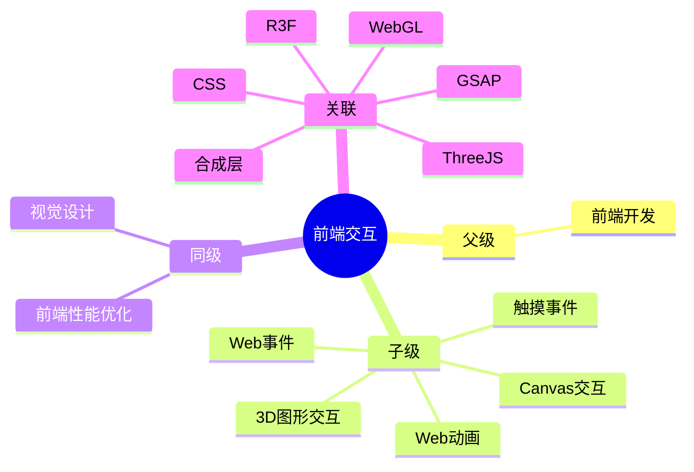

## Area: 前端交互

> 通过动画、事件、手势等手段创造流畅用户交互体验的技术领域。

---

### 领域知识图谱

> 该领域在知识网络中的定位。

---

### 领域定义

- **核心范畴**：用户操作反馈、状态转换动画、手势识别与响应、触摸交互优化、Canvas 交互式动画、**3D 图形交互**
- **不包括**：页面布局（[[CSS]]）、数据请求（[[AJAX]]）、路由逻辑、静态图形渲染（[[SVG]]）
- **与相关领域的区别**：[[前端交互]] 关注 " 响应用户的方式 "，[[前端性能优化]] 关注 " 响应用户的速度 "，[[视觉设计]] 关注 " 呈现的美感 "

---

### 长期目标

- **愿景**：掌握前端交互核心原理，能独立实现复杂交互动画，优化移动端触摸体验
- **里程碑**：
	- [ ] 阶段 1：掌握 [[Web动画]] 体系（CSS Animation → GSAP → Web Animations API）
		- [x] [[CSS Animation]] ✅ 2026-03-30
		- [ ] [[GSAP]] — 复杂动画序列
		- [ ] [[Web Animations API]] — 原生动画编程
	- [ ] 阶段 2：掌握 [[Web事件]] 与 [[Pointer Events]]
	- [ ] 阶段 3：实践手势识别与移动端交互优化
	- [ ] 阶段 4: 实践复刻一个最佳实践级别的交互网站
		- [ ] https://unseen.co/projects/

---

### 关键领域

> 该领域的核心知识主题（链接 Concept 或子领域 Area）

- **动画系统**
	- [[Web动画]] — 动画总览
	- [[CSS Animation]] — CSS 原生动画
	- [[GSAP]] / [[Motion]] / [[Anime]] — 专业动画库
	- [[requestAnimationFrame]] — 浏览器帧调度
	- [[ASCII动画]] — ASCII 字符帧动画
- **事件处理**
	- [[Web事件]] — 事件体系
	- [[DOM]] — 事件绑定目标
	- [[BOM]] — 窗口级事件
- **性能优化**
	- [[回流和重绘|回流与重绘]] — 动画性能关键
	- [[合成层]] — GPU 加速原理
	- [[核心Web指标]] — 交互性能衡量
- **触摸与手势**
	- [[触摸事件]] — 移动端基础
	- [[手势识别]] — 待创建
- **Canvas 交互**
	- [[Canvas绑定事件]] — 待创建（点击检测、坐标转换）
	- [[Canvas动画]] — 待创建（游戏循环、requestAnimationFrame）
- **3D 图形交互**
	- [[WebGL]] — 浏览器原生 3D 图形 API
	- [[ThreeJS]] — 3D 图形库
	- [[R3F]] — React Three Fiber（React 中的 Three.js）
	- [[着色器]] — GPU 着色器编程

---

### SOP

- ![[动画效果示例|MOC-动画效果SOP]]

---

### FAQ

> 该领域的常见问题（链接 Question 或 MOC）

- [[Q-如何实现流畅的页面转场动画]]
- [[Q-CSS动画与JavaScript动画如何选择]]
- [[Q-移动端触摸交互有哪些最佳实践]]

---

### 探索前沿

- R3F + Suspense 的异步加载模式
- WebGPU 作为 WebGL 继任者的发展
- AI 生成交互动画的可能性
- WebXR（Web VR/AR）的实际应用场景

---

### 复盘

- **最近**：2026-04-01
- **版本**：v2.0
- **更新内容**：新增 3D 图形交互子领域，补充 WebGL、ThreeJS、R3F、着色器

---

### 领域健康度

| 维度 | 状态 | 说明 |
|:---:|:---:|:---|
| 目标进展 | 🟡 | 刚建立领域，概念笔记较少 |
| 认知更新 | 🟢 | 有大量相关笔记可整合 |
| 行动频率 | 🟡 | 日常开发中有涉及 |
