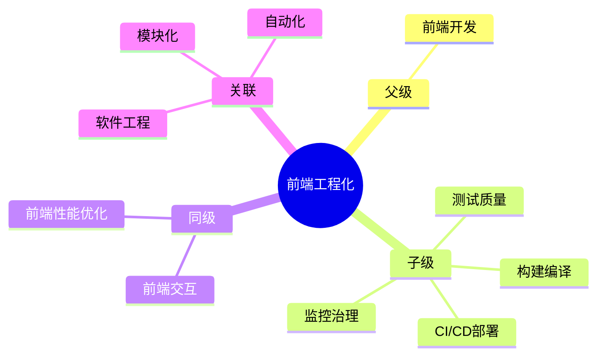

## Area: 前端工程化

> 将软件工程方法论应用于前端开发，通过规范化、模块化、自动化解决规模化、协作化和性能优化挑战。

**核心目标**：提效、保质、监控。

---

### 领域知识图谱

---

### 领域定义

- **核心范畴**：开发体验优化、构建编译、质量保障、部署运维、监控治理
- **不包括**：具体业务代码实现、UI 设计
- **与相关领域的区别**：
	- [[前端工程]] 关注 " 如何高效、可控地开发 "
	- [[前端交互]] 关注 " 如何响应用户 "
	- [[前端性能优化]] 关注 " 如何让页面加载更快 "

---

### 长期目标

- **愿景**：建立标准化工程体系，实现高效、高质量的前端开发
- **里程碑**：
	- [x] 阶段 1：建立标准脚手架和工程规范 ✅ 2026-05-19
		- [x] 项目初始化 — 脚手架创建 → 环境配置 → 规范集成 ✅ 2026-05-19
		- [x] 统一代码风格（ESLint + Prettier） ✅ 2026-05-19
	- [ ] 阶段 2：实现全链路自动化
		- Commit 规范 → Hooks 检查 → Code Review
		- [ ] CI 流水线（GitHub Actions）
	- [ ] 阶段 3：构建完整监控体系
		- [ ] 错误监控（Sentry）
		- [ ] 性能监控（Web Vitals）

---

### 关键领域

> 该领域的核心知识主题（链接 Concept 或子领域 Area）

- **核心概念**
	- [[微前端]]
	- [[脚手架]]
	- [[Monorepo|Monorepo]]
	- [[GitHub Actions]]
- **构建编译**
	- [[MOC-前端工程化工具]] — 工具索引
	- [[Vite]] — 下一代构建工具
	- [[Webpack]] — 模块打包器
	- [[Rspack]] — 高性能打包器
- **测试质量**（测试金字塔：[[单元测试]] → [[集成测试]] → E2E）
	- [[Vitest]] — 单元测试
	- [[Playwright]] / [[Cypress]] — E2E 测试
- **代码质量**
	- [[ESLint]] — 代码检查
	- [[Prettier]] — 代码格式化
	- [[Husky]] — Git Hooks
- **CI/CD**
	- [[GitHub Actions]] — 自动化工作流
	- [[Docker]] — 容器化
- **前端监控**
	- [[Sentry]] — 错误监控
	- [[前端监控与告警实践]] — 监控体系

---

### SOP

> 该领域的标准化操作流程（SOP）

- [[建立前端工程规范]]
- [[构建前端脚手架]]
- [[代码审查流程]]
- [[CI-CD流程|SOP-CI/CD流程]]
- 发布流程 — 版本管理 → 构建产物 → 部署验证

---

### FAQ

> 该领域的常见问题（链接 Question 或 MOC）

- [[Webpack vs Vite]]
- [[Q-如何选择构建工具]]

---

### 探索前沿

- Serverless 如何改变前端边界
- AI 辅助编程如何整合进 Code Review
- 如何量化工程化 ROI

---

### 领域健康度

| 维度 | 状态 | 说明 |
|:---:|:---:|:---|
| 目标进展 | 🟡 | 有相关项目进行中 |
| 认知更新 | 🟢 | MOC 工具笔记已建立 |
| 行动频率 | 🟡 | 有工程实践需求 |

---

### 复盘

> 2026-05-19

- 版本： v3.0
- 动作：添加核心概念、补充 SOP 断链

> 2026-03-16

- **版本**：v2.0
- **待改进**：补充技术词条、添加 SOP 文档、完善监控体系
