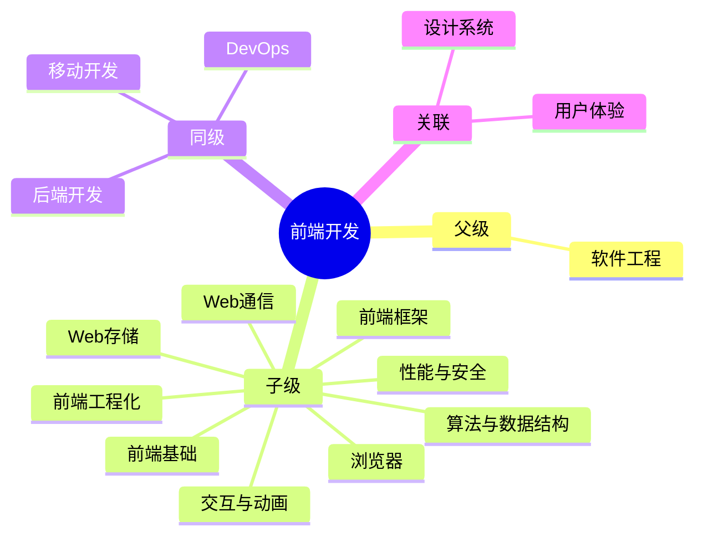

## Area: 前端

> 创建用户交互界面的技术领域，关注体验、性能与兼容性。

---

### 领域知识图谱

---

### 领域定义

- **核心范畴**：用户界面开发、交互实现、浏览器兼容性
- **不包括**：后端业务逻辑、数据库管理
- **与相关领域的区别**：关注用户可见的呈现层，而非服务端数据处理

---

### 里程碑

- **愿景**：成为能够独立负责中大型前端项目的高级工程师
- **里程碑**：
	- [ ] 阶段 1：掌握 JavaScript/Typescript/Vue/React 核心原理
		- [x] [[JavaScript]] ✅ 2026-03-16
		- [ ] [[TypeScript]]
		- [ ] [[Vue]]
		- [ ] [[React]]
	- [x] 阶段 2：建立完整工程化知识体系 ✅ 2026-03-16
	- [ ] 阶段 3：深入性能优化与架构设计

---

### 专题导航

> 前端领域中观层按「子领域 + 专题 MOC」组织：子领域（Area）承载持续责任，专题 MOC（Map of Content）聚合知识地图。中观层粒度判定：资料容量 5~20 篇高价值内容、攻关周期 1~3 周（详见 [[本库子系统概述#知识粒度子系统]]）。各专题内部的原子概念在对应 MOC 中展开，此处不再平铺。

- **前端基础** — [[JavaScript]] · [[TypeScript]]（子领域）· [[HTML]] · [[CSS]]
- **浏览器与渲染** — [[浏览器]]（子领域）· [[浏览器核心架构]] · [[浏览器渲染流程]] · [[浏览器安全机制]]
- **Web 通信** — [[Web通信]]（MOC：HTTP 协议族 / 实时通信 / 跨域）
- **前端框架** — [[前端框架]]（MOC：Vue / React / Angular / Svelte / ThreeJS）
- **前端工程化** — [[前端工程]]（MOC：构建 / 测试 / CI/CD）· [[MOC-前端工程化工具]] · [[MOC-前端构建与打包]]
- **Web 存储** — [[Web存储]]（MOC：Cookie / localStorage / IndexedDB）
- **交互与动画** — [[前端交互]]（MOC：动画 / 事件 / 手势）· [[Web动画]] · [[Canvas动画]]
- **性能与安全** — [[前端性能优化]]（MOC）· [[Web安全]] · [[前端监控]]
- **算法与数据结构** — [[算法与数据结构]]（MOC）

---

### SOP

> 前端开发的标准化操作流程

- [[SOP-前端项目启动流程]] — 项目初始化、配置、开发、构建
- [[SOP-代码审查流程]] — PR 创建、审查、合并规范

---

### FAQ

> 前端开发领域的常见问题

- [[MOC-前端面试真题库|前端面试题]]
- [[如何进行代码重构？]]
- [[Q-Web Components 能否成为下一代前端框架]]
- [[Q-如何将AI能力有效融入前端开发工作流]]
- [[如何使用AI高保真复刻网页设计]]

> 注：FAQ 中的 Q-* 问题与部分 SOP 尚属待补缺口，见「待探索」。

---

### 待探索

> 尚未补齐的笔记缺口

- [ ] 补齐 [[SOP-前端项目启动流程]] — 项目初始化、配置、开发、构建
- [ ] 补齐 [[Q-Web Components 能否成为下一代前端框架]]
- [ ] 补齐 [[Q-如何将AI能力有效融入前端开发工作流]]

---

### 领域健康度

| 维度 | 状态 | 说明 |
|:---:|:---:|:---|
| 目标进展 | 🟡 | 阶段 1 接近完成（JS 已掌握），TypeScript/Vue/React 待深入 |
| 认知更新 | 🟢 | Angular、工程化、性能优化持续更新 |
| 行动频率 | 🟢 | 日常开发维护中，持续积累实践经验 |

---
