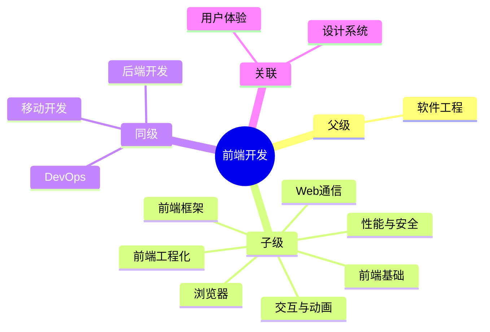

## Area: 前端

> 创建用户交互界面的技术领域，关注体验、性能与兼容性。

---

### 领域知识图谱

---

### 领域定义

- **核心范畴**：用户界面开发、交互实现、浏览器兼容性
- **不包括**：后端业务逻辑、数据库管理
- **与相关领域的区别**：关注用户可见的呈现层，而非服务端数据处理

---

### 里程碑

- **愿景**：成为能够独立负责中大型前端项目的高级工程师
- **里程碑**：
	- [ ] 阶段 1：掌握 JavaScript/Typescript/Vue/React 核心原理
		- [x] [[JavaScript]] ✅ 2026-03-16
		- [ ] [[TypeScript]]
		- [ ] [[Vue]]
		- [ ] [[React]]
	- [x] 阶段 2：建立完整工程化知识体系 ✅ 2026-03-16
	- [ ] 阶段 3：深入性能优化与架构设计

---

### 关键领域

> 前端开发的核心知识主题

- **前端基础**
	- [[JavaScript]]
	- [[HTML]]
	- [[CSS]]
- **浏览器**
	- [[浏览器]] — 前端代码的宿主环境
	- [[浏览器核心架构]] — 多进程架构
	- [[浏览器渲染流程]] — 页面从代码到像素
	- [[浏览器安全机制]] — 沙箱与隔离
- **Web 通信**
	- [[HTTP]] — 应用层协议基础
	- [[HTTP~1.1]] — 持久连接、管道化
	- [[HTTP~2]] — 多路复用、头部压缩
	- [[HTTP~3]] — QUIC 协议
	- [[HTTPS]] — 安全传输
	- [[AJAX]] — 异步通信技术
- **前端框架**
	- [[前端框架]] — 框架总览
	- [[Vue]] — 渐进式框架
	- [[React]] — 函数式框架
	- [[Angular]]
	- [[Svelte]] — 编译时框架
	- [[ThreeJS]] — 3D 图形库
- **前端工程化**⭐
	- [[前端工程]] — 工程化体系
	- [[微前端]]
	- [[Monorepo]]
	- [[Webpack]] — 模块打包
	- [[Vite]] — 现代构建工具
- **算法与数据结构**
	- [[算法与数据结构]] — MOC：算法与数据结构知识索引
- **Web 存储**
	- [[Web存储]] — 客户端存储技术
	- [[localStorage]] 、[[sessionStorage]] — 键值对存储
	- [[IndexedDB]] — 结构化数据存储
- **辅助技能**
	- [[Python]] — 通用开发语言
- **交互与动画**
	- [[前端交互]] — 动画、事件、手势
	- [[Web动画]] — 动画体系
	- [[Canvas动画]] — Canvas 逐帧绘制技术与进阶技巧
	- [[Web事件]] — 事件处理
- **性能与安全**⭐
	- [[前端性能优化]] — 前端性能提升
	- [[Web安全]] — 安全机制
	- [[前端监控]] — 数据上报、分析

---

### SOP

> 前端开发的标准化操作流程

- [[SOP-前端项目启动流程]] — 项目初始化、配置、开发、构建
- [[SOP-代码审查流程]] — PR 创建、审查、合并规范

---

### FAQ

> 前端开发领域的常见问题

- [[MOC-前端面试真题库|前端面试题]]
- [[如何进行代码重构？]]
- [[Q-Web Components 能否成为下一代前端框架]]
- [[Q-如何将AI能力有效融入前端开发工作流]]
- [[如何使用AI高保真复刻网页设计]]

---

### 领域健康度

| 维度 | 状态 | 说明 |
|:---:|:---:|:---|
| 目标进展 | 🟡 | 阶段 1 接近完成（JS 已掌握），TypeScript/Vue/React 待深入 |
| 认知更新 | 🟢 | Angular、工程化、性能优化持续更新 |
| 行动频率 | 🟢 | 日常开发维护中，持续积累实践经验 |

---
