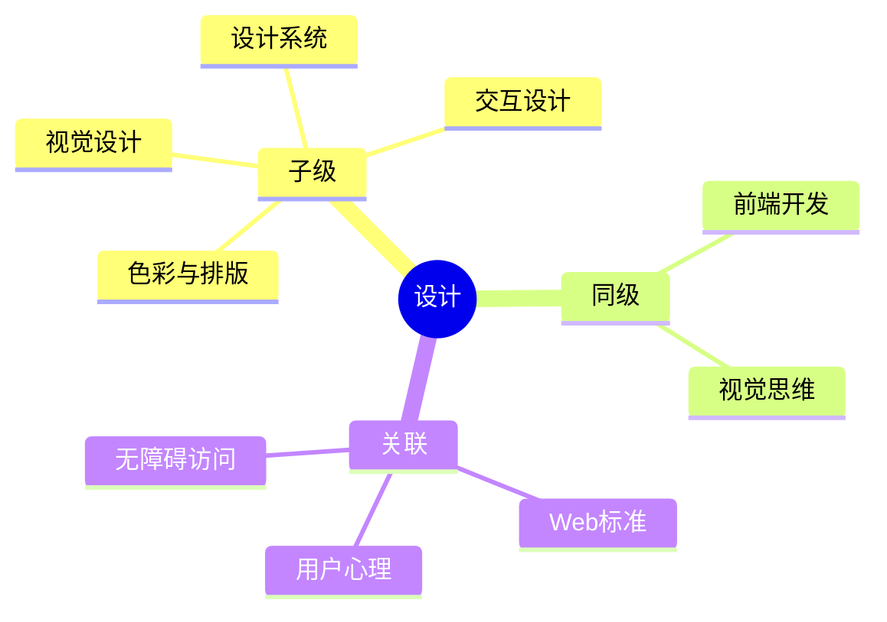

## Area: 设计

> 通过色彩、排版、布局、图形、交互等视觉手段，创造美观、一致、可访问的用户体验。

---

### 领域知识图谱

---

### 领域定义

- **核心范畴**：视觉设计（色彩/排版/布局）、交互设计、设计系统、UI 模式
- **不包括**：前端代码实现（属于前端开发）、品牌策略（属于商业设计）、工业/产品造型
- **与相关领域的区别**：
  - vs [[前端开发]]：设计关注"呈现什么"，前端关注"如何实现"
  - vs [[视觉思维]]：设计追求可用性和美感，视觉思维追求信息清晰度和思考辅助
  - vs [[前端交互]]：设计定义交互方式，前端交互实现交互效果

---

### 长期目标

- **愿景**：建立系统化的设计知识体系，能够独立完成中等复杂度的 UI 设计并理解设计决策背后的原则
- **里程碑**：
  - [ ] 阶段 1：掌握视觉设计基础（色彩理论、排版规则、布局系统）
  - [ ] 阶段 2：理解交互设计原则和设计系统架构
  - [ ] 阶段 3：能独立完成组件库设计并产出设计规范

---

### 核心心智模型

- **已有概念**
  - [[视觉设计]] — 视觉设计总览（C-视觉设计）
  - [[视觉设计原则]] — 指导视觉元素组织的基本规则
  - [[色彩心理学]] — 颜色对行为和情绪的影响
  - [[设计系统与组件库工程实践]] — 设计系统架构与组件化
  - [[认知负荷]] — 设计需降低用户认知成本
- **待创建的概念**
  - 排版基础（字型、行高、字间距、层级）
  - 布局系统（栅格、间距、响应式断点）
  - 交互设计模式（按钮、输入、导航、反馈）
  - 无障碍设计（WCAG 标准、ARIA）
  - Figma（设计工具使用）

---

### 知识网络

- **上游**（理论支撑）：认知心理学、色彩理论、人机交互
- **下游**（实际应用）：Web 应用 UI、移动端界面、数据可视化
- **协同**（配合领域）：[[前端开发]]、[[视觉思维]]、[[前端交互]]

---

### 领域健康度

| 维度 | 状态 | 说明 |
|:---:|:---:|:---|
| 目标进展 | 🟡 | 刚建立领域，已有部分概念笔记 |
| 认知更新 | 🟡 | 有设计实践但未系统化 |
| 行动频率 | 🟡 | 项目中有设计需求时使用 |

---

### 复盘

- **最近**：2026-06-19
- **版本**：v1.0
- **变更**：新建领域，整合已有设计相关概念笔记
