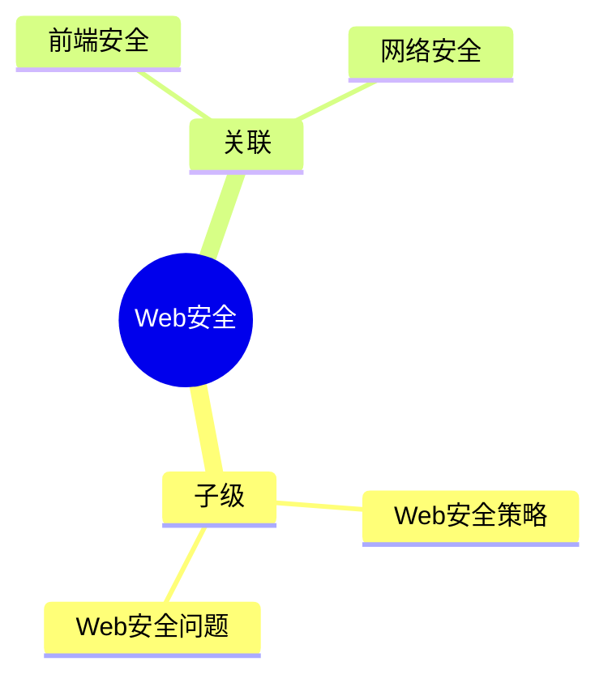

## Area: Web 安全

> 保护 Web 应用免受常见攻击的安全知识体系，涵盖传输层、渲染层、认证层等多个维度。

---

### 领域知识图谱

---

### 领域定义

- **核心范畴**：通过技术手段防止 Web 应用遭受恶意攻击
- **不包括**：后端安全（如数据库加固）、物理安全
- **与相关领域的区别**：
	- vs 前端安全：Web 安全范围更广，包含前端 + 后端 + 传输层
	- vs 网络安全：Web 安全特指 HTTP/HTTPS 协议层面的安全

---

### 长期目标

- **愿景**：建立完整的前端安全知识体系，能识别和防御常见 Web 攻击
- **里程碑**：
	- [ ] 掌握 HSTS、CSP 等安全策略头部
	- [ ] 理解 XSS、CSRF 攻击原理和防御方式
	- [ ] 能够在实际项目中实施安全方案

---

### 关键领域

- **[[Web安全策略]]**
	- [[HSTS]] — HTTP 严格传输安全
	- [[CSP]] — 内容安全策略
	- X-Frame-Options — 防点击劫持
	- X-Content-Type-Options — 防 MIME 嗅探
- **[[Web安全问题]]**
	- [[XSS]] — 跨站脚本攻击
	- [[CSRF]] — 跨站请求伪造
	- SSL Stripping — SSL 剥离攻击
	- 中间人攻击 (MITM)

---

### SOP

- [[SOP-HTTP安全响应头配置]] — 配置常见安全响应头
- [[SOP-XSS防御实践]] — 防止 XSS 注入的标准流程

---

### FAQ

- [[Q-如何防止CSRF攻击]] — CSRF 防御策略
- [[Q-HSTS的max-age应该如何设置]] — HSTS 最佳配置
- [[MOC-Web安全策略]] — 安全策略索引

---

### 领域健康度

| 维度 | 状态 | 说明 |
|:---:|:---:|:---|
| 目标进展 | 🟡 | 策略笔记已创建，问题笔记待补充 |
| 认知更新 | 🟢 | 建立了基本框架 |
| 行动频率 | 🟢 | 结合实际项目学习 |
