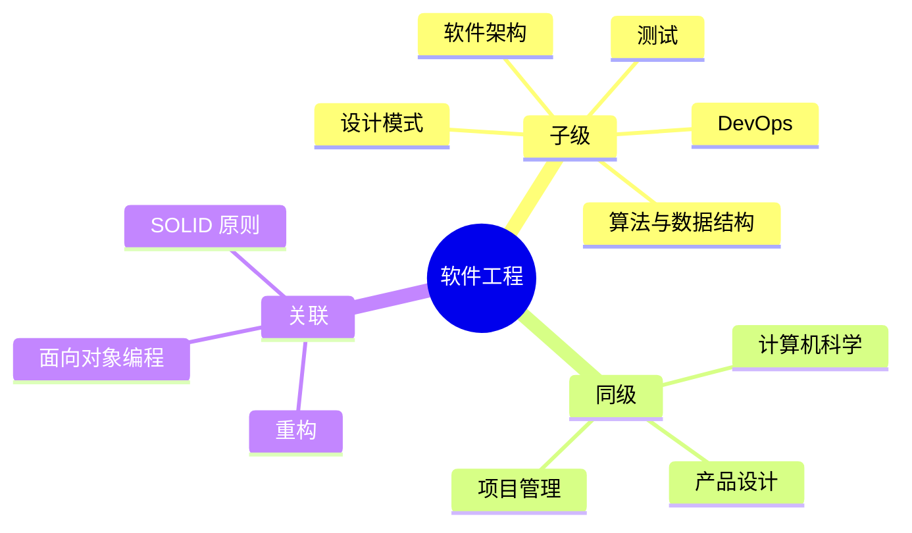

## Area: 软件工程

> 运用工程化方法进行软件开发的学科领域，将系统化、规范化的工程原则应用于软件构建与维护。

---

### 领域知识图谱

---

### 领域定义

- **核心范畴**：将工程化方法应用于软件开发——需求分析、系统设计、编码实现、测试验证、部署运维、维护演进
- **不包括**：具体编程语言的语法细节、特定框架的使用、纯理论研究
- **与相关领域的区别**：
  - **计算机科学**：CS 关注计算理论和算法本质，软件工程关注实际构建和交付
  - **产品设计**：产品设计关注用户体验和商业价值，软件工程关注技术实现和质量

---

### 里程碑

- **愿景**：建立完整的软件工程知识体系，能系统性地设计、评估和改进软件系统
- **里程碑**：
  - [ ] 阶段 1：完成设计模式和 SOLID 原则的知识网络建设
  - [ ] 阶段 2：建立软件架构和设计方法论的知识体系
  - [ ] 阶段 3：覆盖测试、CI/CD、DevOps 等工程实践

---

### 关键领域

> 该领域的核心知识主题

- **代码设计**
  - [[设计模式|MOC-设计模式]] — 设计模式是软件设计中可复用的解决方案
  - [[SOLID 原则]] — 面向对象设计的基本原则
  - [[重构]] — 持续改进代码结构的实践
- **核心基础**
  - [[算法与数据结构]] — 问题求解的方法论
  - [[面向对象编程]] — 主流的编程范式

---

### SOP

> 该领域的标准化操作流程

- [[代码审查流程]] — 系统化的代码审查步骤和检查清单
- [[重构工作流]] — 安全重构的标准操作步骤

---

### FAQ

- [[设计模式|MOC-设计模式]] — 设计模式概览与分类索引

---

### 领域健康度

| 维度 | 状态 | 说明 |
|:---:|:---:|:---|
| 目标进展 | 🟡 | 初始建设阶段 |
| 认知更新 | 🟢 | |
| 行动频率 | 🟡 | 持续建设中 |