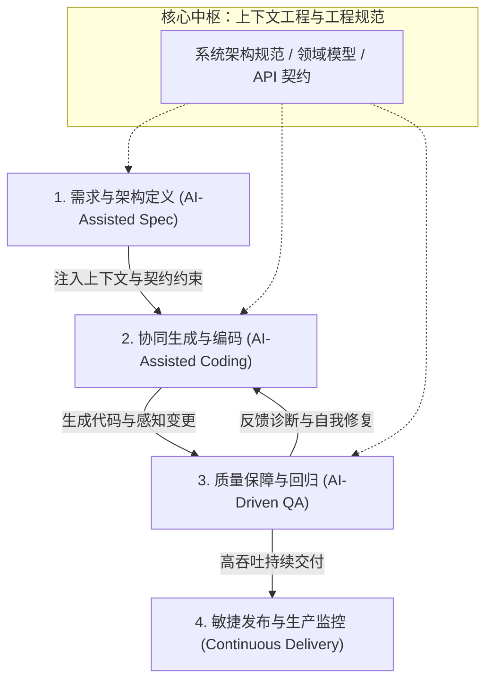

## 概念：AI First (AI-First 研发范式)

> AI First 是一种将人工智能从边缘「辅助工具」提升为底层「生产力中枢」，贯穿需求规划、架构设计、协同编码到质量保障全生命周期，进而驱动组织架构与交付机制重构的软件工程范式。

**解决的核心痛点**：传统软件工程中长链路、高沟通成本、人力密集型的交付瓶颈，以及「AI 仅作为代码补全单点工具（Point Solution）」时所产生的割裂感与浅层效率天花板。

### 核心命题

- [[AI-First 是工作流中枢重构而非单点效率插件集成]]
	- **原理**：AI 不再局限于 Copilot 式的行内自动补全，而是作为全流程中枢，直接参与「需求定界/PRD → 交互设计与架构生成 → 自动化编码 → 智能用例生成与 QA 验收」的全闭环。
- [[软件工程产能度量从代码产出量转向上下文架构与决策密度]]
	- **原理**：代码编写本身的边际成本趋近于零，工程团队的杠杆在于高质量上下文工程（Context Engineering）、精确的系统约束定义以及对 AI 生成结果的架构评估与风控。
- [[组织效能杠杆从人头扩张转向小团队高吞吐的杠杆放大]]
	- **原理**：AI-First 改变了研发团队规模与交付能力之间的线性关系，使精简的核心工程师团队能够借助端到端 AI 工具链实现数倍的交付速率与跨周期吞吐。

### 运行机制

AI-First 研发体系重构了传统的 SDLC（软件开发生命周期）阶段，通过上下文链路（Context Pipeline）与智能体协同（Agentic Workflow）连接各个环节：

代码段

### 关键区别

|**维度**|**AI-First (AI 优先范式)**|**AI-Assisted (AI 辅助/Copilot 阶段)**|**Traditional (传统软件工程)**|
|---|---|---|---|
|**定位与角色**|全流程工作流**中枢与主导生成者**|辅助**副驾驶/单点补全插件**|完全依赖人工编写与手工流程|
|**核心工程职责**|上下文工程、契约定义、系统把控与质量验收|逐行编码、调试、手动补充单元测试|详细编码实现、手动写测试用例、繁重流程协同|
|**交付节奏与人效**|周期大幅压缩（如数周缩减为数天），人均产出成倍跃迁|局部效率提升 10%–20%，整体交付周期改善有限|线性依赖团队人数（Headcount 扩张驱动）|
|**前端与交互周期**|前端脚手架与 UI 原型通过上下文大幅压缩|手动搭框架，局部组件代码补全|交互设计、原型打磨、手工切图还原链路漫长|

### 适用范围

- ✅ **适用场景**
	- **高迭代节奏的产品演进**：需要快速将产品路线图推进为高吞吐生产交付的企业平台（如 Auddia 的 faidr 等多平台高频迭代）。
	- **精益创业与高人效团队**：在人员编制受限的情况下，通过端到端 AI 工具链撬动数倍的单兵交付速度。
	- **标准化重构与自动化覆盖**：已有完善 API 契约与领域模型、需要大面积覆盖测试与快速构建服务接口的系统。
- ⛔ **误用**
	- **盲目信任生成代码（黑盒投产）**：在缺乏自动化测试断言与质量门禁（Quality Gates）的前提下直接放行 AI 代码进入生产环境。
	- **上下文匮乏的指令式开发**：未建立严谨的代码规范与业务上下文仓库，指望 AI 通过宽泛 Prompt 自行"脑补"核心业务逻辑。
- **失效边界**
	- **未知物理/数学原创算法攻关**：缺乏公开数据模式、需要深层次物理推导或全新科学理论突破的领域。
	- **零容忍容错且无验证闭环的极端安全系统**：若缺乏形式化验证或精确的自动化测试环境，AI 生成的幻觉可能引入隐蔽缺陷。

### 批判

- **外部批判**
	- **软件工程韧性学派**：过度依赖 AI 生成代码可能导致代码库"表面膨胀但深层理解力断层"，当系统出现极端偶发 Bug 时，排查与架构重构的认知门槛显著上升。
	- **安全与合规审计派**：全流程生成引入的代码供应链安全、第三方模型合规性以及专有业务上下文泄露风险需要额外治理成本。
- **内在张力**
	- **"极速生成"与"架构腐化"的对抗**：AI 能在短时间内生成海量代码，若缺乏严格的架构契约与一致性审查，极易引发技术债快速累积。

### FAQ

- [[AI-First 模式下研发人员的技能树应如何重构？]]
- [[如何构建适配 AI-First 模式的上下文工程（Context Engineering）标准？]]
- [[从 Copilot 辅助向全流程 AI-First 迁移时，团队应如何设计质量门禁？]]
- [[为什么传统基于行数/工时的效能度量在 AI-First 时代彻底失效？]]

### SOP

- [[SOP-AI驱动的需求规范与API契约定义流程]] — 规范如何将业务需求转化为供 AI 消费的高精度 Spec 与 Schema。
- [[SOP-AI辅助编码与代码审查规范]] — 约束 AI 生成代码的边界、可读性要求与人工架构审查 Checklists。
- [[SOP-AI全自动测试生成与质量验收流水线配置]] — 基于变更上下文自动生成单元测试、集成测试并执行 CI 拦截的标准流程。

### 知识图谱

- **父级概念**：[[软件工程研发范式]] — 软件开发生命周期（SDLC）与组织方法论演进。
- **子级概念**：
	- [[提示词工程]] — 为 AI Agent 提供精准代码与架构上下文的核心技术
	- [[AI辅助设计与规范 (AI-Assisted Spec)]] — 需求与交互原型的自动化压缩机制
	- [[智能体协同研发工作流 (Agentic Dev Workflow)]] — 自主规划、执行、重构与部署的多 Agent 协作体系
	- [[AI驱动质量保障 (AI-Driven QA)]] — 自动化用例生成与智能断言测试闭环
- **并列概念**：
	- [[敏捷开发 (Agile Development)]] — 以迭代与快速反馈为核心的传统协作范式
	- [[持续集成与持续部署|CI/CD]] — 贯穿研发到运维的自动化交付管道
	- [[DevOps]]
- **相关概念**：
	- [[代码大模型 (Code LLMs)]] — 提供代码生成与理解的基础模型支撑
	- [[软件架构与契约测试]] — 为 AI 提供确定性约束的底层设计原则
- **参考文章**
	- [Auddia Adopts AI-First Development Model to Accelerate Product Delivery | GlobeNewswire](https://www.globenewswire.com/news-release/2026/08/25/3350297/0/en/auddia-adopts-ai-first-development-model-to-accelerate-product-delivery-across-its-platforms.html)
	- [AI-First Software Development: Redefining How We Build Software](https://rywalker.com/ai-first-software)
