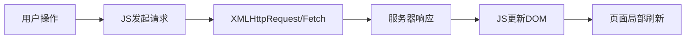

## 概念：AJAX

> AJAX（Asynchronous JavaScript and XML）是一种浏览器端的异步通信技术，允许网页在不刷新的情况下与服务器交换数据。

**解决的问题**：实现无感知的局部更新，提升用户体验

---

### 核心命题

- **核心原理**
  - XMLHttpRequest / Fetch API
  - 异步通信
  - 局部DOM更新

- **现代替代**
  - Fetch API：更现代的异步请求
  - axios：封装库
  - WebSocket：实时通信

---

### 运行机制



---

### 实现方式

#### 1. XMLHttpRequest（传统）

```javascript
const xhr = new XMLHttpRequest()
xhr.open('GET', '/api/data')
xhr.onload = () => {
  if (xhr.status === 200) {
    console.log(JSON.parse(xhr.responseText))
  }
}
xhr.send()
```

#### 2. Fetch API（现代）

```javascript
fetch('/api/data')
  .then(res => res.json())
  .then(data => console.log(data))
```

#### 3. async/await（推荐）

```javascript
async function getData() {
  const res = await fetch('/api/data')
  const data = await res.json()
  console.log(data)
}
```

---

### 与HTTP的关系

| 维度 | 说明 |
|:---|:---|
| 协议 | HTTP/HTTPS |
| 方法 | GET/POST/PUT/DELETE |
| 状态码 | 2xx/4xx/5xx |
| 跨域 | 受 CORS 限制 |

---

### 知识图谱

- **父级概念**：[[前端开发]]
- **关联概念**：
  - [[HTTP]] — 通信协议
  - [[CORS]] — 跨域资源共享
  - [[Fetch API]] — 现代异步请求

---

### 参考延伸

- MDN: Using Fetch API
- 浏览器开发者工具 Network 面板
