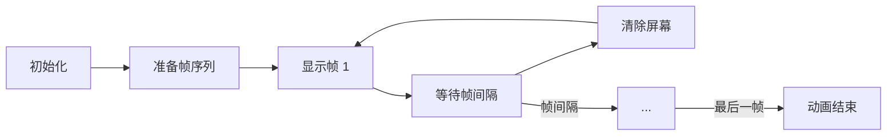

## 概念：ASCII 动画

> ASCII 动画是通过在终端或浏览器中连续显示 ASCII 字符帧，利用人眼视觉暂留效应形成动画效果的技术。

**解决的核心痛点**：在纯文本环境中（如终端、老式终端模拟器）无法使用传统图形动画，需要用字符模拟动态效果。

---

### 核心命题

- ASCII 动画的本质是「帧替换」——通过快速刷新字符帧，利用视觉暂留形成连续运动
- ASCII 动画的关键是「帧率控制」——帧率过高会导致终端闪烁，过低会卡顿
- ASCII 动画的魅力在于「局限性创造美」——字符的粗粒度反而产生独特的复古美学

---

### 运行机制

#### 动画循环

#### 核心技术

| 技术 | 说明 |
|:---|:---|
| **转义序列** | `\033[2J` 清屏，`\033[H` 移动光标 |
| **循环刷新** | requestAnimationFrame 或 setTimeout 循环 |
| **帧缓冲** | 预计算帧序列，减少计算开销 |

---

### 关键区别

| 维度 | ASCII 动画 | 传统动画 |
|:---|:---|:---|
| **渲染介质** | 终端/控制台 | 浏览器/图形界面 |
| **分辨率** | 字符网格（低） | 像素（高） |
| **视觉效果** | 复古、粗粒度 | 精细、流畅 |
| **性能** | 极低资源 | 依赖 GPU |

---

### 应用场景

- ✅ **适用场景**
	- **终端加载动画**：CLI 工具的进度提示，如 `pip`、`npm` 安装
	- **终端游戏**：如 `nethack`、`cowsay` 变体
	- **技术演示**：展示算法执行过程，如排序算法可视化
	- **复古美学**：创造 80 年代计算机氛围
- ⛔ **误用**
	- **现代应用**：有图形界面的应用无需使用
	- **需要精细动画**：字符分辨率无法满足需求

#### SOP

- [[在React中实现ASCII动画]]

#### FAQ

- [[Q-如何在终端中创建简单的加载动画]]
- [[Q-ASCII动画的性能瓶颈在哪里]]
---

### 知识图谱

- **父级概念**：[[前端交互]] — ASCII 动画是前端交互的一种实现
- **子级概念**：
	- 终端转义序列 — 控制终端显示的技术
	- 帧率控制 — 管理动画节奏的方法
- **并列概念**：
	- [[终端工具]] — 终端环境下的其他工具
	- 动画框架 — 浏览器端的动画解决方案
- **相关概念**：
	- [[CSS Animation]] — CSS 动画原理
	- [[GSAP]] — JavaScript 动画库

---

### 参考延伸

- [再花里胡哨一点？在网页里使用ASCII动画_哔哩哔哩_bilibili](https://www.bilibili.com/video/BV1H6eyzYE3V?spm_id_from=333.788.player.switch&vd_source=d909cd5773c434648664a934ea4a8dae)
- [ASCII Movie Player](https://github.com/jart/ascii.pipe)
- [终端转义序列参考](https://en.wikipedia.org/wiki/ANSI_escape_code)
