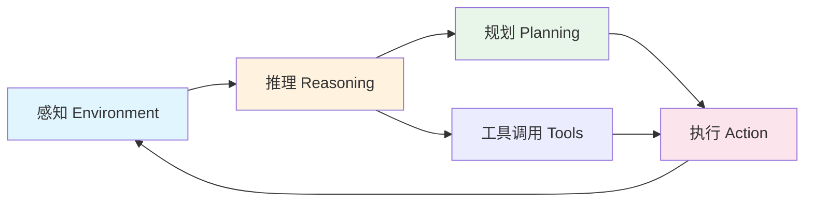
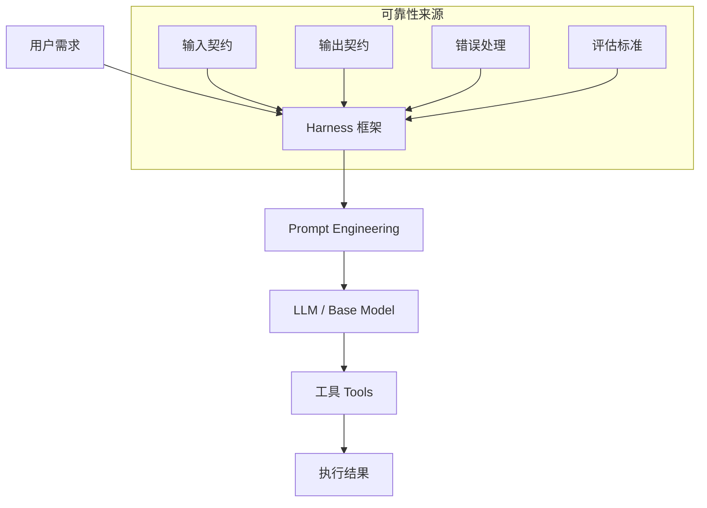

## 概念：Agent

> 能够感知环境、自主决策并执行行动以实现特定目标的智能实体。

**解决的核心痛点**：传统软件只能被动响应输入，Agent 能够自主感知环境、推理决策、执行复杂多步骤任务，实现真正的智能化自动化。

---

### 核心命题

- [[Agent = LLM + 上下文 + 工具]]
- Agent 的本质是「感知 - 推理 - 执行」的闭环系统，而非单一工具调用
- Agent 的可靠性取决于 Harness（工程化框架），而非单纯的 Prompt 优化
- 好的 Agent 设计是在「灵活性」与「可控性」之间找到平衡

---

### 运行机制

#### 核心能力

| 能力 | 说明 |
|:---|:---|
| **感知 (Perception)** | 理解输入、环境状态、上下文 |
| **推理 (Reasoning)** | 分析问题、制定策略 |
| **规划 (Planning)** | 分解任务、设计执行步骤 |
| **执行 (Action)** | 调用工具、生成输出 |
| **学习 (Learning)** | 从反馈中调整策略（可选） |

---

### Agent vs 相关概念

| 维度       | [[Agent]]  | [[提示词工程\|Prompt Engineering]] | 传统软件    |
|:------- |:--------- |:---------------------------- |:------ |
| **执行模式** | 自主决策循环     | 一次性输入输出                       | 预定义逻辑   |
| **核心特点** | 主动性、适应性    | 引导模型输出                        | 确定性     |
| **工程重点** | Harness 设计 | Prompt 优化                     | 流程控制    |
| **适用场景** | 复杂多步骤任务    | 单一任务、生成                       | 规则明确的任务 |

---

### Agent 的架构层次

- [[提示词工程|Prompt Engineering]] — 优化模型能力表达
- [[Harness]] — 优化工程可靠性（输入/输出契约、错误处理）
- LLM — 提供推理能力

---

### 分类

**按智能程度分类**：
- 简单反射智能体
- 基于模型的反射智能体
- 基于目标的智能体
- 基于效用的智能体
- 学习型智能体

**按应用领域分类**：
- 软件智能体（聊天机器人、推荐系统）
- 物理智能体（机器人、自动驾驶）
- 混合智能体（软硬件结合）

---

### 应用场景

- ✅ **复杂工作流自动化**：多步骤任务、跨系统操作
- ✅ **智能助手**：[[Claude Code]]、[Siri/Alexa](语音助手)
- ✅ **自动驾驶**：Tesla Autopilot
- ✅ **游戏 AI**：AlphaGo、NPC 行为控制
- ⛔ **简单确定性任务**：传统程序更高效

---

### 知识图谱

- **父级概念**：[[人工智能]] — Agent 是 AI 的重要分支
- **子级概念**：
	- [[Harness]] — Agent 工程化框架
	- [[智能体编排]] — 多个 Agent 协作
- **并列概念**：
	- [[提示词工程|Prompt Engineering]] — 优化模型输出
	- [[RAG]] — 检索增强生成
- **相关领域**：
	- [[强化学习]] — Agent 的学习方法论
	- [[Claude Code]] — Agent 的具体实现

---

### 常见问题

- ⛔ **过度依赖 Agent**：忽视可靠性验证和错误处理
- ⛔ **Prompt vs Harness 失衡**：只优化 Prompt 而忽视工程约束
- ⛔ **缺乏评估标准**：无法量化 Agent 质量就无法迭代

---

### 参考延伸

- Russell, S., & Norvig, P. *Artificial Intelligence: A Modern Approach*
- Wooldridge, M. *An Introduction to MultiAgent Systems*
- [Anthropic - Building Effective Agents](https://docs.anthropic.com/)
