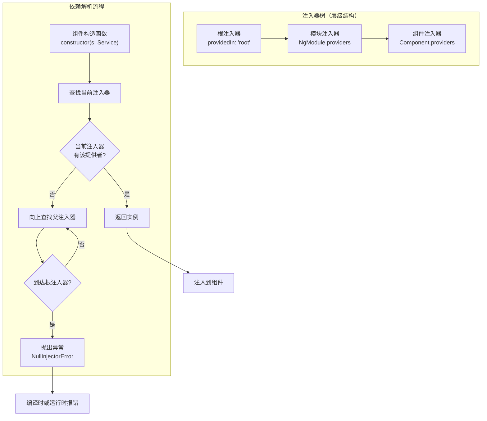

## 概念：Angular 依赖注入

> Angular 依赖注入（DI）是框架内置的设计模式——服务在构造函数中声明依赖，注入器自动解析并传入实例，组件无需关心对象的创建和生命周期。

**解决的核心痛点**：手动管理依赖（new 服务、传递实例）导致代码耦合、测试困难、生命周期混乱。DI 将"创建依赖"的责任交给框架，组件只声明"我需要什么"。

---

### 核心命题

- [[依赖注入将控制权从消费者转移到容器]]
	- **原理**：依赖不再由消费者创建，而是由注入器提供，实现控制反转（IoC）
- [[注入器层级决定了服务的单例范围]]
	- **原理**：Angular 的注入器是树状结构，服务的单例范围取决于它注册在哪层注入器

---

### 运行机制



**三种注册方式**：

| 方式 | 写法 | 单例范围 | 适用场景 |
|:---|:---|:---|:---|
| `providedIn: 'root'` | `@Injectable({ providedIn: 'root' })` | 全局单例 | 通用服务，首选 |
| `NgModule.providers` | `providers: [Service]` | 模块级 | 延迟加载模块的隔离服务 |
| `Component.providers` | `providers: [Service]` | 组件级（每个组件新实例） | 组件专属状态，或需要隔离实例 |

**注入令牌的类型**：

```typescript
// 类令牌（最常用）
@Injectable({ providedIn: 'root' })
export class UserService { }

// 字符串令牌（多实现场景）
providers: [{ provide: 'API_URL', useValue: '/api/v1' }]
constructor(@Inject('API_URL') private apiUrl: string) {}

// InjectionToken（类型安全）
export const API_URL = new InjectionToken<string>('API_URL');
providers: [{ provide: API_URL, useValue: '/api/v1' }]
```

**提供者语法**：

| 语法 | 用途 | 示例 |
|:---|:---|:---|
| `useClass` | 指定实现类 | `{ provide: Logger, useClass: FileLogger }` |
| `useValue` | 提供常量/配置 | `{ provide: 'CONFIG', useValue: { debug: true } }` |
| `useExisting` | 别名现有提供者 | `{ provide: OldService, useExisting: NewService }` |
| `useFactory` | 工厂函数创建 | `{ provide: Logger, useFactory: () => new Logger(config) }` |
| `multi: true` | 多提供者（合并数组） | `{ provide: HTTP_INTERCEPTORS, useClass: LogInterceptor, multi: true }` |

---

### 关键区别

| 维度 | 前端 DI（Angular） | 手动依赖管理 | React Context |
|:---|:---|:---|:---|
| **注入方式** | 构造函数自动注入 | `new Service()` 手动创建 | `useContext()` 消费 |
| **生命周期** | 由注入器管理（单例/工厂） | 开发者自行管理 | 由 React 树管理 |
| **测试便利性** | 高（可注入 Mock） | 低（需重写创建逻辑） | 中等（Provider 包裹） |
| **类型安全** | 强（TypeScript + 令牌） | 取决于实现 | 取决于泛型 |

---

### 应用场景

- ✅ **适用场景**
	- **全局状态**：通过 `providedIn: 'root'` 的服务实现共享状态（配合 Signal 或 BehaviorSubject）
	- **跨组件通信**：服务作为中介者，组件通过服务交换数据而非直接耦合
	- **配置注入**：`useValue` 注入环境配置、API 基础路径等
	- **测试 Mock**：`useClass` 在测试模块中替换真实服务为 Mock
- ⛔ **误用**
	- **过度注入**：将不应共享的逻辑（如纯工具函数）注入为服务——纯函数更简单
	- **循环依赖**：ServiceA → ServiceB → ServiceA，需用 `Injector` 延迟解决

---

### 知识图谱

- **父级概念**：[[Angular|A-前端/Angular]] — Angular 框架的核心机制之一
- **相关概念**：
	- [[Signal(Angular)]] — 常配合 DI 服务实现全局状态管理
	- [[Angular变更检测]] — DI 控制服务实例范围，间接影响变更检测行为
	- [[依赖注入]] — 抽象的依赖注入设计模式
	- [[控制反转]] — DI 的底层设计模式
- **相关对比**：[[Angular vs React]] — React 无内置 DI，是两者核心差异之一

### 参考延伸

- **核心实践**：`@Injectable()` + 构造函数注入 + `providedIn: 'root'` 是 Angular 官方推荐的三位一体模式
