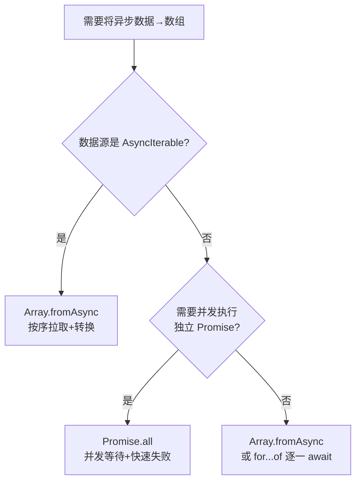

## Array.fromAsync() vs Promise.all()

### 一句话对比

`Array.fromAsync` 是**异步数组构造器**，擅长将异步可迭代对象按序转换为数组；`Promise.all` 是**并发协调器**，擅长同时等待多个独立 Promise 全部完成。

---

### 核心对比

| 维度 | **Array.fromAsync()** | **Promise.all()** |
|:---|:---|:---|
| **定义** | 将 AsyncIterable / Iterable / 类数组对象转换为数组，按序 resolve | 并发等待所有 Promise 完成，返回结果数组 |
| **核心本质** | 数组构造器 + 异步迭代 | 并发协调器 |
| **适用场景** | 异步数据流 → 数组 | 多个独立 Promise → 等待全部完成 |

### 差异点

- **`Array.fromAsync()`：顺序执行 (Sequential)**
		它会**懒惰地**遍历数据源，一个接一个地等待每个异步结果完成，再取下一个。这保证了处理顺序，但速度相对较慢。

- **`Promise.all()`：并发执行 (Concurrent)**
		它会**急切地**一次性读取所有数据，然后**并发地**等待所有 Promise 完成。速度更快，但不保证在大型数据集上的内存友好性。

---

### 场景选择

- **选 Array.fromAsync 当**：需要将异步生成器 / 异步可迭代对象转换为数组，或需要对每个元素应用异步映射转换
- **选 Promise.all 当**：已有多个独立的 Promise，需要并发执行并在全部完成后统一处理结果

---

### 决策树



---

### 示例

```js
function* makeIterableOfPromises() {
  for (let i = 0; i < 5; i++) {
    yield new Promise((resolve) => setTimeout(resolve, 100));
  }
}

(async () => {
  console.time("Array.fromAsync() time");
  await Array.fromAsync(makeIterableOfPromises());
  console.timeEnd("Array.fromAsync() time");
  // 输出: Array.fromAsync() time: 约 503ms (顺序等待 5 个 100ms)

  console.time("Promise.all() time");
  await Promise.all(makeIterableOfPromises());
  console.timeEnd("Promise.all() time");
  // 输出: Promise.all() time: 约 101ms (并发等待，几乎同时完成)
})();
```

---

### 知识图谱

- **父级概念**：[[JavaScript]]
- **相关对比**：[[Promise.allSettled() vs Promise.all()]]
