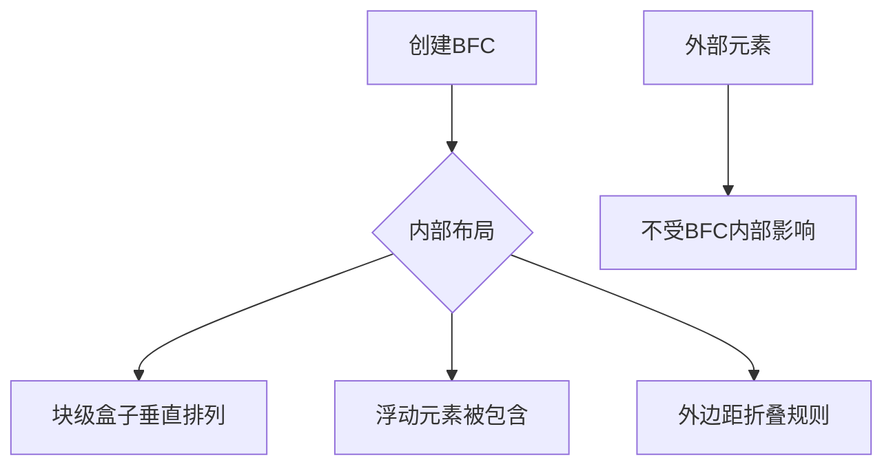

## 概念：BFC

> BFC（Block Formatting Context，块格式化上下文）是 CSS 视觉渲染的一部分，可以看作一个独立的容器，内部的元素不会影响外部，反之亦然。

**解决的问题**：浮动塌陷、外边距重叠、布局混乱

---

### 核心命题

- **BFC 的本质**
	- 独立的渲染区域
	- 内部盒子垂直排列
	- 与外部隔离
- **触发条件**
	- 根元素 `<html>`
	- `float` 不为 `none`
	- `position` 为 `absolute`/`fixed`
	- `display` 为 `inline-block`/`flex`/`grid` 等
	- `overflow` 不为 `visible`

---

### 运行机制

#### 三大特性

1. **内部盒子垂直排列**
	 - 内部块级盒子一个接一个垂直排列
2. **包含浮动元素**
	 - BFC 会包含浮动元素，防止高度塌陷
3. **阻止外边距折叠**
	 - 不同 BFC 之间的外边距不会折叠

---

### 应用场景

| 场景 | 解决方案 | 示例 |
|:---|:---|:---|
| 清除浮动 | 父元素设置为 BFC | `overflow: auto` |
| 防止 margin 重叠 | 元素放入独立 BFC | `display: inline-block` |
| 多栏自适应布局 | 创建独立 BFC | Grid 布局 |
| 防止浮动元素覆盖 | 非浮动元素设置为 BFC | `overflow: hidden` |

---

### 与 CSS 盒模型的关系

- BFC 是盒模型的外层容器
- 盒模型定义单个元素的组成（content/padding/border/margin）
- BFC 定义一组盒子的布局规则

---

### 知识图谱

- **父级概念**：[[CSS]]
- **关联概念**：
	- [[CSS盒模型]] — BFC 内部的盒子组成
	- [[层叠上下文]] — BFC 是二维布局，BFC 是垂直布局
- **相关问题**：
	- Flexbox 和 BFC 有什么区别

---

### 参考延伸

- [CSS BFC (Block Formatting Context) 详解在 CSS 布局中，BFC（Block For - 掘金](https://juejin.cn/post/7403657162529210409?from=search-suggest)
- MDN: Block formatting contexts
- CSS Tricks: Understanding CSS Layout and BFC
