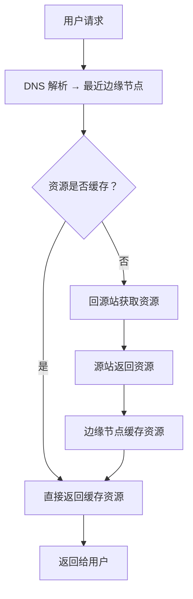

> CDN（Content Delivery Network）是**内容分发网络**，通过在全球部署边缘节点缓存静态资源，实现用户就近访问

**解决的核心痛点**：资源服务器地理分散导致访问延迟高、源站负载压力大、大流量请求容易造成服务器崩溃。

---

## 核心命题

> 核心命题引用 atomic 笔记（陈述句观点），每个命题是一句话洞见

- （待补充 atomic 洞见）

---

## 运行机制

**CDN 工作原理**：

**核心组件**：
- **边缘节点（PoP）**：全球分布的服务器，负责缓存和响应
- **源站（Origin）**：存放原始资源的服务器
- **DNS 智能解析**：根据用户位置返回最近节点
- **缓存策略**：Cache-Control、ETag、Last-Modified 等

---

## 关键区别

| 维度 | 传统部署 | CDN |
|:--- |:--- |:--- |
| **访问路径** | 用户 → 源站 | 用户 → 边缘节点 |
| **延迟** | 取决于源站距离 | 就近访问，通常 < 50ms |
| **可用性** | 源站挂了就挂了 | 边缘节点冗余，源站压力小 |
| **成本** | 带宽费用高 | 按需付费，有缓存复用 |
| **适用内容** | 动态内容 | 静态资源（图片/CSS/JS/视频） |

---

## 应用场景

- ✅ **适用场景**
	- **静态资源加速**：图片、视频、CSS、JS 等
	- **跨地域加速**：用户分布全球的业务
	- **抵御 DDoS**：边缘节点吸收恶意流量
	- **HTTPS 证书**：边缘节点托管 SSL 证书
- ⛔ **误用**
	- **实时动态内容**：股票行情、聊天消息等
	- **频繁变化的 API**：每次都需要回源，失去加速意义

---

## SOP

> 与本概念相关的标准操作流程

- （暂无相关 SOP，待补充）

---

## FAQ

> 与本概念相关的开放性问题

- （暂无相关 Question，待补充）

---

## 知识图谱

> 知识图谱链接 term（术语定义）和相关 concept

- **子级概念**：
	- [[Edge Runtime]] — 基于 CDN 基础设施的边缘计算能力
	- [[Cloudflare Workers]] — CDN 厂商的边缘计算产品
- **并列概念**：
	- [[对象存储]] — 常与 CDN 配合使用的存储服务
- **相关概念**：
	- [[负载均衡]] — 流量分发技术
	- [[反向代理]] — CDN 的技术基础之一

---

## 参考延伸

- [Cloudflare CDN 文档](https://developers.cloudflare.com/cache/)
- [CDN 工作原理详解](https://www.cloudflare.com/learning/cdn/what-is-a-cdn/)
