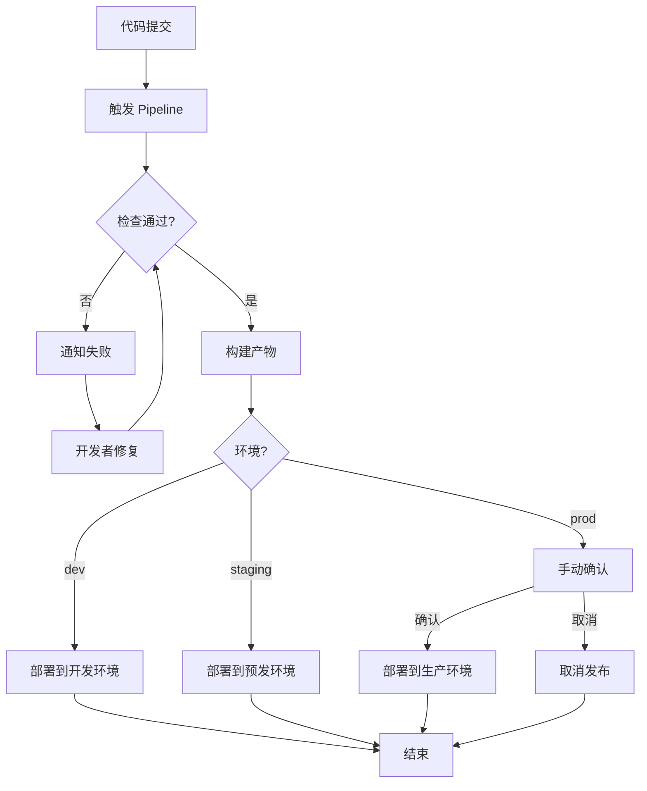

## SOP：前端 CI/CD 流程

> 通过自动化流水线实现代码从提交到部署的标准化流程

目标：实现代码提交后自动构建、测试、部署，提升交付效率和质量
实现：每次提交自动触发流水线，部署周期从天级缩短到分钟级

---

### 适用场景

- 场景 1：前端项目搭建 CI/CD 流水线
- 场景 2：优化现有 CI/CD 流程
- 场景 3：新成员了解 CI/CD 工作原理

---

### 流程图解



---

### 核心步骤

1. **代码提交**：开发者将代码推送到代码仓库（GitHub/GitLab）
	 - 注意：提交信息应遵循规范，便于追溯
2. **触发 Pipeline**：Webhooks 触发 CI 系统（GitHub Actions/GitLab CI/Jenkins）
	 - 注意：配置触发条件（push/tag/PR）
3. **自动化检查阶段**：
	 - 安装依赖（npm install / pnpm install）
	 - 运行 Lint 检查（ESLint/Prettier）
	 - 运行类型检查（TypeScript）
	 - 运行单元测试（Jest/Vitest）
	 - 注意：此阶段失败应立即通知开发者
4. **构建阶段**：
	 - 构建生产产物（vite build / webpack build）
	 - 生成构建产物
	 - 产物上传到构建产物存储（如 S3/Artifactory）
5. **部署阶段**：
	 - 根据环境选择部署目标（dev/staging/prod）
	 - 执行部署脚本（Docker/K8s/FaaS）
	 - 验证部署结果
	 - 注意：生产环境部署应有人工确认环节

---

### 实践/示例

#### GitHub Actions 示例

```yaml
name: CI/CD Pipeline

on:
  push:
    branches: [main, develop]
  pull_request:
    branches: [main]

jobs:
  lint-and-test:
    runs-on: ubuntu-latest
    steps:
      - uses: actions/checkout@v4
      - uses: actions/setup-node@v4
        with:
          node-version: '22'
          cache: 'npm'
      - run: npm ci
      - run: npm run lint
      - run: npm run type-check
      - run: npm run test

  build-and-deploy:
    runs-on: ubuntu-latest
    needs: lint-and-test
    if: github.ref == 'refs/heads/main'
    steps:
      - run: npm run build
      - name: Deploy to CDN
        run: |
          echo "Deploying to CDN..."
```

#### 部署环境配置

```javascript
// deploy.config.js
module.exports = {
  dev: {
    url: 'https://dev.example.com',
    branch: 'develop'
  },
  staging: {
    url: 'https://staging.example.com',
    branch: 'main'
  },
  prod: {
    url: 'https://example.com',
    branch: 'main',
    approval: true  // 需要人工确认
  }
}
```

---

### 常见坑点

- ⛔ **反模式**：流水线步骤过多 → 耗时长，快速反馈价值降低，控制在 10 分钟内
- ⛔ **反模式**：缺少缓存策略 → 每次全量安装依赖，构建慢
- ⛔ **反模式**：生产部署没有确认环节 → 风险高，可能直接发布有问题版本
- 🔧 **排查**：流水线经常随机失败 → 检查是否有并行任务竞争、时区问题
- 🔧 **排查**：部署后页面空白 → 检查静态资源路径、CDN 缓存策略

---

### 知识图谱

- **相关概念**：
	- [[代码审查流程]]
	- [[建立前端工程规范]]
	- [[Git 工作流]]
- **相关 SOP**：
	- [[SOP-使用Claude-Code自动化CI-CD流水线]] — AI 驱动的代码审查/修复 CI 集成
