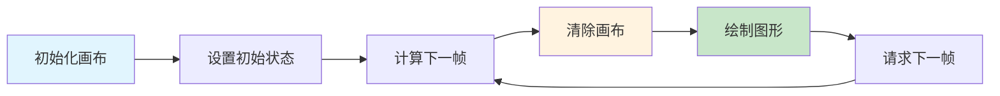

## 概念：Canvas 动画

> Canvas 动画是使用 HTML5 Canvas API，通过在画布上**逐帧绘制图形**来实现动画效果的技术。

**解决的核心痛点**：DOM 动画受限于 CSS 属性，而 Canvas 可以实现任意图形的动画、游戏粒子效果、实时数据可视化等高性能需求。

---

### 核心命题

- Canvas 动画的本质是「帧重绘」——每一帧清除画布并重新绘制所有图形
- Canvas 的优势是「像素级控制」——可以在任意位置绘制任意形状
- Canvas 的局限是「手动管理」——没有 DOM 结构，需要自己实现事件系统和状态管理

---

### 运行机制

#### 动画循环

#### 核心技术

| 技术                              | 说明                                 |
| :------------------------------ | :--------------------------------- |
| **requestAnimationFrame**       | 浏览器提供的帧同步 API，与屏幕刷新率同步，自动暂停于后台标签页  |
| **Canvas 2D Context**           | 绘制矩形、弧线、文字、图片、像素等 2D 图形 API        |
| **离屏 Canvas / OffscreenCanvas** | 在 Worker 线程中独立绘制，避免阻塞主线程，适合计算密集型场景 |
| **分层渲染**                        | 静态层 + 动态层分离，静态内容只绘制一次，减少每帧重绘面积     |
| **脏矩形（Dirty Rect）**             | 只重绘变化区域而非全画布，适合大量静态元素中局部变动的场景      |

---

### 进阶技巧

#### 交互类

| 技巧 | 说明 | 应用场景 |
|:---|:---|:---|
| **粒子系统** | 大量粒子（位置/速度/生命周期）独立更新，鼠标交互驱动粒子行为 | 星空背景、鼠标跟随、连接线、烟花特效 |
| **碰撞检测** | 矩形碰撞（AABB）、圆形碰撞（距离检测）、像素级碰撞（getImageData） | 游戏开发、拖拽交互、边界约束 |
| **图像处理** | 通过 getImageData / putImageData 直接操作像素 RGBA 值 | 滤镜（灰度/模糊/浮雕）、颜色提取、抠图 |

#### 性能优化类

| 技巧 | 说明 |
|:---|:---|
| **分层渲染** | 将静态背景和动态元素分到不同 Canvas 层，静态层只绘制一次 |
| **脏矩形更新** | 记录变化区域，每帧只 clearRect + drawRect 脏区域而非整画布 |
| **OffscreenCanvas** | 在 Web Worker 中执行绘制计算，避免阻塞主线程 UI 响应 |
| **对象池** | 复用粒子/精灵对象而非频繁 GC，减少垃圾回收停顿 |
| **节流高频事件** | resize / mousemove 等事件用 RAF 节流，避免事件积压 |

#### 绘制进阶类

| 技巧              | 说明                                                 |
| :-------------- | :------------------------------------------------- |
| **贝塞尔曲线与路径**    | quadraticCurveTo / bezierCurveTo 绘制平滑曲线，适合手写签名、图表  |
| **Canvas 文字排版** | measureText 精确测量、多行换行实现、富文本渲染（与 DOM 文字排版差异大）       |
| **WebGL 2D 加速** | 用 WebGL 管线加速 2D 渲染，性能可达 Canvas 2D 的 10 倍以上（适合万级粒子） |

#### 实战场景

| 技巧               | 说明                                              |
| :--------------- | :---------------------------------------------- |
| **Canvas 截图/导出** | toDataURL / toBlob 导出为图片，canvas.toBlob() 可上传或下载 |
| **Canvas + 视频**  | drawImage(videoElement) 逐帧绘制视频画面，可叠加滤镜或标注       |
| **Canvas 转 PDF** | 通过图片中间格式（toDataURL）嵌入 PDF，或使用 jsPDF 直接绘制        |

| 维度 | Canvas 动画 | CSS 动画 | DOM 动画 |
|:---|:---|:---|:---|
| **控制粒度** | 像素级 | 属性级 | 属性级 |
| **性能** | 高（位图操作） | 中（GPU 加速） | 低（重排/重绘） |
| **适用场景** | 游戏、粒子、数据可视化 | UI 过渡 | 简单交互 |
| **状态管理** | 手动 | 自动 | 自动 |

---

### 应用场景

- ✅ **适用场景**
	- **游戏开发**：2D 游戏、精灵动画、碰撞检测
	- **粒子系统**：火焰、烟雾、爆炸等特效
	- **数据可视化**：实时图表、动态图形
	- **图像处理**：滤镜、变换、图像合成
	- **物理模拟**：重力、碰撞、弹簧效果
- ⛔ **误用**
	- **简单 UI 动画**：按钮点击、页面过渡用 CSS 即可
	- **需要 DOM 特性的场景**：无障碍、SEO、内容选择

#### SOP

![[动画效果示例#Canvas]]

#### FAQ

- [[Q-Canvas 和 SVG 应该如何选择]]
- [[Q-如何优化 Canvas 动画性能]]
---

### 知识图谱

- **父级概念**：[[前端开发]] — Canvas 动画是前端图形开发的重要组成
- **子级概念**：
	- requestAnimationFrame — 帧同步核心 API
	- Canvas 2D Context — 绘制 API
	- 离屏渲染（OffscreenCanvas）— Worker 线程绘制
	- 分层渲染 — 动静分离优化
	- 脏矩形 — 局部重绘策略
	- 粒子系统 — 大量独立粒子的动画系统
- **并列概念**：
	- [[CSS Animation]] — CSS 实现的交互动画
	- SVG 动画 — 矢量图形动画
	- WebGL — 3D 图形 API
- **相关概念**：
	- [[动画原理]] — 动画的理论基础
	- [[Canvas]] — Canvas API 基础
	- [[前端性能优化]] — 性能优化与渲染策略

---

### 参考延伸

- [MDN - Canvas API](https://developer.mozilla.org/en-US/docs/Web/API/Canvas_API)
- [HTML5 Canvas Tutorial](https://www.html5canvastutorials.com/)
