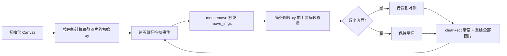

## SOP：使用 Canvas 实现网页无限滑动效果

> 本 SOP 定义使用 Canvas API 实现可拖拽双向无限滑动图片墙的标准流程，核心思路是**网格坐标 + 边界传送**，适用于创意图片展示、作品集、照片墙等场景。

目标效果：[Hisami Kurita Portfolio | ARCHIVE](https://hsmkrt1996.com/archive/)

---

### 适用场景

- ✅ 场景 1：创意官网作品集的图片展示墙
- ✅ 场景 2：照片墙/图库的交互式浏览
- ✅ 场景 3：数据可视化大屏的全局拖拽探索

---

### 流程图解



---

### 核心原理

无限滑动的本质是**边界传送**：图片不是真的无限多，而是超出边界后瞬间传送到对侧，视觉上感知不到跳跃。

```bash
向左拖动时：
  图片 A 超出左边界 → 传送到最右侧
  [A][B][C][D]  →  [B][C][D][A]
         ↓ 继续拖动
  [B][C][D][A]  →  [C][D][A][B]
```

与 CSS 跑马灯方案的区别：Canvas 方案是**事件驱动的逐帧重绘**，每次鼠标移动都 `clearRect` + 重绘所有元素，而非用 CSS transform 移动容器。没有 `requestAnimationFrame` 自动循环，只在有交互时才渲染。

---

### 核心步骤

#### 步骤 1：定义参数，计算网格总尺寸

```javascript
const config = {
  img_total: 28,         // 图片总数
  row_max: 7,            // 列数（横向排列数量）
  line_max: 4,           // 行数（纵向排列数量）
  img_width: 350,        // 单张图片宽度（原始尺寸 / 缩放比）
  img_height: 500,       // 单张图片高度
  img_margin: 200,       // 图片间距
}

// 网格总宽高（最后一张不带右/下间隔，故 -img_margin）
const total_width  = config.row_max  * (config.img_width  + config.img_margin) - config.img_margin
const total_height = config.line_max * (config.img_height + config.img_margin) - config.img_margin
```

#### 步骤 2：按网格计算每张图片的初始坐标

```javascript
function creat_img_data() {
  const img_data = []
  for (let i = 0; i < config.img_total; i++) {
    const img = new Image()
    img.src = `./photos/photo (${i + 1}).png`
    img.onload = () => {
      // 序号 → 行列 → 坐标
      const col = i % config.row_max
      const row = Math.floor(i / config.row_max)
      const x   = col * (config.img_width  + config.img_margin)
      const y   = row * (config.img_height + config.img_margin)
      img_data.push({ img, x, y })
      // 加载完立即绘制，避免白屏等待
      ctx.drawImage(img, x, y, config.img_width, config.img_height)
    }
  }
  return img_data
}
```

> 加载完一张立即绘制一张，避免等待所有图片加载完成才显示。

#### 步骤 3：拖拽时移动图片 + 边界传送

这是核心算法。每次 `mousemove` 时，清屏并对每张图片执行：

```javascript
function move_imgs(dx, dy) {
  ctx.clearRect(0, 0, canvas.width, canvas.height)

  img_data.forEach((item) => {
    // 应用位移
    item.x += dx
    item.y += dy

    // 横向边界传送
    if (item.x > total_width - config.img_width)   // 向右超出
      item.x -= total_width + config.img_margin     // 传送到最左侧
    if (item.x < -config.img_width)                 // 向左超出
      item.x += total_width + config.img_margin     // 传送到最右侧

    // 纵向边界传送（同上）
    if (item.y > total_height - config.img_height)
      item.y -= total_height + config.img_margin
    if (item.y < -config.img_height)
      item.y += total_height + config.img_margin

    ctx.drawImage(item.img, item.x, item.y, config.img_width, config.img_height)
  })
}
```

**边界条件解析**：

| 方向 | 超出条件 | 传送目标 | 公式 |
|:---|:---|:---|:---|
| 向右超出 | `x > total_width - img_width` | 移到最左 | `x -= total_width + img_margin` |
| 向左超出 | `x < -img_width` | 移到最右 | `x += total_width + img_margin` |
| 向下超出 | `y > total_height - img_height` | 移到最上 | `y -= total_height + img_margin` |
| 向上超出 | `y < -img_height` | 移到最下 | `y += total_height + img_margin` |

> 传送偏移量是 `total + margin`（而不只是 `total`），确保传送后图片与相邻图片保持正确间距。

#### 步骤 4：绑定鼠标事件

```javascript
let if_movable = false

canvas.addEventListener('mousedown',  () => { if_movable = true })
canvas.addEventListener('mouseup',    () => { if_movable = false })
canvas.addEventListener('mouseleave', () => { if_movable = false })
canvas.addEventListener('mousemove',  (e) => {
  if (!if_movable) return
  move_imgs(e.movementX, e.movementY)
})
```

> 使用 `e.movementX / movementY` 直接获取鼠标位移增量，不需要手动记录上一帧坐标。

#### 步骤 5：响应式 resize

Canvas 的 `width/height` 属性被修改后，画布内容会自动清空，需重新绘制：

```javascript
function resize() {
  canvas.width  = canvas.clientWidth
  canvas.height = canvas.clientHeight
  if (img_data.length) move_imgs(0, 0) // 传入 0 位移，只触发重绘
}

window.addEventListener('resize', resize)
```

#### 步骤 6（可选）：点击检测

鼠标抬起时，判断点击的是哪张图片：

```javascript
canvas.addEventListener('mouseup', (e) => {
  const clicked = img_data.find(item =>
    e.x >= item.x && e.x < item.x + config.img_width &&
    e.y >= item.y && e.y < item.y + config.img_height
  )
  if (clicked) console.log('点击了图片：', clicked)
})
```

---

### 完整骨架

```javascript
const photobox = {
  canvas: null,
  ctx: null,
  img_data: [],
  if_movable: false,
  // 参数...
  init() {
    this.canvas = document.querySelector('.photobox')
    this.ctx    = this.canvas.getContext('2d')
    this.total_width  = this.row_max  * (this.img_width  + this.img_margin) - this.img_margin
    this.total_height = this.line_max * (this.img_height + this.img_margin) - this.img_margin
    this.resize()
    this.creat_events()
    this.creat_img_data()
  },
  resize()        { /* 重设 canvas 宽高并重绘 */ },
  creat_img_data(){ /* 加载图片，计算初始坐标 */ },
  creat_events()  { /* 绑定鼠标事件 */ },
  move_imgs(dx, dy){ /* 清屏 → 位移 → 边界检测 → 重绘 */ },
  check_img(x, y) { /* 点击检测 */ },
}

photobox.init()
```

---

### 常见坑点

- ⛔ **图片传送后出现空白缝隙**
	- **原因**：传送偏移量只用了 `total_width`，少算了一个 `img_margin`
	- **排查**：传送公式必须是 `total_width + img_margin`
- ⛔ **resize 后画面变空白**
	- **原因**：修改 canvas 的 `width/height` 属性会自动清空画布内容
	- **排查**：resize 回调中调用 `move_imgs(0, 0)` 触发重绘
- ⛔ **图片加载完成前画面空白时间过长**
	- **原因**：等待所有图片加载完才开始绘制
	- **排查**：在每张图片的 `onload` 回调中立即绘制该图片
- ⛔ **拖动松手后图片仍在漂移**
	- **原因**：未监听 `mouseleave`，鼠标移出 canvas 后 `if_movable` 未重置
	- **排查**：同时监听 `mouseup` 和 `mouseleave`，两者都重置 `if_movable = false`
- 🔧 **点击与拖拽冲突**：在 `mousedown` 记录起始坐标，`mouseup` 时计算总位移，位移小于阈值（如 5px）才触发点击逻辑

---

### 知识图谱

- **父级概念**：[[Canvas动画]] — 本 SOP 是 Canvas 动画的垂直场景扩展
- **关联概念**：
	- [[动画原理]] — 动画的理论基础（帧率、插值）
	- [[CSS实现文字横向滚动效果]] — CSS 实现的横向无限滚动（对比：自动滚动 vs 拖拽滚动）
- **参考文章**
	- [进化！网页无限滑动：高性能canvas版_哔哩哔哩_bilibili](https://www.bilibili.com/video/BV11D421T7AV/?spm_id_from=333.788.comment.all.click&vd_source=d909cd5773c434648664a934ea4a8dae)
