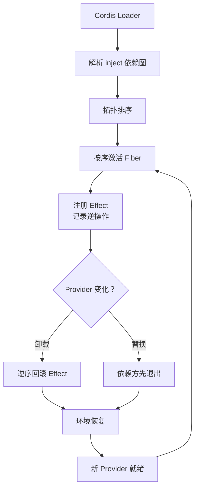

## 概念：DeepSeek Harness

> DSH 是 DeepSeek 团队发布的开源 Agent 执行框架，核心理念是「一切皆插件」，底层构建在「Cordis」框架能力上。

**解决的核心痛点**：DSH 是一个开源 Harness 框架，解决了「黑箱 Harness」导致的不可控与不可审查。根据「一切皆插件」的核心理念构建的无特权内核让 DSH 不再依赖单一模型，让构建和定制 Agent 的底层能力从厂商的黑箱中解放出来，交还给开发者。

---

### 核心命题

> 核心命题引用 atomic 笔记（陈述句观点），每个命题是一句话洞见

- [[DSH 的运行时没有不可替换的特权组件]]
	- **原理**：从 Session、Agent Loop、LLM 适配器到沙箱、UI，所有能力均由插件组合而成，仅最底层的 Cordis Runtime 保持稳定，它只提供六种基础操作（use/effect/set/get/isolate/intercept）。
- [[Cordis 用可回退 Effect 让插件“装得上也卸得干净”]]
	- **原理**：每一次注册（监听器、服务、定时器）都被视为一个 Effect，框架自动记录逆操作；卸载时按 LIFO 顺序回滚，保证插件退出后共享环境恢复原状。
- [[响应式 Coeffect 让依赖关系随运行时自动伸缩]]
	- **原理**：插件通过 `inject` 声明依赖，Cordis 等待依赖就绪后再激活；提供方被替换或卸载时，依赖方自动卸载或重载，无需手写重连逻辑。
- [[Capability Seam 将“能力”与“实现”解耦]]
	- **原理**：任何系统能力被拆分为 Definition（接口契约）、Provider（具体实现）、Consumer（调用方）三角色，替换 Provider 不影响 Consumer 的调用方式。
- [[TypeScript 类型化事件构成插件间的决策链]]
	- **原理**：事件分发模式（emit/parallel/serial/waterfall）是公开契约，waterfall 模式实现 around-middleware，使审批、超时、追踪等策略可作为插件插入执行链路而不侵入核心。

---

### 运行机制

Cordis 的加载器根据插件声明的 `inject` 构建依赖图，拓扑排序后按序激活。每个插件的注册行为被记录为可回退 Effect。当某个 Provider 被卸载或替换时，依赖它的插件先退出，其 Effect 按逆序回滚，随后新 Provider 就绪，依赖方自动重新加载。

---

### 关键区别

| 维度 | DSH | Claude Code / Codex |
|:--- |:--- |:--- |
| **核心逻辑** | 无特权内核，所有能力可替换 | 封装好的成品，核心不可动 |
| **适用场景** | 需要深度定制 Agent 行为、构建自有 Agent 产品的开发者 | 开箱即用的编程助手场景 |
| **模型依赖** | 不绑定单一模型，适配器可插拔 | 通常与特定模型强绑定 |
| **生态模式** | 社区插件自由组合、热插拔 | 厂商定义扩展点，受控集成 |

---

### 适用范围

- ✅ **适用场景**
	- **构建自有 Agent 产品**：DSH 提供可自由拼装的运行时底座，开发者无需从零造 Harness，只需组合插件。
	- **需要热替换/热升级能力的场景**：LLM Provider 限流、工具服务崩溃时，Cordis 自动处理依赖方的卸载与重载，无需重启进程。
	- **Agent 自进化实验**：内置 `dsh-tool-cordis` 自指工具集，Agent 可巡检自身运行时、现场定义并运行动态插件，用完即卸。
- ⛔ **误用**
	- **期望开箱即用的普通用户**：DSH 的标准模式可作为默认起点，但"一切皆插件"的完整能力面向的是愿意配置、组合、调试的开发者；四种模式的选择本身就有认知成本。
	- **把插件化等同于简单**：DSH 的插件系统复杂度高，集成时可能遇到"隐式拓扑雪崩"——缺少底层 Provider 会导致下游大量插件静默挂起，而非显式报错。
- **失效边界**
	- Cordis 的形式化保证目前仅在 Koishi 单一生态和 TypeScript 单一语言上验证，论文作者自认未提供性能基准或对照实验。
	- "一切皆插件"的长期可维护性依赖社区治理，4000 个 Koishi 插件的实践与全球开发者社区的规模不可同日而语。

---

### 批判

- **外部批判**
	- **社区开发者**：插件化产品的长期生态面临"六个月后不兼容、过时、缺乏治理"的风险，DeepSeek 的理论保证能否在更大规模下成立仍是未知数。
	- **AI 工程实践者**：对普通用户而言认知负担过重——四种模式的选择、插件的组合配置、隐式依赖的调试，都提高了上手门槛，而市面上"开箱即用"的 Harness 在稳定性和易用性上有明确优势。
- **内在张力**
	- **可组合性与可预测性的矛盾**：插件越自由组合，系统的全局行为越难被静态推理；Cordis 用运行时依赖图和 Effect 回滚来管理动态性，但这意味着很多错误（如缺少 Provider）只能在运行时暴露，而非编译期。
	- **"无特权内核"的边界**：Cordis 本身作为不可替换的运行时，其六种基础操作的语义若发生变化，整个生态都受影响——它虽小，但确实是"特权"的。

---

### FAQ

> 与本概念相关的开放性问题，先理解问题（发散），再看标准流程（收敛）

- [[DSH的的一切皆插件架构是如何实现的？]]
- [[Cordis 的可回退 Effect 机制是如何工作的？]]
- [[DSH 的 Capability Seam 三角色模型解决了什么问题？]]
- [[为什么 DSH 选择 TypeScript 而非 Python？]]
- [[Agent 如何用 cordis-tool 检查并改装自己的运行时？]]

---

### SOP

> 与本概念相关的标准操作流程，是 FAQ 中问题经过实践验证后的收敛成果

- [[构建一个无特权内核架构的MVP实现]]
- [[DSH 快速启动 SOP]] — `npx @deepseek-ai/dsh web`，配 API Key，选工作区
- [[编写 DSH 插件 SOP]] — 声明 `inject` 依赖、用 `ctx.effect()` 注册可回退副作用、通过 Service 或 Event 与其他插件协作
- [[动态插件实验 SOP]] — 用 `cordis_define` 定义、`cordis_run` 沙箱执行、`cordis_stop` 卸载，全程不重启

---

### 知识图谱

> 知识图谱链接 term（术语定义）和相关 concept，建立概念关系网络

- **父级概念**：[[Agent Harness]] — 环绕大模型、负责工具调度与执行闭环的控制系统
- **子级概念**：
	- [[Cordis]] — DSH 底层的插件元框架，提供依赖调度与生命周期管理
	- [[Capability Seam]] — 能力接口契约，解耦定义、实现与消费
	- [[Revertible Effect]] — 可回退的注册副作用，保证插件可干净卸载
	- [[Typed Event]] — 类型化事件系统，支持多种分发模式
	- [[DSH-Agent-Loop]]
- **并列概念**：
	- [[Claude Code]] — Anthropic 的闭源 Coding Agent 产品
	- [[OpenAI Codex]] — OpenAI 的 Agent 产品线
- **相关概念**：
	- [[依赖注入]] — Cordis 的 inject 机制借鉴并扩展了 DI 的思路
	- [[微内核架构]] — "无特权内核"是微内核思想的体现
	- [[时空可组合性]] — Cordis 的理论基础，论文形式化了时间与空间两个维度的组合问题
- **参考文章**
	- DeepSeek Harness 官方文档与 GitHub 仓库
	- 《A Programming Paradigm for Spatiotemporal Composability》（北京大学 & DeepSeek-AI）
	- Cordis 源码与 Koishi 插件生态实践
