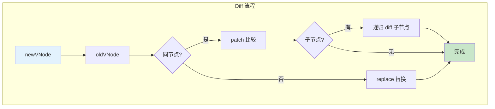

## 概念：Diff 算法

> Diff 算法是虚拟 DOM 的核心，通过对比新旧 VNode 树的差异，计算出最小更新操作，高效地更新真实 DOM。

**解决的问题**：直接操作真实 DOM 性能差，Diff 通过对比差异实现最小化更新

---

### 核心命题

- **同层级比较**
	- 只比较同层级的节点，不跨层级移动
	- 时间复杂度 O(n)
- **key 的作用**
	- 帮助识别相同节点
	- 避免不必要的 DOM 操作
- **Vue3 的优化**
	- Block + 静态提升减少动态节点数量
	- PatchFlag 精准对比

---

### 运行机制



---

### 核心流程

#### 1. patch 相同节点

```javascript
function patch(oldVNode, newVNode) {
  // 1. key 不同，直接替换
  if (oldVNode.key !== newVNode.key) {
    return replace(oldVNode, newVNode)
  }

  // 2. tag 不同，直接替换
  if (oldVNode.type !== newVNode.type) {
    return replace(oldVNode, newVNode)
  }

  // 3. 相同节点，patch 属性和子节点
  patchProps(oldVNode, newVNode)
  patchChildren(oldVNode, newVNode)
}
```

#### 2. 子节点 diff

```javascript
function patchChildren(oldVNode, newVNode) {
  const oldChildren = oldVNode.children
  const newChildren = newVNode.children

  // 四种情况
  if (旧有文本 && 新无文本) {
    // 删除文本
  } else if (旧无文本 && 新有文本) {
    // 设置文本
  } else if (旧有子 && 新有子) {
    // 递归 diff
    updateChildren(oldChildren, newChildren)
  } else {
    // 清空并设置新子节点
  }
}
```

#### 3. updateChildren 优化

```javascript
function updateChildren(oldChildren, newChildren) {
  let oldStartIndex = 0
  let newStartIndex = 0
  let oldEndIndex = oldChildren.length - 1
  let newEndIndex = newChildren.length - 1

  // 双指针 + key 匹配
  while (oldStartIndex <= oldEndIndex && newStartIndex <= newEndIndex) {
    // 头头比较 → 尾尾比较 → 交叉比较 → 乱序查找
    // ...
  }
}
```

---

### Vue3 vs Vue2 Diff 区别

| 维度 | Vue2 | Vue3 |
|:---|:---|:---|
| **结构** | 完整 VNode 树 | Block + 动态节点数组 |
| **Diff 范围** | 整棵树 | 只 diff 动态节点 |
| **静态节点** | 每次都参与 diff | 已提升，不参与 diff |
| **性能** | O(n) | O(d)，d=动态节点数 |

---

### key 的重要性

```html
<!-- 不推荐：没有 key，可能导致问题 -->
<div v-for="item in items">{{ item.name }}</div>

<!-- 推荐：使用唯一 key -->
<div v-for="item in items" :key="item.id">{{ item.name }}</div>
```

**key 的作用**：
- 复用相同类型的 VNode
- 避免错误的 DOM 更新
- 列表渲染时的性能优化

---

### 知识图谱

- **父级概念**：[[Virtual DOM]]
- **关联概念**：
	- [[响应式原理(Vue3)]] — 数据变化触发重新渲染
	- [[模板编译(Vue3)]] — 生成 render 函数
	- [[Block管理]] — Vue3 的优化机制
- **相关问题**：
	- [[Vue3的Diff算法与React有哪些异同？]]
	- [[Vue2 vs Vue3 Diff算法|Vue3的Diff算法和Vue2有什么区别？]]

---

### 参考延伸

- Vue3 源码：`packages/runtime-core/src/renderer.ts`
- Vue 官方文档：Virtual DOM
