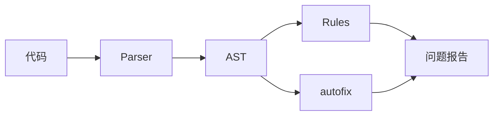

## 术语：ESLint

> **别名**: ESLint
> **领域**: #前端开发/工程化

### 定义

ESLint 是一种可配置的 JavaScript 静态代码分析工具，通过规则检测代码中的问题并提供自动修复功能。它使用 AST（抽象语法树）来分析代码，而非简单的文本匹配。

### 核心概念

| 概念 | 说明 |
|------|------|
| **规则 (Rules)** | ESLint 检查代码的核心，每个规则检测特定问题 |
| **配置 (Config)** |.eslintrc 或 eslint.config.js，定义启用的规则 |
| **插件 (Plugins)** | 扩展 ESLint 功能的规则集合 |
| **预设 (Extends)** | 预定义配置集合，如 eslint:recommended |

### 工作流程



### 常用配置

```javascript
// eslint.config.js
export default [
  {
    rules: {
      'no-unused-vars': 'warn',
      'no-console': 'error',
      'semi': ['error', 'always']
    }
  },
  pluginJs.configs.recommended
]
```

### 锚点连接

- **属于**：[[前端工程]]
- **相关概念**：[[Babel]] — 代码转换，ESLint 专注代码质量
- **相关工具**：Prettier（代码格式化）、TypeScript（类型检查）

---

### 相关 SOP

- [[SOP-代码审查流程]] — 代码审查中如何使用 ESLint
