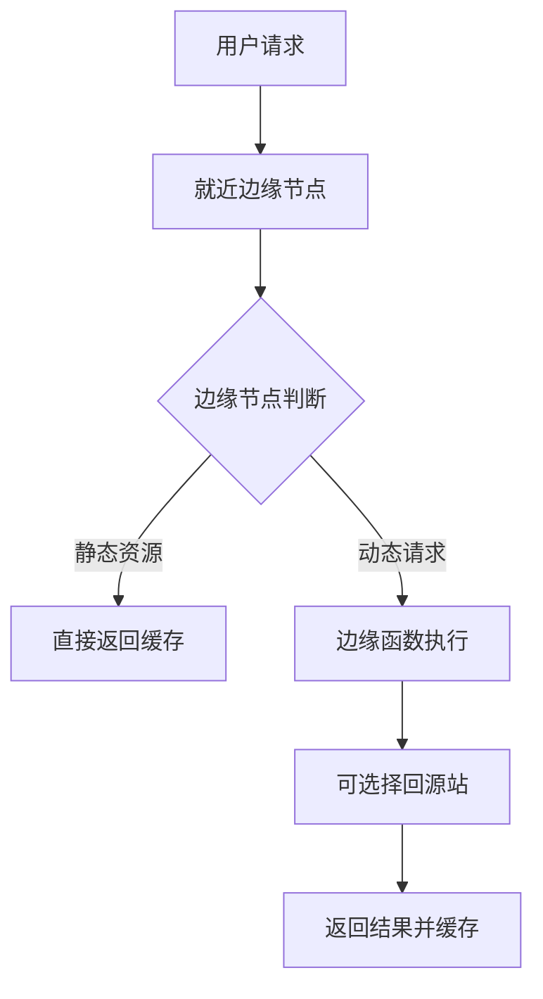

> Edge Runtime 是一种在**全球边缘节点**运行的轻量级 JavaScript 运行时，特点是**低延迟**、**高并发**、**无服务器运维**

**解决的核心痛点**：传统服务端部署有地域延迟，冷启动影响体验，需要运维管理服务器资源。

---

## 核心命题

> 核心命题引用 atomic 笔记（陈述句观点），每个命题是一句话洞见

- （待补充 atomic 洞见）

---

## 运行机制

**边缘计算原理**：

**核心特点**：
- **V8 隔离环境**：使用 Cloudflare Workers 的 V8 Isolates（非容器）
- **全球分布**：请求在最近的边缘节点处理
- **无冷启动**：V8 Isolates 比传统容器启动快 100 倍
- **限制**：不能用 Node.js API，无文件系统访问

---

## 关键区别

| 维度 | Edge Runtime | Node.js 服务端 |
|:--- |:--- |:--- |
| **执行环境** | V8 Isolates（边缘节点） | V8 + 容器/服务器 |
| **启动时间** | < 5ms（无冷启动） | 100ms- 几秒 |
| **全球延迟** | ~50ms（就近处理） | 取决于服务器位置 |
| **API 可用性** | 受限（无 fs/net 等） | 完整 Node.js API |
| **适用场景** | 轻量逻辑、鉴权、路由 | 复杂业务逻辑、数据库操作 |

---

## 应用场景

- ✅ **适用场景**
	- **A/B 测试路由**：低延迟判断用户群体
	- **JWT 验证/鉴权**：在边缘验证 token
	- **响应式重定向**：根据用户地区返回不同内容
	- **API Gateway**：聚合多个后端服务
- ⛔ **误用**
	- **复杂业务逻辑**：需要大量计算的场景
	- **数据库直接访问**：Edge 环境不适合长连接

---

## SOP

> 与本概念相关的标准操作流程

- （暂无相关 SOP，待补充）

---

## FAQ

> 与本概念相关的开放性问题

- （暂无相关 Question，待补充）

---

## 知识图谱

> 知识图谱链接 term（术语定义）和相关 concept

- **父级概念**：
	- [[CDN]] — Edge 的基础设施层
- **子级概念**：
	- [[Cloudflare Workers]] — Edge Runtime 的具体实现
- **并列概念**：
	- [[NodeJS]] — 传统服务端运行时
- **相关概念**：
	- [[Serverless]] — 无服务器架构范式
	- [[Deno Deploy]] — Deno 的边缘计算产品

---

## 参考延伸

- [Cloudflare Workers 文档](https://developers.cloudflare.com/workers/)
- [Edge Runtime 与 Node.js 的区别](https://blog.cloudflare.com/workers-runtimes/)
