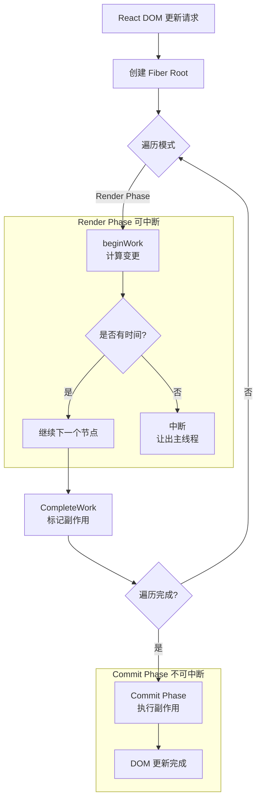
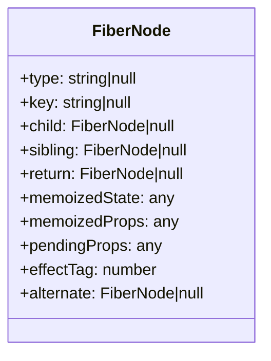
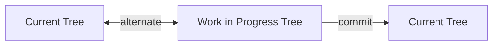

## 概念：Fiber架构

> React 16 引入的新协调引擎，将同步整树渲染改为异步可中断的链表遍历，使得渲染任务可以分片执行。

**解决的核心痛点**：React 15 的 Stack Reconciler 采用同步递归调和，同步遍历整棵 Virtual DOM 树，中途无法中断，导致大型应用在渲染时主线程阻塞，用户交互卡顿。

---

### 核心命题

- [[React Fiber 是可中断的增量渲染架构]]
	- 原理：把 VDOM 树拆成 Fiber 链表，利用 requestIdleCallback 分片执行
- [[React Fiber 采用链表结构代替递归]]
	- 原理：递归树遍历无法中断，链表因为存储了节点指针，所以可以终端和恢复
- [[React Fiber 的时间切片基于优先级调度]]
	- 原理：高优先级任务（例如用户交互）能够打断低优先级任务（例如列表渲染）

---

### 运行机制

#### Fiber 节点结构

#### 双缓存机制

---

### 关键区别

| 维度 | Stack Reconciler (React 15) | Fiber Reconciler (React 16+) |
|:---|:---|:---|
| **结构** | 递归树 | 链表 |
| **执行** | 同步整树渲染 | 异步可中断 |
| **中断点** | 无法中断 | 任意单元可中断 |
| **优先级** | 无 | 有（异步优先级调度） |
| **主线程** | 阻塞直到完成 | 让出给高优先级任务 |
| **更新恢复** | 从头开始 | 从中断点恢复 |

---

### 应用场景

- ✅ **适用场景**
	- **大型列表渲染**：大量数据时不会阻塞用户输入
	- **动画/过渡**：保持 60fps 流畅度
	- **数据预取**：高优先级响应用户交互，低优先级处理数据加载
- ⛔ **误用**
	- **setState 同步期望**：Fiber 的异步批处理可能导致批量更新，非预期同步行为

---

### 知识图谱

- **父级概念**：[[React]] — React 生态的核心架构
- **演进关系**：[[React版本演进]] — Fiber 在 React 16 中引入
- **相关概念**：
	- [[Virtual DOM|VDOM]] — Fiber 操作的底层对象
	- [[Concurrent Mode]] — Fiber 的能力扩展
	- [[useTransition]] — 基于 Fiber 优先级的 API
	- [[Scheduler|Scheduler]] — Fiber 的优先级调度基于Scheduler
