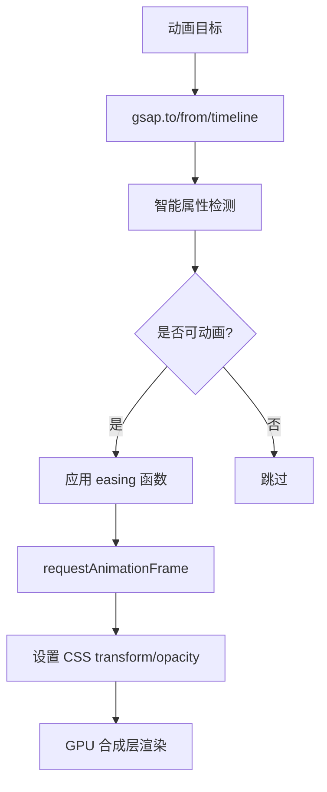

## 概念：GSAP

> GSAP（GreenSock Animation Platform）是一个专业的高性能 JavaScript 动画库，用于创建流畅的 Web 动画。

**解决的核心痛点**：解决原生 CSS 动画和 Web Animations API 难以实现复杂动画序列、精确时间控制和高性能渲染的问题

---

### 核心命题

- [[GSAP 通过优化的动画引擎实现高性能渲染]]
	- **原理**：GSAP 使用智能属性检测 + requestAnimationFrame，只动画可变化的属性（如 opacity、transform），避免触发布局重排（reflow），利用 GPU 加速 [[合成层]]
- [[GSAP 的时间线功能支持复杂动画序列编排]]
	- **原理**：Timeline 可以精确控制多个动画的时序、延迟、叠加
- [[GSAP 兼容性问题少，跨浏览器表现一致]]
	- **原理**：GreenSock 团队长期维护，对浏览器兼容性处理完善

---

### 运行机制

---

### 关键区别

| 维度 | GSAP | CSS Animation |
|:--- |:--- |:--- |
| **控制精度** | 精确到帧，可暂停/恢复/反转 | 只能播放/暂停 |
| **时间线** | 支持复杂序列编排 | 只能简单延迟 |
| **性能** | 硬件加速优化好 | 依赖浏览器 |
| **适用场景** | 复杂交互动画 | 简单循环动画 |

---

### 应用场景

- ✅ **适用场景**
	- **复杂交互动画**：页面转场、滚动触发、序列动画
	- **游戏动画**：Sprite 动画、粒子效果
	- **SVG 动画**：路径动画、图形变换
- ⛔ **误用**
	- **简单动画用 GSAP**：CSS 足以实现的简单动画不必引入 GSAP
	- **忽视清理**：大量动画未清理会导致内存泄漏

---

### 知识图谱

- **父级概念**：[[Web动画]]
- **子集概念**：
	- [[ScrollTrigger]]
	- [[Flip]]
- **并列概念**：
	- [[CSS Animation]]
	- [[Web Animations API]]
	- [[Framer Motion]]
- **相关概念**：
	- [[SVG]]
	- [[Canvas]]

---

### 参考延伸

- 官网：[Homepage | GSAP](https://gsap.com/)
- 插件：ScrollTrigger、Flip、TextPlugin
- 替代方案：Framer Motion（React）、Anime.js
