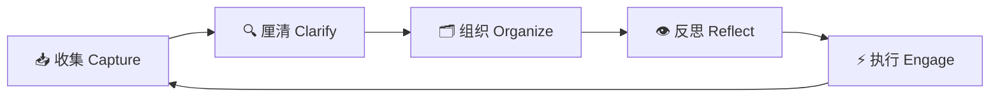

## 概念：GTD（Getting Things Done）

> GTD 是一套完整的行为管理系统，核心理念是将所有待办事项从大脑卸载到外部可信系统，从而释放认知资源专注于当下的执行。

**解决的核心痛点**：大脑的"工作记忆"容量有限（[[米勒法则]]认为约 4 个组块），当未完成的任务在脑中盘旋时，会产生"蔡格尼克效应"——未完成的任务持续消耗注意力。GTD 通过建立外部系统来解决这一问题。

---

### 核心命题

- [[认知卸载提升工作效率]]
	- **原理**：将任务从大脑移到外部系统，释放工作记忆空间
- [[心如止水的本质是适当的响应]]
	- **原理**：生产力不是做更多，而是在正确的时间做正确的事
- [[行动决策需要明确的下一步动作]]
	- **原理**：模糊的行动项导致拖延，明确的下一步动作降低执行门槛

---

### 运行机制

GTD 的核心工作流是五个阶段的循环：

#### 阶段一：收集（Capture）

**原则**：捕获一切未完成之事，无论大小。不要过早判断重要性。

**工具**：物理收件箱、数字收件箱（Todoist/Notion/Obsidian 快速捕获）、语音备忘录、随身笔记本

**判断标准**：任何引起你的注意、承诺、或"待办"感的事物都应被捕获。

#### 阶段二：厘清（Clarify）

对每个收件箱条目进行判断：

1. **这是可行动的吗？**
	 - 否 → 分为三类：**垃圾**（丢弃）、**参考资料**（归档）、**孵化**（将来/也许清单）
	 - 是 → 下一步行动是什么？

2. **单一步骤还是多步骤项目？**
	 - 单一步骤且 < 2 分钟 → **立即执行**（2 分钟原则）
	 - 单一步骤且 > 2 分钟 → **推迟**（加入下一步行动清单）或 **授权**
	 - 多步骤 → **定义为项目**，确定下一步行动

#### 阶段三：组织（Organize）

将厘清后的条目放入以下分类：

| 分类 | 说明 | 示例 |
|:---|:---|:---|
| **项目清单** | 需要多步骤完成的承诺，每个项目有具体成果定义 | "完成 Q3 报告" |
| **下一步行动** | 按上下文分类的具体行动 | @电脑、@外出、@电话、@待讨论 |
| **等待清单** | 授权给他人的任务 | "等张三发设计稿" |
| **将来/也许** | 有兴趣但未承诺的事项 | "学日语"、"换电脑" |
| **参考资料** | 无需行动但有价值的信息 | 会议笔记、文章剪藏 |
| **日历** | 硬性约定 | 会议、截止日期 |

#### 阶段四：反思（Reflect）

**每周回顾是 GTD 的"关键成功因素"**：

- 清空所有收件箱（物理 + 数字）
- 审查所有项目清单，确保每个项目都有下一步行动
- 审查将来/也许清单，决定是否升级为项目
- 审查日历，确认下周承诺
- 更新等待清单
- 确保系统完整可信

#### 阶段五：执行（Engage）

**执行决策的 4 重标准**（在任意时刻决定做什么）：

1. **上下文**（你在哪？有什么工具？）
2. **可用时间**（你有多少时间？）
3. **可用精力**（你现在有多少精力？）
4. **优先级**（什么是现在最重要的？）

结合[[四象限法则]] 进行优先级排序，但 GTD 更强调上下文而非紧急程度。

---

### 关键区别

| 维度 | GTD | [[四象限法则]]/[[番茄工作法]] |
|:--- |:--- |:--- |
| **核心关注** | 建立可信系统，清空大脑 | 任务优先级 / 专注时段 |
| **适用规模** | 全生命周期任务管理 | 单日调度 / 单任务执行 |
| **复杂度** | 较高，需要持续维护 | 较低，即学即用 |
| **最大价值** | 系统性焦虑消除 | 即时效率提升 |
| **弱点** | 维护成本高，易过度工程化 | 不适合复杂项目管理 |

---

### 应用场景

- ✅ **适用场景**
	- **信息过载的知识工作者**：需要处理大量输入（邮件、消息、会议产出），GTD 防止遗漏
	- **多项目并行者**：同时推进多个项目，需要可靠的系统来跟踪每个项目的下一步
	- **容易焦虑/过度承诺者**：通过完整的外部队列减轻心理负担
- ⛔ **误用**
	- **为 GTD 而 GTD**：花过多时间维护系统本身，而不是完成任务 —— 系统应服务于行动，而非反之
	- **完美主义陷阱**：追求系统"完美"，反复调整分类/标签/流程，却不真正推进工作

---

### SOP

> 本概念相关的标准操作流程

- [[SOP-每周回顾工作流]] — GTD 每周回顾的标准流程
- [[SOP-任务收件箱处理流程]] — 每日清空收件箱的标准操作

---

### FAQ

> 与本概念相关的开放性问题

- [[Q-如何在保持系统可信的同时避免过度工程化]]
- [[Q-GTD 在数字化时代的今天需要哪些调整]]

---

### 知识图谱

- **父级概念**：[[A-时间管理]] — 时间管理方法论的核心组成部分
- **子级概念**：
	- [[2 分钟原则]] — GTD 中"立即执行"的判断标准
	- [[每周回顾]] — GTD 的关键成功因素
- **并列概念**：
	- [[四象限法则]] — 聚焦优先级排序，与 GTD 互补
	- [[番茄工作法]] — 聚焦专注时段执行
	- [[PARA笔记法]] — 信息组织方法论，可与 GTD 结合使用
- **相关概念**：
	- [[认知卸载]] — GTD 的理论基础
	- [[蔡格尼克效应]] — GTD 要解决的心理机制
- **参考文章**
	- David Allen, "Getting Things Done: The Art of Stress-Free Productivity" (2001)
