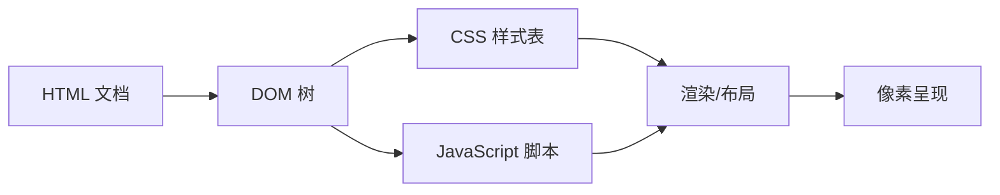

## 概念：HTML

> HTML（HyperText Markup Language，超文本标记语言）是 Web 的结构层语言，通过元素（element）与标签（tag）定义网页内容的语义结构。

**解决的核心痛点**：如何以标准、可访问、可被浏览器解析的方式描述网页的内容与结构？

---

### 核心命题

- HTML 是**结构**而非样式与行为：内容结构由 HTML 定义，呈现由 CSS 负责，交互由 JavaScript 负责
- 语义化标签（`header`/`nav`/`article`/`section`）提升可访问性与 SEO
- HTML 通过 `href`/`src` 等属性与其他资源建立链接，构成"超文本"网络

---

### 运行机制

HTML 文档被浏览器解析为 DOM 树，CSS 与 JavaScript 分别作用于结构与行为。

---

### 关键区别

| 维度 | [[HTML]] | [[CSS]] | [[JavaScript]] |
|:--- |:--- |:--- |:--- |
| **角色** | 结构层 | 表现层 | 行为层 |
| **语言类型** | 标记语言 | 样式语言 | 编程语言 |
| **浏览器产物** | DOM 树 | 计算样式 | 运行效果 |

---

### 适用范围

- ✅ **适用场景**
	- **页面结构**：定义文本、图像、链接、表单等内容骨架
	- **语义化**：用语义标签提升可访问性与 SEO
- ⛔ **误用**
	- **用 HTML 做样式**：如用 ` `/`<table>` 排版，应由 CSS 负责
	- **用 HTML 做交互**：应交给 JavaScript 与事件机制

---

### 知识图谱

- **父级概念**：[[前端开发]] — 前端领域顶层 area
- **并列概念**：[[CSS]] — 表现层语言；[[浏览器]] — HTML 的宿主环境
- **相关概念**：[[前端框架]] — 框架将组件编译为 HTML

---

### 参考延伸

- [MDN HTML 文档](https://developer.mozilla.org/zh-CN/docs/Web/HTML)
- [HTML Living Standard](https://html.spec.whatwg.org/)
