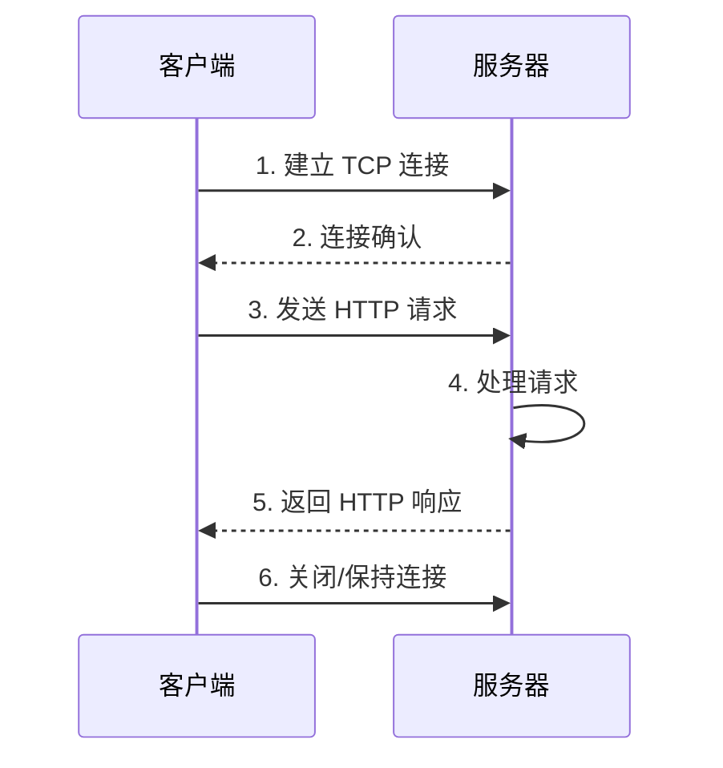

> HTTP（Hypertext Transfer Protocol，超文本传输协议）是一种用于在 Web 服务器和客户端之间传输数据的应用层协议，是构建在 TCP/IP 协议之上的请求 - 响应式协议。

**解决的核心痛点**：如何让客户端和服务器之间进行高效、可靠的数据通信？HTTP 定义了标准化的请求 - 响应格式，使得不同系统之间可以相互通信。

---

## 核心命题

- [[HTTP 是基于请求-响应模型的无状态协议]]
	- **原理**：客户端发起请求，服务器返回响应；每个请求都是独立的，服务器不保存客户端状态，需要通过 Cookie、Session 或 Token 维护状态
- [[HTTP 是可扩展的协议]]
	- **原理**：通过自定义头部、状态码、请求方法等，可以灵活扩展协议功能，满足不同业务需求

---

## 运行机制

1. **建立连接**：基于 TCP（HTTP/3 基于 QUIC）
2. **发送请求**：包含方法、URI、头部、正文
3. **处理请求**：服务器根据 URI 查找资源
4. **返回响应**：包含状态码、头部、响应体
5. **关闭连接**：HTTP/1.1 默认持久连接

---

## 关键区别

| 维度 | HTTP/1.1 | [[HTTP~2]] | [[HTTP~3]] |
|:--- |:--- |:--- |:--- |
| **传输方式** | 文本 | 二进制帧 | QUIC 数据报 |
| **多路复用** | 管道化（队头阻塞） | 多路复用 | 多路复用 |
| **头部压缩** | 无 | HPACK | QPACK |
| **队头阻塞** | 有 | 无 | 无 |
| **底层协议** | TCP | TCP | QUIC |

---

## 版本演进

| 版本           | 特点                        | 缺点   |
| :----------- | :------------------------ | ---- |
| HTTP/0.9     | 最初版本，只支持 GET              |      |
| [[HTTP~1.0]] | 引入头部、状态码、多种方法             |      |
| [[HTTP~1.1]] | 持久连接、管道化、缓存控制             | 队头阻塞 |
| [[HTTP~2]]   | [[多路复用]]、头部压缩、Server Push |      |
| [[HTTP~3]]   | 基于 [[QUIC]]、0-RTT 连接      |      |

---

## 应用场景

- ✅ **适用场景**
	- **网页浏览**：浏览器与服务器通信
	- **API 接口**：前后端数据交互
	- **文件传输**：上传/下载资源
- ⛔ **误用**
	- **明文传输敏感信息**：应使用 HTTPS
	- **频繁建立连接**：应使用持久连接或 HTTP/2

---

## FAQ

- [[网络协议相关问题|MOC-网络协议相关问题]]

---

## 知识图谱

- **父级概念**：[[网络协议]] — HTTP 是应用层协议之一
- **子级概念**：
	- [[HTTP~1.0]]
	- [[HTTP~1.1]]
	- [[HTTP~2]]
- **并列概念**：
	- [[WebSocket]] — 双向通信协议
- **相关概念**：
	- [[HTTPS]] — HTTP 的安全版本
	- [[RESTful API]] — 基于 HTTP 的 API 设计风格
	- [[HTTP缓存]]

---

## 参考延伸

- [HTTP | MDN](https://developer.mozilla.org/zh-CN/docs/Web/HTTP)
- [RFC 7231 - HTTP/1.1](https://httpwg.org/specs/rfc7231/)
- [RFC 7540 - HTTP/2](https://httpwg.org/specs/rfc7540/)
