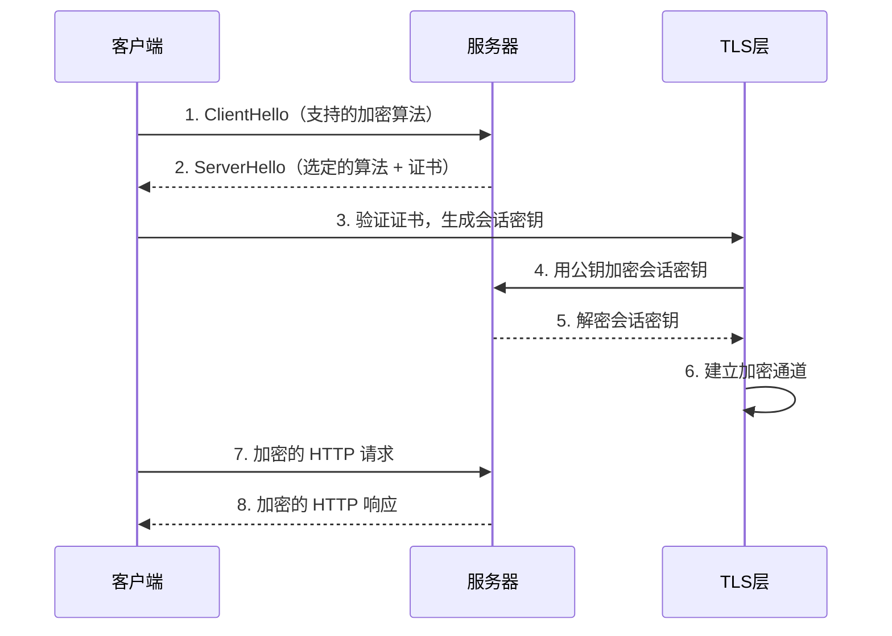

> HTTPS（HTTP Secure，超文本传输安全协议）是 HTTP 的安全版本，通过 [[TLS/SSL]] 协议对通信数据进行加密，确保数据在传输过程中的机密性和完整性。

**解决的核心痛点**：HTTP 协议以明文传输数据，容易被窃听和篡改；HTTPS 通过加密技术保护数据安全，防止中间人攻击和数据泄露。

---

## 核心命题

- [[HTTPS 通过 TLS/SSL 加密保护数据安全]]
	- **原理**：HTTPS 在 TCP 和 HTTP 之间插入 TLS 层，使用对称加密和非对称加密相结合的方式，对传输数据进行加密
- [[HTTPS 验证服务器身份，防止中间人攻击]]
	- **原理**：服务器需要提供由可信 CA 颁发的数字证书，客户端验证证书确认服务器身份

---

## 运行机制

1. **握手阶段**：协商加密算法、验证服务器证书
2. **密钥交换**：客户端生成会话密钥，用服务器公钥加密后发送
3. **加密通信**：双方使用会话密钥进行对称加密通信
4. **会话结束**：关闭连接时销毁会话密钥

---

## 关键区别

| 维度 | [[HTTP]] | HTTPS |
|:--- |:--- |:--- |
| **安全性** | 明文传输 | 加密传输 |
| **默认端口** | 80 | 443 |
| **证书** | 无 | 需要 CA 证书 |
| **性能** | 更快 | 略慢（握手开销） |
| **SEO** | 不安全标记 | 优先收录 |

---

## TLS/SSL 核心概念

| 概念 | 作用 |
|:--- |:--- |
| **数字证书** | 证明服务器身份，由 CA 颁发 |
| **对称加密** | 加密和解密使用相同密钥（效率高） |
| **非对称加密** | 公钥加密、私钥解密（用于密钥交换） |
| **CA（证书颁发机构）** | 可信第三方，负责颁发和管理证书 |
| **证书链** | 从根证书到服务器证书的信任链 |

---

## 应用场景

- ✅ **适用场景**
	- **敏感数据传输**：登录密码、支付信息、个人资料
	- **电商交易**：在线购物、支付流程
	- **企业内网**：需要身份验证的内部系统
	- **SEO 优化**：搜索引擎优先收录 HTTPS 网站
- ⛔ **误用**
	- **证书过期**：未及时续期导致安全警告
	- **自签名证书**：仅用于开发，生产环境需可信 CA

---

## 知识图谱

- **父级概念**：[[网络协议]] — HTTPS 是应用层安全协议
- **子级概念**：
	- [[TLS]] — HTTPS 使用的加密协议
- **并列概念**：
	- [[HTTP]] — HTTPS 的基础协议
- **相关概念**：
	- [[SSL证书]]
	- [[Web安全]]
	- [[WebSocket]] — 也可使用 WSS 加密

---

## 参考延伸

- [HTTPS | MDN](https://developer.mozilla.org/zh-CN/docs/Glossary/HTTPS)
- [RFC 5246 - TLS 1.2](https://tools.ietf.org/html/rfc5246)
- [Let's Encrypt - 免费 CA](https://letsencrypt.org/)
