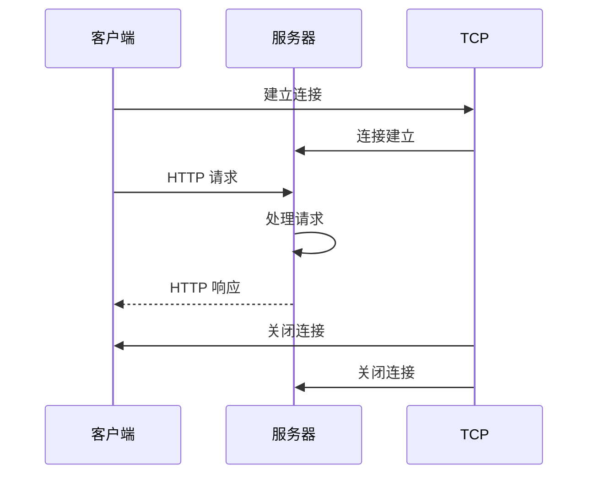

> HTTP/1.0 是 HTTP 协议的第一个被广泛使用的版本，它定义了客户端和服务器之间如何进行通信，以获取 Web 资源。

**解决的核心痛点**：如何在客户端和服务器之间传输超文本数据？HTTP/1.0 确立了请求 - 响应模式，为 Web 通信奠定了基础。

---

## 核心命题

- [[HTTP/1.0 采用短连接模式]]
	- **原理**：每次 HTTP 请求都需要建立一个新的 TCP 连接，请求完成后立即关闭连接，导致性能开销大
- [[HTTP/1.0 是无状态协议]]
	- **原理**：服务器不会记住客户端的任何信息，每个请求都是独立的

---

## 运行机制

1. 建立 TCP 连接
2. 客户端发送 HTTP 请求
3. 服务器处理请求并返回响应
4. 关闭 TCP 连接

---

## 关键区别

| 维度 | HTTP/1.0 | [[HTTP~1.1]] |
|:--- |:--- |:--- |
| **连接方式** | 短连接 | 持久连接 |
| **管道化** | 不支持 | 支持 |
| **缓存控制** | 有限 | 增强 |
| **Host 头** | 可选 | 必需 |

---

## 应用场景

- ✅ **适用场景**
	- **简单请求**：资源量小的页面
	- **历史兼容**：遗留系统
- ⛔ **误用**
	- **高频请求**：每次建连开销大，应使用 HTTP/1.1

---

## 知识图谱

- **父级概念**：[[HTTP]] — HTTP/1.0 是 HTTP 协议的第一个版本
- **子级概念**：
	- [[HTTP~1.1]] — HTTP/1.0 的后续版本
- **相关概念**：
	- [[TCP]] — HTTP/1.0 的传输层协议

---

## 参考延伸

- [MDN: HTTP/1.0](https://developer.mozilla.org/en-US/docs/Web/HTTP/1.0)
