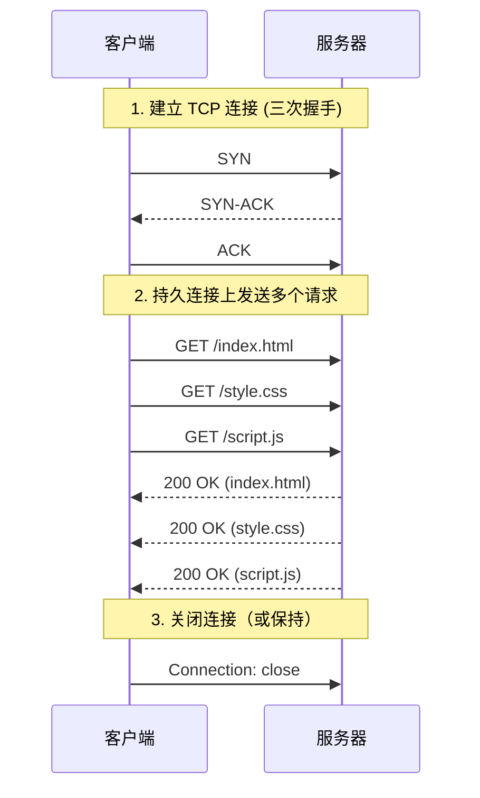

> HTTP/1.1 (Hypertext Transfer Protocol 1.1) 是 HTTP 协议的第二个主要版本，在 HTTP/1.0 基础上引入了持久连接、管道化、分块传输等特性，提高了 Web 应用的性能和效率。

**解决的核心痛点**：如何减少 TCP 连接建立的开销，提升页面加载速度？

---

## 核心命题

- [[HTTP/1.1 通过持久连接减少 TCP 连接建立次数]]
	- **原理**：默认开启 Keep-Alive，同一个 TCP 连接可处理多个请求 - 响应，避免重复三次握手
- [[HTTP/1.1 管道化允许并发发送请求]]
	- **原理**：无需等待前一个响应返回，即可发送下一个请求，提升网络利用率
- [[HTTP/1.1 存在队头阻塞问题]]
	- **原理**：虽然可以并发发送请求，但响应必须按顺序返回，若首个请求卡住，后续请求全部阻塞

---

## 运行机制

---

## 关键区别

| 维度          | HTTP~1.1 | [[HTTP~1.0]] | [[HTTP~2]] |
|:---------- |:------- |:----------- |:--------- |
| **持久连接**    | 默认开启     | 需手动开启        | 默认开启       |
| **管道化**     | 支持       | 不支持          | 多路复用       |
| **队头阻塞**    | 有（响应有序）  | 无            | 无          |
| **头部压缩**    | 无        | 无            | HPACK      |
| **多路复用**    | 无        | 无            | 支持         |
| **Host 头部** | 必需       | 可选           | 必需         |

---

## 应用场景

- ✅ **适用场景**
	- **兼容性强**：所有浏览器和服务器都支持，适用于需要广泛兼容性的场景
	- **简单请求**：请求数量较少时，持久连接已能满足性能需求
- ⛔ **误用**
	- **大量并发请求**：应使用 HTTP/2 或 HTTP/3，避免队头阻塞
	- **敏感数据传输**：应使用 HTTPS 而非明文 HTTP/1.1

---

## 知识图谱

- **父级概念**：[[HTTP]] — HTTP/1.1 是 HTTP 协议的一个版本
- **子级概念**：
	- [[持久连接]] — HTTP/1.1 的核心特性
	- [[管道化]] — HTTP/1.1 的请求并发方式
- **并列概念**：
	- [[HTTP~1.0]] — HTTP/1.1 的前身
	- [[HTTP~2]] — HTTP/1.1 的后续版本
- **相关概念**：
	- [[TCP]] — HTTP/1.1 的传输层协议
	- [[队头阻塞]] — HTTP/1.1 的性能瓶颈

---

## 参考延伸

- [MDN HTTP/1.1](https://developer.mozilla.org/en-US/docs/Web/HTTP/1.1)
- [RFC 7231 - HTTP/1.1](https://httpwg.org/specs/rfc7231/)
