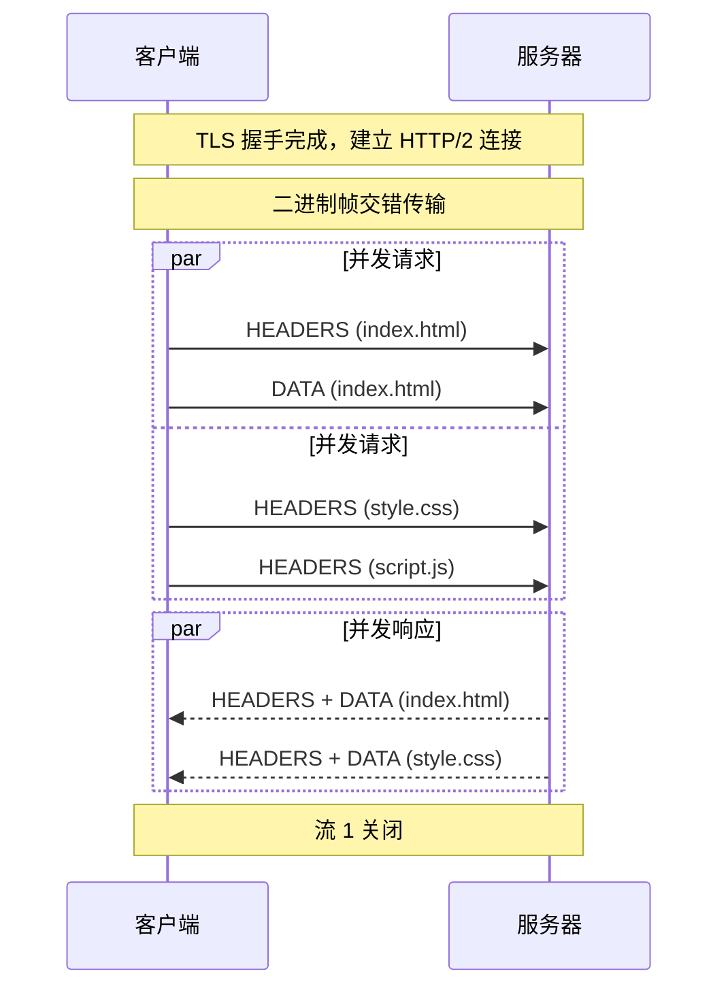

> HTTP/2 (Hypertext Transfer Protocol 2) 是 HTTP 协议的第三个主要版本，在 HTTP/1.1 基础上引入了多路复用、[[头部压缩]]、服务器推送等特性，旨在提高 Web 应用的性能和效率。

**解决的核心痛点**：如何解决 HTTP/1.1 的队头阻塞问题，提升并发传输效率？

---

## 核心命题

- [[HTTP2 通过多路复用实现真正的并发请求]]
	- **原理**：二进制帧交错传输，同一连接上可并行处理多个请求 - 响应，无需等待响应有序返回

> HTTP/2 解决了 HTTP/1.1 的什么问题？通过什么手段？ #card
> 应用层队头阻塞（响应需有序返回）。手段：二进制帧 + 多路复用（同一连接并行多个请求-响应）+ HPACK 头部压缩。

- [[HTTP/2 通过 HPACK 压缩头部减少传输开销]]
	- **原理**：静态表 + 动态表 + 哈夫曼编码，极大减少重复头部传输
- [[HTTP/2 服务器推送可以提前发送资源]]
	- **原理**：服务器主动推送客户端可能需要的资源，减少 RTT 等待
- [[HTTP/2 仍存在 TCP 队头阻塞]]
	- **原理**：HTTP/2 解决了应用层队头阻塞，但 TCP 层丢包仍会阻塞所有流

---

## 运行机制

---

## 关键区别

| *维度*      | HTTP~2    | [[HTTP~1.1]]   | [[HTTP~3]] |
|:-------- |:-------- |:------------- |:--------- |
| **传输方式**  | 二进制帧      | 文本             | 二进制帧       |
| **多路复用**  | ✅         | ⚠️  管道化（有队头阻塞） | ✅          |
| **队头阻塞**  | TCP 层     | 响应有序           | ❌          |
| **头部压缩**  | HPACK     | 无              | QPACK      |
| **服务器推送** | ✅         | ❌              | ✅          |
| **底层协议**  | TCP + TLS | TCP            | QUIC       |

---

## 应用场景

- ✅ **适用场景**
	- **高并发页面**：多资源并行加载，减少页面加载时间
	- **资源密集型**：大量图片、CSS、JS 的页面
	- **API 聚合**：一次请求获取多个相关资源
- ⛔ **误用**
	- **低延迟场景**：高丢包率网络下性能可能不如 HTTP/1.1（TCP 队头阻塞）
	- **无 TLS 环境**：主流浏览器仅支持 HTTP/2 over TLS

---

## 知识图谱

- **父级概念**：[[HTTP]] — HTTP/2 是 HTTP 协议的一个版本
- **子级概念**：
	- [[多路复用]] — HTTP/2 的核心特性
	- [[HPACK]] — HTTP/2 的头部压缩算法
	- [[服务器推送]] — HTTP/2 的资源推送机制
- **并列概念**：
	- [[HTTP~1.1]] — HTTP/2 的前一个版本
	- [[HTTP~3]] — HTTP/2 的后续版本
- **相关概念**：
	- [[TCP]] — HTTP/2 的传输层协议
	- [[TLS]] — HTTP/2 主流实现所需的加密层
	- [[队头阻塞]] — HTTP/2 仍存在的性能瓶颈

---

## 参考延伸

- [MDN HTTP/2](https://developer.mozilla.org/en-US/docs/Web/HTTP/2)
- [RFC 7540 - HTTP/2](https://httpwg.org/specs/rfc7540/)
