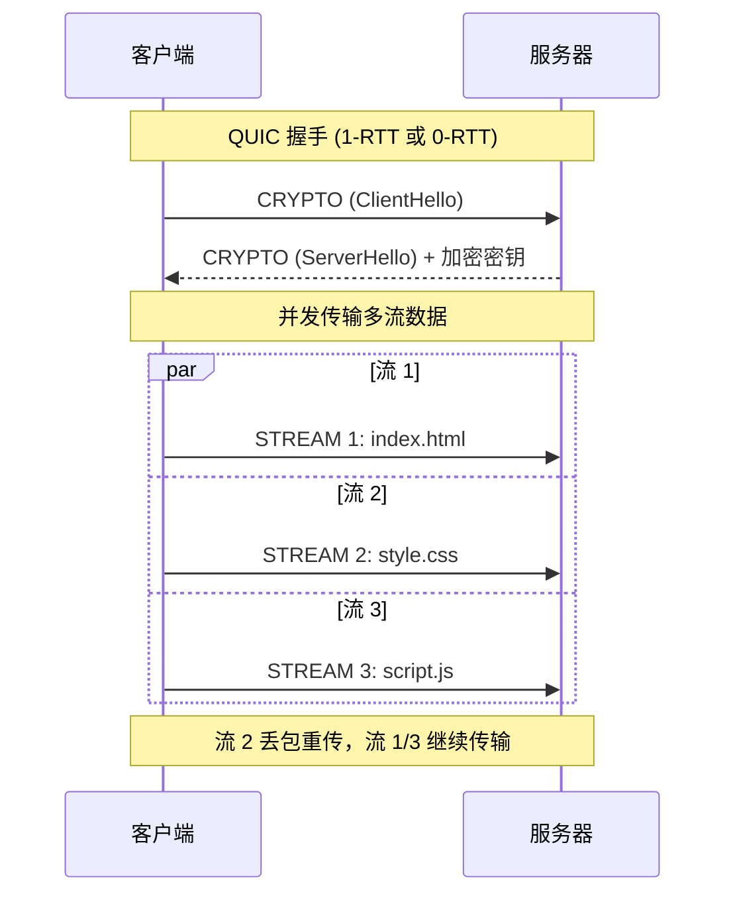

> HTTP/3 (Hypertext Transfer Protocol 3) 是 HTTP 协议的第三个主要版本，基于 QUIC（UDP）协议传输，彻底解决了 TCP 层队头阻塞问题。

**解决的核心痛点**：如何在高丢包率网络中保持高性能，解决 HTTP/2 的 TCP 队头阻塞问题？

---

## 核心命题

- HTTP/3 基于 [[QUIC]] 协议消除队头阻塞
	- **原理**：QUIC 基于 UDP，每个数据流独立传输，单一流丢包只阻塞该流，其他流不受影响
- [[HTTP/3 支持 0-RTT 连接建立]]
	- **原理**：客户端可缓存服务器密钥，无需等待握手完成即可发送数据
- HTTP/3 使用 [[QPACK]] 头部压缩
	- **原理**：基于 QUIC 的流控制，支持动态表的无序解压缩
- [[HTTP/3 支持连接迁移]]
	- **原理**：连接由 64 位连接 ID 标识，网络切换（如 WiFi → 5G）时无需重建连接

---

## 运行机制

---

## 关键区别

| 维度 | HTTP/3 | [[HTTP~2]] | [[HTTP~1.1]] |
|:--- |:--- |:--- |:--- |
| **底层协议** | QUIC (UDP) | TCP | TCP |
| **队头阻塞** | 无 | TCP 层 | 响应有序 |
| **连接迁移** | ✅ | ❌ | ❌ |
| **0-RTT** | ✅ | ❌ | ❌ |
| **头部压缩** | QPACK | HPACK | 无 |
| **TLS** | 内置 | TLS 1.3 | 可选 |

---

## 应用场景

- ✅ **适用场景**
	- **高移动性场景**：WiFi/蜂窝网络切换，需要连接迁移
	- **高丢包率网络**：移动网络、卫星通信等
	- **低延迟需求**：0-RTT 加速首次请求
- ⛔ **误用**
	- **稳定网络环境**：HTTP/2 足够且更成熟
	- **需要穿透防火墙**：UDP 可能被部分网络限制

---

## 知识图谱

- **父级概念**：[[HTTP]] — HTTP/3 是 HTTP 协议的一个版本
- **子级概念**：
	- [[QUIC]] — HTTP/3 的底层协议
	- [[QPACK]] — HTTP/3 的头部压缩算法
- **并列概念**：
	- [[HTTP~1.1]] — HTTP/3 的前一个版本
	- [[HTTP~2]] — HTTP/3 的前一个版本
- **相关概念**：
	- [[UDP]] — QUIC 基于 UDP
	- [[队头阻塞]] — HTTP/3 彻底消除队头阻塞

---

## 参考延伸

- [MDN HTTP/3](https://developer.mozilla.org/en-US/docs/Web/HTTP/3)
- [RFC 9114 - HTTP/3](https://httpwg.org/specs/rfc9114/)
