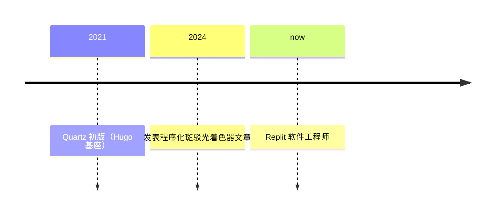

> Quartz 静态站点生成器的作者，把"数字花园"从理念变成大众可用的工具；也是程序化斑驳光着色器技术文章的作者。

## 人物卡片

| 项目 | 信息 |
|------|------|
| **姓名** | Jacky Zhao（GitHub: jackyzha0） |
| **生卒** | 在世（出生年份待核实） |
| **国籍** | 待核实（现居美国旧金山） |
| **职业** | 软件工程师（Replit）/ 独立研究者 / 开源开发者 |
| **代表领域** | 开源工具、数字花园、静态站点生成器 |

---

### 生平简介

Jacky Zhao（GitHub: jackyzha0），现居旧金山，Replit 软件工程师。在加拿大英属哥伦比亚大学（UBC）学习计算机科学与哲学。他自称个人网站是"互联网上的小岛"（my little island on the internet），专注于开源工具与基础设施，关注公共物品资助（public goods funding）、更好的人机交互与负责任的科技；近期探索独立研究、本地优先（local-first）协作应用与数据互操作性。最知名的作品是 **Quartz**——一款把 Markdown 内容变成完整网站的"开箱即用"静态站点生成器，是数字花园运动最主流的落地工具之一。

> ⚠️ 出生年份、国籍等细节未经独立核实，以上基于 GitHub 主页、个人网站与公开资料整理。

---

### 人生时间线

| 时间    | 事件                                                   | 影响                         |
| ----- | ---------------------------------------------------- | -------------------------- |
| ~2021 | 创建 Quartz（初版 Hugo 基座，后重写为 TypeScript）                | 数字花园工具化，~7000 GitHub stars |
| 2024  | 发表 "Experiments in procedural dappled light shaders" | 本库 [[斑驳光]] 概念的来源           |
| 现在    | Replit 软件工程师                                         | 继续开源与工具开发                  |

---

### 主要成就

- **Quartz**（2021）：TypeScript 静态站点生成器，MIT 开源，~7000 GitHub stars，数字花园领域最主流的工具之一
- **cursor-chat**：为网页添加 Figma 风格"光标聊天"的开源库
- **"Experiments in procedural dappled light shaders"**（2024）：程序化斑驳光（木漏れ日）着色器技术文章，本库 [[斑驳光]] 概念的直接来源

---

### 思想与观点

> 提炼人物的核心思想，链接到相关 atomic/concept 笔记

- **数字花园工具化**：让"公开数字花园"免费、简单，降低发布门槛（[[数字花园]]）
- **程序化生成美学**：用 fragment shader 程序化模拟自然光与树叶摇曳，营造"数字家园"氛围（[[斑驳光]]）
- **开源与公共物品**：关注 public goods funding 与负责任的科技，视开源为公共基础设施

---

### 代表作品

- **Quartz**（quartz.jzhao.xyz）— 数字花园静态站点生成器
- **cursor-chat** — Figma 风格光标聊天库
- **jzhao.xyz** — 个人网站（本身即 Quartz 构建的数字花园，并实践了斑驳光背景）
- **"Experiments in procedural dappled light shaders"**（2024）— 程序化斑驳光技术文章

---

### 关系网络

- **公司**：Replit（现任软件工程师）
- **教育**：加拿大英属哥伦比亚大学 UBC（计算机科学与哲学）
- **开源生态**：Quartz 数字花园社区；与 [[数字花园]] 理念阐述者（Maggie Appleton 等）同属数字花园运动
- **社交**：Twitter [@_jzhao](https://twitter.com/_jzhao)、个人网站 [jzhao.xyz](https://jzhao.xyz)

---

### 名言

> The goal of Quartz is to make hosting your own public digital garden free and simple. —— Quartz 项目目标（2021）

> 🌿 Welcome to my little island on the internet – I'm Jacky! —— 个人简介

---

### 评价与争议

- **正面评价**：Quartz 把"数字花园"从理念变成大众可用的工具，是数字花园运动最主流的落地项目之一
- **争议**：无明显争议；作为工具型开源者，个人思想观点的公开讨论相对较少

---

### 知识图谱

- **父级领域**：[[数字花园]]（其创造的 Quartz 是数字花园的主要落地工具）
- **相关概念**：
	- [[数字花园]] — Quartz 所服务的核心理念
	- [[斑驳光]] — 其 2024 年文章是本库该概念的直接来源
- **相关人物**：
	- [[尤雨溪]] — 同为前端开源工具创作者（Vue/Vite vs Quartz）
- **参考来源**
	- GitHub: https://github.com/jackyzha0
	- 个人网站: https://jzhao.xyz
	- Quartz 官网: https://quartz.jzhao.xyz
	- 网络检索（2026-08）
