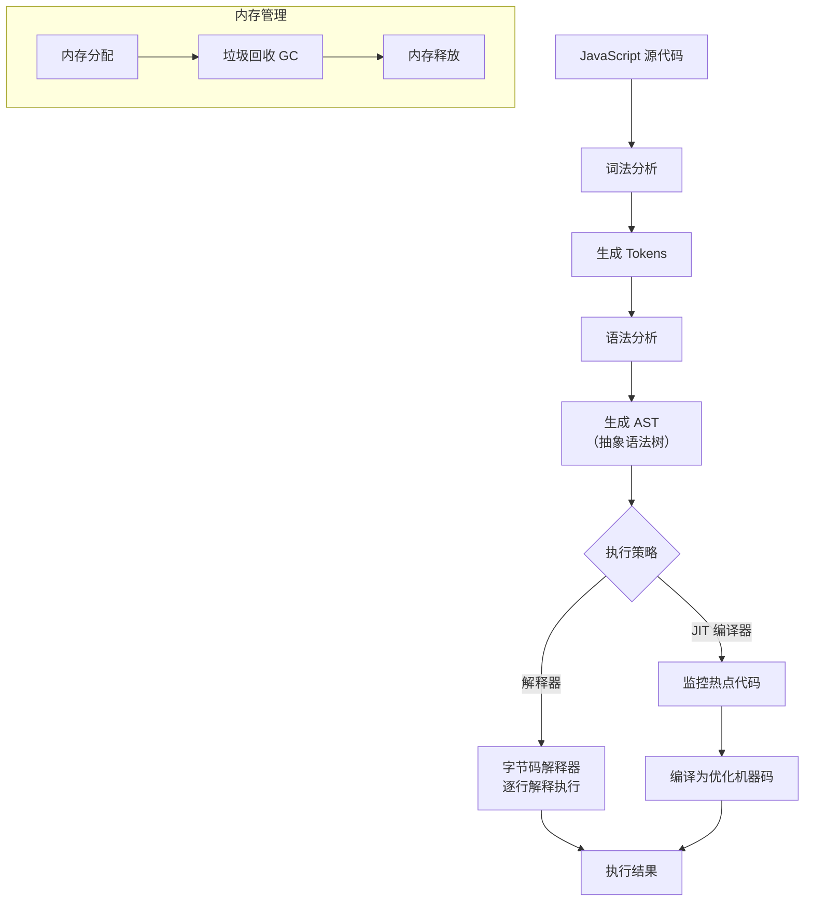

## 🧩 概念：JavaScript 引擎

### 1. 核心定义 (The Essence)

> [!abstract]
> JavaScript 引擎是一种解释和执行 JavaScript 代码的程序或解释器，负责将高级 JavaScript 代码转换为机器可以理解和执行的指令。它是 Web 浏览器和 Node.js 等 JavaScript 运行时的核心组件。

**解决的核心痛点**：JavaScript 作为一门高级脚本语言，无法直接被计算机硬件执行。JavaScript 引擎正是为了解决 " 代码执行 " 问题而存在的，它充当了 JavaScript 代码与底层硬件之间的桥梁，实现了跨平台、高性能的代码执行环境。

### 2. 核心命题与原则 (Atomic Propositions)

- [[JavaScript引擎的核心工作是解释和执行代码]]
	- **原理**：引擎读取源代码，通过词法分析、语法分析生成抽象语法树 (AST)，然后解释执行或编译执行。
- [[现代JavaScript引擎普遍采用即时编译技术提升性能]]
	- **原理**：JIT (Just-In-Time) 编译器在运行时将热点代码（频繁执行的代码）编译为优化的机器码，显著提升执行速度。
- [[垃圾回收机制是JavaScript引擎内存管理的核心]]
	- **原理**：引擎自动跟踪内存分配，识别不再使用的对象，并释放其占用的内存，防止内存泄漏。

### 3. 运行机制/模型 (Mechanism)

#### ⚙️ 运作流程

#### 🆚 关键区别 (Compare & Contrast)

| 维度         | **[[JavaScript 引擎]]**       | **[[Java 虚拟机 (JVM)]]**    |
|:----------- |:---------------------------- |:--------------------------- |
| **核心逻辑** | 解释/编译执行 JavaScript 代码 | 解释/编译执行 Java 字节码    |
| **语言特性** | 动态类型、原型继承            | 静态类型、类继承             |
| **内存管理** | 自动垃圾回收（标记清除等）    | 自动垃圾回收（分代收集等）   |
| **优化重点** | JIT 编译、隐藏类、内联缓存    | JIT 编译、逃逸分析、栈上分配 |

### 4. 应用场景与反模式 (Use Cases)

- ✅ **适用场景**
	- **Web 浏览器**：作为浏览器的核心组件，执行页面中的 JavaScript 代码，实现动态交互。
	- **服务器端开发**：Node.js 使用 V8 引擎，使 JavaScript 能够用于后端服务。
	- **桌面应用**：Electron 等框架使用 JavaScript 引擎构建跨平台桌面应用。
	- **移动应用**：React Native 等框架使用 JavaScript 引擎构建原生移动应用。
- ⛔ **误用与反模式 (Anti-Patterns)**
	- **忽略引擎差异**：不同引擎（V8、SpiderMonkey、JavaScriptCore）在实现细节和性能特性上存在差异，编写跨平台代码时需要注意。
	- **滥用动态特性**：过度使用 `eval()`、`with` 等动态特性会阻碍引擎优化，导致性能下降。
	- **内存泄漏**：虽然引擎有垃圾回收，但不当的引用（如闭包中的循环引用）仍可能导致内存无法释放。

### 5. 知识图谱 (Knowledge Graph)

- **父级概念**：[[编程语言实现]]、[[运行时环境]]
- **子概念/组成部分**：[[解释器]]、[[JIT 编译器]]、[[垃圾回收]]、[[V8 引擎]]、[[SpiderMonkey]]
- **关联概念**：[[ECMAScript]]、[[执行上下文]]、[[事件循环]]、[[Node.js]]
- **相关工具/库**：浏览器开发者工具的 Performance 和 Memory 面板可用于分析引擎性能。

### 6. 参考与延伸

- **经典文献**：《V8 引擎设计》、《JavaScript 引擎优化技术》
- **推荐阅读**：
	- [V8 引擎官方网站](https://v8.dev/)
	- [SpiderMonkey 引擎文档](https://developer.mozilla.org/en-US/docs/Mozilla/Projects/SpiderMonkey)
	- [[浏览器工作原理]] - 了解引擎在浏览器中的角色
