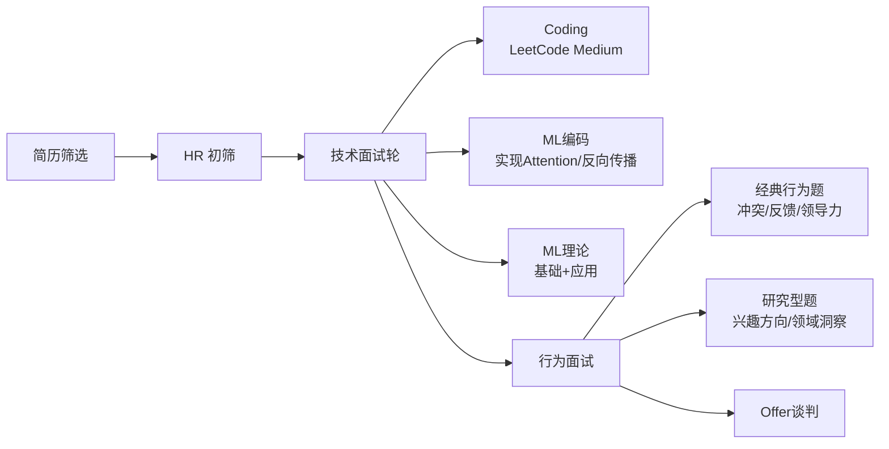

## 概念：ML求职面试指南

> 顶级 AI 实验室的面试不只考技术能力，更是对面试准备的系统性考验。能否将研究成果有效转化为面试表现，往往决定了最终结果。

**解决的核心痛点**：许多优秀的 ML 研究者在面试中失败，不是因为研究能力不足，而是因为面试准备缺乏系统性和针对性。

---

### 核心命题

- [[ML 面试的关键不是研究能力而是准备充分度]]
	- **原理**：ML 面试有独特的考核模式（LeetCode + ML 编码 + 理论 + 行为），日常研究与面试所需技能集不重合
- [[LLM 模拟面试是最高效的备考方法]]
	- **原理**：用 Claude/Gemini 模拟真实面试场景，能高度预测实际面试问题

---

### 面试流程解析

---

### 六大准备维度

| 维度 | 核心要求 | 关键资源 |
|:--- |:--- |:--- |
| **技术基础** | ML 理论全面覆盖（RL、LLM、Generative、Applied ML、General ML、线性代数） | Anki 闪卡、系统化梳理 |
| **ML 编码** | 从零实现 Attention、Transformer、反向传播、Flash Attention | DeepML、Tensor Puzzles |
| **LeetCode** | Blind 75 + NeetCode 150，重点 Medium，20 分钟内完成 | LeetCode、NeetCode |
| **面试流程** |一天一场，优先面不太在意的公司练手 | 实地经验积累 |
| **情绪管理** | 规律运动、固定仪式、接受随机性 | The Now Habit 等书籍 |
| **谈判策略** | 多家对比、坦诚沟通、保持竞争性报价 | 竞争性 Offer 是最大筹码 |

---

### 关键技术知识体系

#### 强化学习（RL）

- Q-Learning / TD Learning / Bellman Equations
- PPO / GRPO / DPO
- Policy Gradient Theorem
- On-Policy vs Off-Policy
- MuZero / AlphaGo / World Models
- Actor-Critic / SARSA / Importance Sampling

#### 大语言模型（LLM）

- Flash Attention / LoRA / RoPE
- TransformerXL / Griffin / Perceiver
- Scaling Laws / Mixture of Experts
- RLHF / Decoding Techniques
- Tokenisation / Pretraining / Finetuning

#### 生成式模型（Generative）

- GANs / VAEs / ELBO
- Diffusion（DDIM / DDPM / Forward / Reverse SDE）
- Flow Matching ODE / Classifier Free Guidance

#### 应用 ML（Applied ML）

- 分布式训练（Tensor Parallelism / FSDP / DDP / Pipeline）
- Mixed precision / Gradient checkpointing / Gradient accumulation
- Profiling / JIT compiling
- 框架对比（JAX vs PyTorch vs TensorFlow）

---

### 适用范围

- ✅ **适用场景**
	- **求职顶级 AI 实验室**（DeepMind、OpenAI、Anthropic、Meta AI 等）的 Research Scientist / Research Engineer 岗位
	- **博士/博士后转型工业界**：已有扎实研究基础但缺乏面试经验
- ⛔ **误用**
	- **非 ML 工程岗位**：纯软件工程岗位的面试准备方向不同
	- **初级入门**：没有 3+ 篇一作顶会论文或同等经验，应优先积累研究产出
- **失效边界**
	- 不适用于 ML 产品经理、数据科学家（偏分析方向）等其他角色

---

### 最佳实践总结

1. **LLM mock interview**：每次面试前用 Claude/Gemini 模拟，指定岗位和公司背景。Claude 的反馈更严格、更有价值
2. **一天只面一场**：面试极其消耗精力，下午/晚上场必然表现下降
3. **从不在意的公司开始**：先面小厂练手，校准自信和谈判基准线
4. **背调 Offer 的「实际价值」**：创业公司股权的实际价值远低于报价，真实计算税后收入
5. **保持竞争性流程**：让各公司知晓你同时面试其他家，这是最有效的谈判杠杆

---

### 知识图谱

- **父级领域**：[[人工智能]] — ML 求职面试是该领域职业发展的重要环节
- **相关概念**：
	- [[P-求职前端岗位]] — 前端求职的类比参考
	- [[技能矩阵]] — 面试准备中的技能维度划分
- **参考来源**：
	- _resources/ML Job Interviews The Ultimate Guide — 原作者 Silvia Sapora 的完整面试经验
