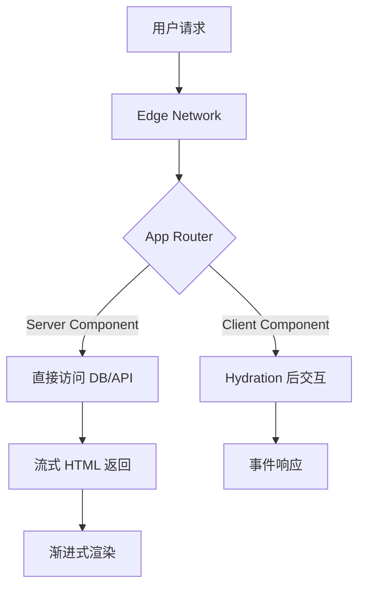

## 概念：NextJS

> NextJS 是 React 生态与 Node.js 服务端能力的深度融合框架

**解决的核心痛点**：传统 React SPA 首屏加载慢、SEO 困难、前后端分离导致协作成本高的问题。

---

### 核心命题

> 核心命题引用 atomic 笔记（陈述句观点），每个命题是一句话洞见

- [[NextJS 的本质是 React 框架与服务端能力的深度融合]]
	- **原理**：通过 React 组件服务端执行、直接查询数据库、API Routes 等机制实现前后端能力统一
- [[NextJS 首屏渲染不需要 JS 引擎参与但 hydration 仍然需要]]
	- **原理**：首屏 HTML 由服务端生成，浏览器直接显示内容无需等待 JS 执行，但后续交互（事件绑定、状态更新）仍需要 JS 引擎执行 Hydration
- [[React RSC 是发动机技术而非完整汽车框架]]
	- **原理**：RSC（React Server Components）只在服务端执行逻辑、返回序列化数据，本身不处理路由/状态/样式，需要 NextJS 等框架整合才能成为完整应用

---

### 运行机制

NextJS 的核心机制围绕 App Router 和 Server Components 展开：

**关键渲染模式**：
- **SSR (Server-Side Rendering)**：页面级服务端渲染，适合动态内容
- **SSG (Static Site Generation)**：构建时生成静态页面，适合博客/文档
- **ISR (Incremental Static Regeneration)**：定时重新生成，适合频繁更新内容
- **RSC (React Server Components)**：组件级服务端渲染，直接在服务器执行逻辑

---

### 关键区别

| 维度 | NextJS | Create React App (CRA) |
|:--- |:--- |:--- |
| **渲染方式** | SSR/SSG/RSC | 纯客户端渲染 |
| **首屏性能** | 快速（服务端返回完整 HTML） | 慢（需要下载 JS 后渲染） |
| **SEO** | 友好（HTML 完整） | 差（需借助 SSR 方案） |
| **服务端能力** | 原生支持 API Routes | 需独立后端服务 |
| **团队协作** | 前后端合一 | 前后端分离 |

---

### 应用场景

- ✅ **适用场景**
	- **SSR/SG 网站**：需要 SEO 的营销网站、博客、文档
	- **全栈应用**：前后端代码统一管理的小型应用
	- **微前端网关**：作为 BFF 层聚合多个微服务
- ⛔ **误用**
	- **纯静态展示**：无交互需求时用 Vite/astro 更轻量
	- **复杂实时应用**：游戏、聊天等适合 WebSocket 实时通信的场景

---

### SOP

> 与本概念相关的标准操作流程，通过实践辅助理解

- （暂无相关 SOP，待补充）

---

### FAQ

> 与本概念相关的开放性问题，待进一步探索

- （暂无相关 Question，待补充）

---

### 知识图谱

> 知识图谱链接 term（术语定义）和相关 concept，建立概念关系网络

- **父级概念**：
	- [[React]] — NextJS 的 UI 渲染基础
	- [[NodeJS]] — NextJS 运行的服务端环境
- **子级概念**：
	- [[服务端渲染]] — NextJS 的核心渲染模式
	- [[React Server Components]] — NextJS App Router 的核心技术
- **并列概念**：
	- [[Nuxt]] — Vue 生态的对标框架
	- [[Remix]] — 另一个 React 全栈框架
- **相关概念**：
	- [[Vercel]] — NextJS 官方推荐的部署平台
	- [[静态站点生成]] — SSG 是一种预渲染策略

---

### 参考延伸

- [NextJS 官方文档](https://nextjs.org/docs)
- [React Server Components 深入理解](https://nextjs.org/docs/app/building-your-application/data-fetching)
- [Vercel 博客 - NextJS 架构解析](https://vercel.com/blog)
